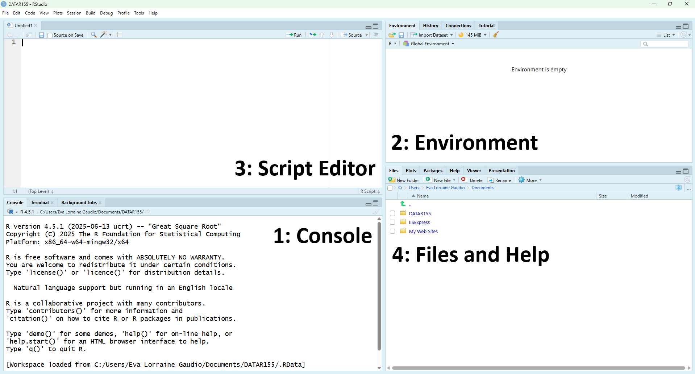
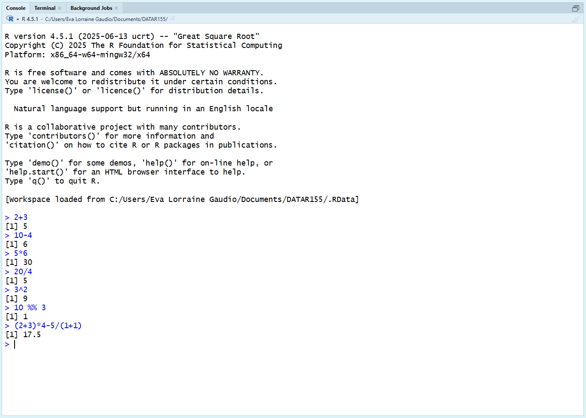
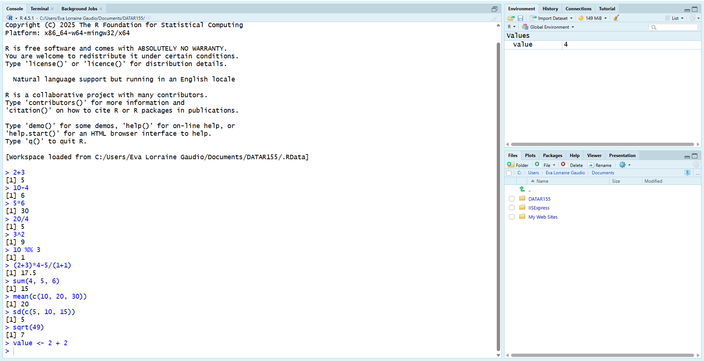
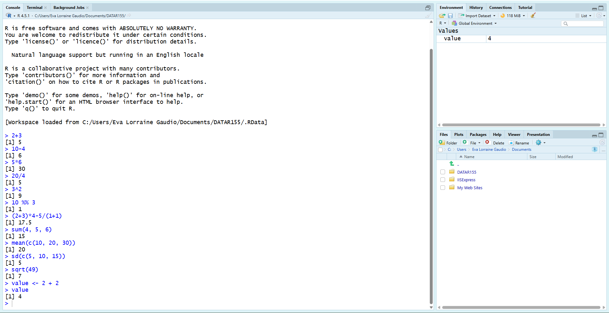
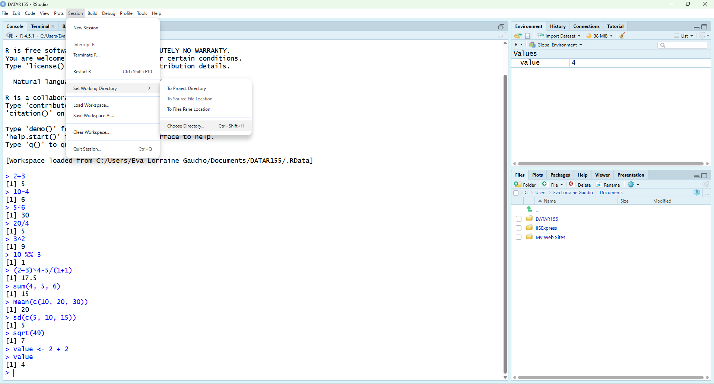
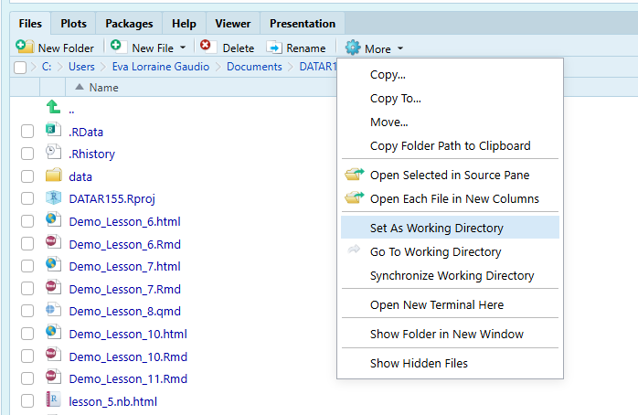
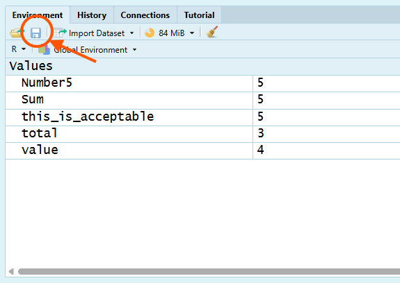
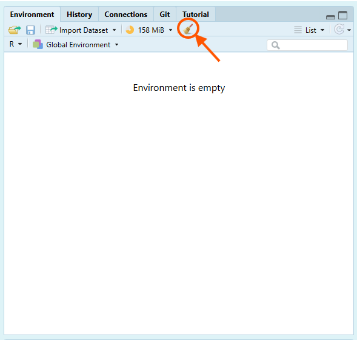

## Overview {#overview}

In Chapter 1, you will learn how to navigate the RStudio interface by identifying the four main panes (Source, Console, Environment, and the Output pane that includes Files/Help), and you will practice running basic calculations and functions in the Console so you can see how R evaluates commands and returns results. You will then learn how to store results as objects using the assignment operator (`<-`), follow R’s object-naming rules, and recognize a few core syntax habits that prevent beginner errors from snowballing into hours of confusion. Finally, you will learn the file-management workflow that makes or breaks this course: organizing a dedicated course folder, explicitly setting and checking your working directory (since that determines where files actually save), saving your workspace as an `.RData` “snapshot,” cleaning your Environment to include only assignment-relevant objects, loading a saved workspace when needed, and uploading the correct `.RData` file to Canvas.

In Chapter One you will learn how to:

- 🖥 Open RStudio and identify its main panes.

- ⚡ Do simple arithmetic in R.

- 🛠 Create and inspect objects with the assignment operator (`<-`).

- 🔍 Follow R's object-naming rules.

- 📦 Save your workspace (environment).

- 🧹 Remove objects you no longer need.

- 📤 Upload your RData to Canvas

## RStudio Interface {#rstudio-interface}

**RStudio Desktop** is an [integrated development environment]{.glossary-term data-term="Integrated Development Environment"} (IDE) because it brings script editing, the R console, environment/object viewing, help/documentation, and file navigation into a single interface.

RStudio should already be installed on your computer. You can identify RStudio by its distinctive round blue icon as shown in Figure 1. If you do not have RStudio installed, please refer to the installation instructions provided in the Preface.


Grey code boxes like this one below contains instructions for you to follow. Complete these tasks to aid your learning. 

```{r echo=FALSE}
# Open RStudio Desktop.  
```

You should see a window with four main [panes]{.glossary-term data-term="Panes"} (see Figure 2).

1. [Console]{.glossary-term data-term="Console Pane"} – where R runs commands and shows results  
2. [Environment]{.glossary-term data-term="Environment Pane"} – where you can see the [objects]{.glossary-term data-term="Objects"} (data, vectors, functions) in your current session  
3. [Script Editor (Source)]{.glossary-term data-term="Script Editor Pane"} – where you write and save your R scripts and notebooks 
4. [Files]{.glossary-term data=term="File Pane"} and [Help]{.glossary-term data=term="Help"} – where you browse files and access plots, packages, and help pages



💡 **Tip:** If your [layout]{.glossary-term data-term="Pane Layout"} looks different, that’s okay—RStudio lets you move panes. Look at the **tab labels** in each pane (for example, *Console*, *Environment*, *Files*, *Help*) to identify them. You can always reset the layout later using **[Tools]{.glossary-term data-term="Tools"} → [Global Options]{.glossary-term data-term="Global Options"} → [Pane Layout]{.glossary-term data-term="Pane Layout"}**.

## Console {#console}

The [Console]{.glossary-term data-term="Console Pane"} is where R runs commands. You can type commands directly into the Console and press **Enter** to run them. R will evaluate your command and usually print the result immediately below.

### Basic Calculations {#basic-calculations}

R performs standard operations like addition (`+`), subtraction (`-`), multiplication (`*`), division (`/`), exponentiation (`^` or `**`), and modulo (`%%`) with the correct order of operations (`PEMDAS`). 

🎯 Type mathematical calculations in the Console.

```{r eval=FALSE}
# ⚡ Type this in the Console and press Enter
# Addition
2 + 3  # Adds 2 and 3

# Subtraction
10 - 4 # Subtracts 4 from 10

# Multiplication
5 * 6  # Multiplies 5 and 6

# Division
20 / 4 # Divides 20 by 4

# Exponents
3^2    # Calculates 3 to the power of 2

# Modulo
10 %% 3 # Remainder of 10 divided by 3

# Combined operations
(2 + 3) * 4 - 5 / (1 + 1) # Mixes several operations
```



🗣 R prints results immediately. 

💡 **Tip:** If you make a typo, use the **Up/Down arrow keys** to go back through previous commands, edit the line, and press Enter to re-run it.

### Functions {#functions}

Many mathematical operations in R are performed using [functions]{.glossary-term data-term="Functions"}. A function is a reusable block of code that takes inputs, processes them, and returns an output. Functions can be built-in or user-defined. In this course, we will only use built-in functions. Many functions have [arguments]{.glossary-term data-term="Arguments"} (inputs) that you provide inside the parentheses. 

Built-in mathematical functions include `sum()`, `mean()`, `sd()`, and `sqrt()`. These functions require arguments to specify the data they operate on.

🎯 Use built-in mathematical functions

```{r eval=FALSE}
# ⚡ Type this in the Console and press Enter
# Sum of numbers
sum(4, 5, 6)  # Adds 4, 5, and 6

# Mean (average) of numbers
mean(c(10, 20, 30)) # Calculates the average of 10, 20, and 30

# Standard deviation of numbers
sd(c(5, 10, 15))    # Calculates the standard deviation of square root of a number

# Square root of a number
sqrt(49)            # Calculates the square root of 49
```

🗣 R prints the results of each function call in the console. 

We'll use functions throughout this course. Before we dive into more details about functions, we need to learn a little bit about the Environment pane. 

## Global Environment {#global-environment}

During a session, you can create or load [objects]{.glossary-term data-term="Objects"} into the global environment. These are named containers that store data values (such as numbers, vectors, data tables, or models), which can then be accessed and manipulated later. Objects are also sometimes called [variables]{.glossary-term data-term="variables"}, identifiers, or data structures. 

The [Environment pane]{.glossary-term data-term="Environment Pane"} lists all of the objects that currently exist in your R session and gives a quick preview of their contents.

### Naming and Storing Results {#naming-and-storing-results}

An **object name** is the label you use to retrieve something you stored. The [assignment operator]{.glossary-term data-term="Assignment Operator"} `<-` (or `->`) is used to **store** a result in an object (a named container). This is how you give a result a name so you can reuse it later.

🎯 Use `<-` to store the result of `2 + 2` in an object named `value`.

```{r}
# ⚡ Type this in the Console and press Enter
value <- 2 + 2
```

🗣 The object name is `value` and the the object is the number *4*. 

🧐 NOTICE that nothing printed in the Console when you ran the assignment; the result was saved instead of displayed. The Environment pane helps you track which names currently exist.


💡 **Tip:** RStudio has a keyboard shortcut for typing the assignment operator `<-`! On Windows/Linux, press `Alt` and `-` at the same time. For macOS, press `Option` and `-`. Try it out for yourself!

```{r eval=FALSE}
# Click in the Console to begin typing
# Press Alt + -  (Windows/Linux) or Option + - (macOS) to type the assignment operator
<- 
```



💡 **Tip:** The `=` symbol has a dual role in R: it acts as an assignment operator (interchangeable with `<-` in most contexts) and as a special syntactic token for binding named arguments within a function call. For practical programming in RStudio, you should use `<-` as the conventional assignment operator to avoid confusion with function arguments. 

🎯 Print the stored value by typing the name of the object in the console and pressing Enter.

```{r eval=FALSE}
# ✅  Check the stored value
value
```



💡 **Tip:** You can also use the `print()` function to display the value of an object. Type the object name inside of the parenthesis to use this function.

```{r eval=FALSE}
# ✅ Check the stored value using the print() function
print(value)
```

### Object Naming Rules {#object-naming-rules}

R won’t accept just any text as an object name. R will not accept object names with a space between words. Object names are case-sensitive and may contain **letters**, **digits**, **periods** (`.`), and **underscores** (`_`). 

To separate words, this course will usually use **snake_case** (e.g., `my_object_name`). You may also see dotted notation (e.g., `my.object.name`) or **CamelCase** (e.g., `myObjectName`).

Names *cannot* start with (1) a digit or (2) a period followed by a digit. Something like `.5` is tokenized as a number, not a name. Additionally they cannot be the same as (3) R’s reserved words (like `if`, `else`, `repeat`, `function`, `TRUE`, `FALSE`, `NULL`, etc.). 

You can use backticks (`` ` ``) to create names that include spaces or special characters, although this is not recommended for everyday use. The backtick is located above the Tab key on most keyboards.

🛠 Break Things! Try valid and invalid names.

```{r eval=FALSE}
# ⚡ Type this in the Console and press Enter
# Valid names
total              <- 5
Sum                <- 5
.fine.with.dot     <- 5
this_is_acceptable <- 5
Number5            <- 5

# Invalid names (will produce errors without backticks)
tot@l <- 5  # @ is not allowed
5um   <- 5  # cannot start with a digit
_five <- 5  # cannot start with underscore
TRUE  <- 5  # built-in constant; do not use as a name
.5number  <- 5  # starts with . followed by digit (tokenizes like a number)
number five <- 5  # space not allowed without backticks
```
🗣 R will return error messages for the invalid names (unless you use backticks). 

### R Syntax Basics {#r-syntax-basics}

The syntax of R can be difficult for students to learn, and they often report spending many hours debugging simple problems. Understanding how R reads your code can help you avoid common pitfalls. I encourage students to reach out to peers, consult with instructors, explore online resources, use AI tools, and refer to R’s help files, since these errors are often simple but difficult to notice on your own. 

The smallest meaningful units R reads when it parses your code is called a [token]{.glossary-term data-term="Tokens"}. R breaks each line into tokens, then checks whether that sequence forms valid syntax.

White space between tokens is generally flexible and ignored by the interpreter for most operations, which offers a high degree of formatting freedom for readability. The whitespace inside a multi-character token can change meaning, because it splits the token.

🛠 **Break Things!** Test out this by adding extra spaces or removing spaces around the assignment operator `<-` when creating a new object named `total` that stores the value `5 - 2`.

```{r eval=FALSE}
# ⚡ Type this in the Console and press Enter
total<-5-2           # tokens: total, <-, 5, -, 2 (stores 5 minus 2)

total   <-   5  -  2 # tokens: total, <-, 5, -, 2 (stores 5 minus 2)
```

🗣 R tokenizes `total` (name/identifier), `<-` (assignment operator), `5` and `2` (number), and `-` (mathematical operator).

```{r eval=FALSE}
# ⚡ Type this in the Console and press Enter
total < -5 -2        # tokens: total, <, -5, -, 2 (tests if total is less-than negative 7)
```
🗣 R tokenizes th`total` (name/identifier), `<` (comparison operator), `-5` (negative number), and `-` (mathematical operator), and `2` (number). This line does not store a value; instead, it tests whether `total` is less than negative 7, returning `TRUE` or `FALSE`.

_____

🚀 **Explore and Play**: Create more objects by storing different calculations.

```{r eval=FALSE}
# ⚡ Create an object of your choice. 
```

_____

## Files Pane {#files-pane}

The [Files pane]{.glossary-term data-term="Files Pane"} allows you to navigate your computer's file system, manage files and folders, and set your [working directory]{.glossary-term data-term="Working Directory"}. 

💡 **Tip:** I do not recommend that you rename, delete, and create new files or folders from this pane. Instead, use your computer's file explorer (e.g., File Explorer on Windows, Finder on macOS) for these tasks to avoid potential issues with file paths and syncing.

### Working Directory {#working-directory}

The [working directory]{.glossary-term data-term="Working Directory"} is where files actually go when you save them from RStudio. RStudio normally starts in your home directory. A common challenge for early RStudio users is having trouble finding their saved files because they were not aware of the working directory. Many “I saved it but I can’t find it” problems are really “my working directory wasn’t what I thought it was.”

Two important points about the working directory:

- RStudio shows your current working directory in the title area of the Console pane.

- Navigating the Files pane does not change your working directory. You must explicitly set it. 

🎯 Check where R will save files right now.

```{r eval=FALSE}
# ⚡ Type this in the Console and press Enter
getwd()
```
🗣 R prints the current working directory path in the Console. 

🧐 NOTICE: There is no "*argument*" inside the parentheses of `getwd()`. This is because `getwd()` does not require any inputs to return the current working directory. 

### Folder Organization {#folder-organization}

Keep your coursework organized by creating a dedicated folder for this course on your computer. You will then set that folder as your working directory in RStudio.

💡 **Tip:**: I recommend local, non-synced storage for R work when possible (sync tools can cause file-locking / sync churn / path issues). For example, windows users should avoid creating their course folder inside a "OneDrive" folder. And macOS users should avoid creating their course folder inside of "iCloud". 

🎯 Create a course folder on your computer to use as your working directory for this course.

```{r eval=FALSE}
# Outside of RStudio:
# 1. Open your file explorer (e.g., File Explorer on Windows, Finder on macOS).
# 2. Navigate to a location where you want to create the folder (e.g., Documents).
# 3. Create a new folder named "DATA-R155". 
```

🗣 Remember the location of this folder. You will need it in the next step.

### Set Working Directory {#set-working-directory}

Many tutorials teach the function `setwd()`. For beginners, the RStudio menu method provides a convenient UI method. Using the UI method helps avoid typos in the file path. There are two reliable UI routes to set the working directory:

Method A. **[Session Menu]{.glossary-term data-term="Session Menu"}**

- **Windows/Linux**: Tools → Change Working Dir…

- **macOS**: Session → Set Working Directory → Choose Directory…

```{r eval=FALSE}
# Use the menu to navigate to your course folder and select it.
```



Method B. **Files Pane**

1. In the Files pane, navigate to your course folder. 

2. Click the `More` button (three vertical dots) and select `Set As Working Directory`.



🎯 Set the working directory using the UI

```{r eval=FALSE}
# ⚡ Use either the Session menu or Files pane method described above.
# Set the working directory to the folder you created for this course.
```

🗣 RStudio sets your working directory to the selected folder. You can confirm this by running `getwd()` again in the Console.

```{r eval=FALSE}
# ✅ Check the working directory again
getwd()
```
🗣 R prints the updated working directory path in the Console. The printed path should end in your course folder name (e.g., .../DATA-R155).

### Save Workspace {#save-workspace}

Saving your workspace is a convenient way to preserve all of the objects you have created during your R session. It is one way you can to share your data with other R users as they can easily load them into RStudio.

Most assignments in this course will require that you submit your R workspace (environment) as an R Data file (`.RData`). This file contains all of the objects you have created during your session.

There are two primary functions for saving your workspace. You can choose to use either method.

Method A. **Floppy disk icon**

Click the **Save Workspace** icon in the Environment pane. This opens a dialog to choose a file name and location to save your workspace as an `.RData` file.




🎯  Type "workspace" as the file name. 

```{r eval=FALSE}
# ⚡ Click the Save Workspace icon in the Environment pane.
# Name the file "workspace" and click Save.
```

🗣 R saves your workspace to a file named `workspace.RData`. Notice that the file extension `.RData` is automatically added. Ensure you are saving it in your working directory (the course folder you set earlier).

Method B. **`save.image()`**

Use the function `save.image()` to save the entire workspace (all objects) to a specified file name.

🎯 Save your entire workspace to a file named `workspace.RData` in your working directory.

```{r eval=FALSE}
# ⚡ Type this in the Console and press Enter
save.image(file = "workspace.RData")
```

Open your file explorer (e.g., File Explorer on Windows, Finder on macOS). Navigate to your course folder (the working directory you set earlier) and verify that `workspace.RData` is present.

```{r eval=FALSE}
# ✅ Check your course folder and verify `workspace.RData` is in your working directory.
```

💡 **Tip:** If `workspace.RData` is not in your folder, your working directory is wrong. Run `getwd()` and reset it using the UI. 

### Clean Environment {#clean-environment}

Saving your workspace is a snapshot of your current R session. You will use it to submit assignments. For this course, your Environment must contain **only the objects you created for the current assignment**. Extra objects make it harder to grade, harder to debug, and easier to mix up results.

#### Listing Objects {#listing-objects}

🎯  Check the objects in your Environment pane using `ls()` to list objects

```{r eval=FALSE}
# ⚡ Type this in the Console and press Enter
ls()
```

🗣 R prints a character vector of the names of all objects currently in your environment.

#### Removing Objects {#removing-objects}

If you have extra objects that are not needed, remove them using the `rm()` function. 

🎯 Remove items using the `rm()` function.

```{r eval=FALSE}
# ⚡ Type this in the Console and press Enter 
# Remove one object 
rm(total)

# Remove multiple objects
rm(value, total)
```

🗣 R removes the specified objects from your environment.

Before beginning any new assignment, start with a clean environment.

🎯 Remove all objects from your environment.

Method A. **Environment Pane**

- Click the 🧹 **broom icon** (Clear All) in the Environment pane to remove all objects.



Method B. **`rm()` function**

- Use `ls()` inside of `rm()` to remove all objects.

```{r eval=FALSE}
# ⚡ Type this in the Console and press Enter 
# Remove all objects from the environment
rm(list = ls())
```

Confirm with ls()

```{r eval=FALSE}
# ✅ Check the objects in your environment again
ls()
```
🗣 R prints an empty character vector if all objects were removed successfully.

### Loading Workspace {#loading-workspace}

If you quit RStudio or start a new session, your environment will be empty. You can restore your saved workspace using the `load()` function.

`load()` restores objects from an .RData file into your current session. 

💡 **Tip:** Loading data into a messy workspace is a common way to create confusion. Objects with the same names will be overwritten. 

🎯 Load the workspace you saved earlier.

```{r eval=FALSE}
# ⚡ Type this in the Console and press Enter
load("workspace.RData")
```

🗣 R restores all objects from `workspace.RData` into your current session. 

Verify by checking the Environment pane or using `ls()`.

```{r eval=FALSE}
# ✅ Check the objects in your environment again
ls()
```
___

### Submit Workspace {#submit-workspace}

It is common for novice R users to struggle with locating their saved RData file or submit the incorrect file type. To avoid this issue later in the course, let's practice. Please submit your R workspace as an RData file (`.RData`).

Use the file explorer on your computer to locate the `workspace.RData` file you saved earlier. Verify that the file type is `.RData`. Upload this file to the assignment submission area on Canvas.

```{r eval=FALSE}
# ✅  In Canvas
# 1. Open the assignment submission page.
# 2. Open your file explorer and navigate to your course folder.
# 3. Select and upload the file named `workspace.RData`.
# 4. Confirm the file name ends in `.RData` before submitting
```
___

Saving your workspace is a snapshot for submission. Your next chapter (Scripts) is the long-term skill: saving the instructions (code) that recreate your work. [Script Editor]{.glossary-term data-term="Script Editor Pane"} (Source) is a place for creating, saving, and submitting R files that keep a record of your code and research process.

___

## Summary {#summary}

The Console is where R runs commands and shows results. You can perform arithmetic operations directly in the Console or use built-in functions like `sum()` and `mean()` to perform calculations. The Environment pane displays the objects you create during your session. You can store results in objects using the assignment operator `<-`, following R's object-naming rules. R reads your code as tokens (the smallest meaningful units, like names, numbers, and operators). Spaces usually don’t matter between tokens (`x<-1` and `x <- 1` behave the same), but a space can change meaning if it splits or changes tokens. For example, `total<-5` assigns `-5` to `total` when written as `total < -5` because R now sees the `<` operator followed by the number `-5`. Also, a space can’t appear inside an object name because it would split the name into two tokens (number five), which is invalid unless you use backticks like `` `number five` ``.

The Files pane helps you navigate folders so you can find course materials and, when needed, set your working directory—the default folder where R will look for files and where it will save outputs unless you specify a different path. RStudio shows the current working directory at the top of the Console pane, and you can also print it with `getwd()`; if you “saved it but can’t find it,” the working directory is the first thing to check. For this course, you should create one dedicated course folder (ideally in local, non-synced storage) and then explicitly set it as the working directory using the menu option or the Files pane’s **More → Set As Working Directory** command—browsing folders in the Files pane alone isn’t enough unless you take that explicit “set” action. After your working directory is correct, you can save your entire workspace as `workspace.RData` using either the Environment pane’s save option or `save.image("workspace.RData")`, verify the file exists in your course folder, and keep your workspace clean with `ls()` and `rm()` so it only contains objects relevant to the current assignment. When you load an `.RData` file with `load()`, it adds objects into your current session and can overwrite objects with the same names, so loading into a messy workspace is a common way to create confusion.

## Chapter Terms {#chapter-terms}

**Arguments**: Inputs that you provide to functions to customize their behavior. Arguments are specified within the parentheses of a function call and can modify how the function operates or what data it processes.

**Assignment Operator**: The symbol `<-` is used to assign values to variables in R. It indicates that the value on the right should be stored in the variable on the left. The less common `->` assigns the value on the left into the name on the right.

**Console Pane**: The pane where R executes commands and prints output. Anything you type and run here is evaluated immediately, and messages, warnings, errors, and results appear here.

**Environment Pane**: The pane that lists the objects currently stored in memory for your session (for example, data frames, vectors, and functions). It helps you check what exists, inspect object names/types, and remove or manage objects.

**Files Pane**:  Tabs/panes used to navigate your project folders and view supporting information. Files lets you browse, open, rename, and manage files.

**Functions**: Reusable blocks of code that perform specific tasks. Functions can take inputs (arguments) and return outputs. R has many built-in functions, and you can also create your own.

**Global Options**: A settings window that controls how RStudio behaves across projects and sessions. This is where you can set defaults like appearance, saving behavior, code formatting, and how RStudio runs R.

**Help**: Located in the Files/Plots/Packages/Help pane, this tab provides access to R documentation, package vignettes, and search functionality to find help topics related to R functions and packages.

**Integrated Development Environment** (IDE): A software application that combines the core tools you need to write and run code in one place. RStudio is an IDE because it brings script editing, the R console, environment/object viewing, help/documentation, and file navigation into a single interface.

**Objects**: The variables, data frames, functions, and other items that you create and store in your R environment during a session. These objects can be viewed and managed in the Environment pane.

**Panes**: The four main sections of the RStudio interface: Source, Console, Environment/History, and Files/Plots/Packages/Help. Each pane serves a specific purpose for coding, executing commands, managing objects, and accessing resources.

**Pane Layout**: The section in Global Options where you choose which tabs appear in each pane and where panes sit on the screen. These settings that let you reposition items like Console, Source, Environment, Files, Plots, and Help to match your workflow.

**Script Editor Pane**: Source; The pane where you write, edit, and save code in script files (typically .R) and author documents like R Markdown/Quarto notebooks. Code written here can be run line-by-line or in chunks without retyping it in the Console.

**Session Menu**: The top-menu item in RStudio that controls actions related to your current R session (the live, running workspace). You use it to restart or terminate R, manage what is loaded in memory, and set session-specific settings like the working directory. It sits alongside menus like File, Edit, Code, View, Plots, Tools, and Help at the top of the RStudio window.

**Tokens**: The smallest meaningful pieces of code that R reads and interprets when it parses a line. Tokens include things like names (mean), numbers (`3.14`), strings (`"text"`), operators (`<-`, `+`), parentheses (`(`,`)`), commas (`,`), and brackets (`[`, `[[`, `{`). Whitespace usually just separates tokens for readability and is otherwise ignored.

**Tools**: The top-menu item that provides access to settings and helper features in RStudio. It is the place you go to change preferences, install tools, and access developer utilities. This menu that groups commands for customizing the IDE and running support tasks (for example, options, addins, and project tools).

**Variables**: See Objects; data values in R. Variables can hold different types of data, such as numbers, text, or more complex structures like data frames and lists. 

**Working Directory**: The folder on your computer that R treats as the default “home base” for the current session. When you read files (e.g., `read.csv("data.csv")`) or save outputs (e.g., `write.csv(df, "results.csv")`) using relative paths, R looks in (and writes to) the working directory unless you specify a full path. You can view or change it using Session → Set Working Directory, and you can check it with `getwd()` or change it with `setwd("path/to/folder")`.

## 📝 Practice Space {#practice-space}

Clear your environment before starting this practice space. When you are done, save your workspace as `chapter1_practice.RData` and upload it to Canvas as directed.

🎯 **Step 1: Start clean.**  
Click the 🧹 **broom icon** in the Environment pane to clear objects. Then complete Tasks 1-5 below.

### Task 1 {#task-1}

🎯  Store the quantity `62` in an object called `items_sold`

```{r , eval=FALSE}
# ⚡ Type this in your Console, filling in the blanks
items_sold <- ___
```

```{r , eval=FALSE}
# ✅ Check the stored value
______
```

### Task 2 {#task-2}

🎯  Store the unit price 100 in an object called `unit_price`

```{r , eval=FALSE}
# ⚡ Type this in your Console, filling in the blanks
unit_price <- ___
```

```{r , eval=FALSE}
# ✅ Check the stored value
______
```

### Task 3 {#task-3}

🎯  Calculate `total_revenue` by multiplying the stored objects `items_sold`  and `unit_price`.

```{r , eval=FALSE}
# ⚡ Type this in your Console, filling in the blanks
total_revenue <- _______ * _______    
```

### Task 4 {#task-4}

Identify the names of the Panes associated with each number in the image below.

![Screenshot of the RStudio interface divided into four panes, each labeled with a large number. (1) Top-left pane is a workspace where you would write and edit code before running it. (2) Top-right pane is used to keep track of items created during your session and review what is currently available to use. (3) Bottom-left pane is where commands are executed and results, messages, and errors appear. (4) Bottom-right pane is used to browse files related to your work and access additional tools such as plots, packages, and help documentation.](images/ch01-navigation/Quiz_Question.png)

**Console**, **Environment**, **Script Editor (Source)**, **Files and Help** 


1. ___________

2. ___________

3. ___________

4. ___________

Select your answers in Canvas as directed.

### Task 5 {#task-5}

🎯 **Step 2: Save**  
Save your workspace (`chapter1_practice.RData`) 


