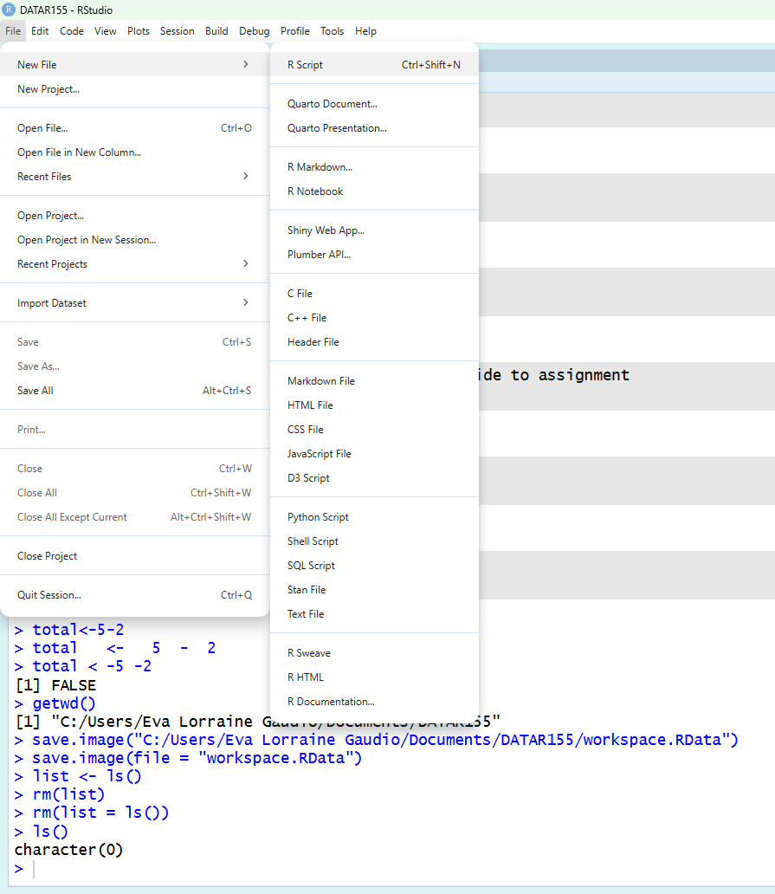
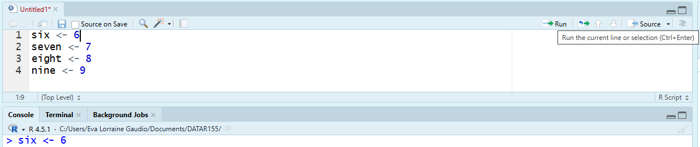
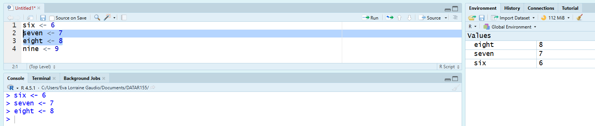
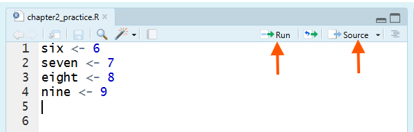
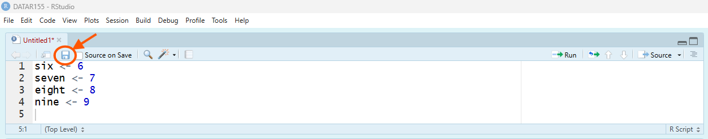

## Overview {#overview}

In Chapter 2, you will move from one-off Console commands to scripts, which are the durable record of your work: what you ran, in what order, and why. You will practice writing code in the Source pane and running it into the Console (line-by-line or in blocks) using RStudio’s Run tools and shortcuts. You will also learn how to use comments as memos to document errors and your troubleshooting process (tenacity). You will practice this as you build vectors of several basic types, checks with `mode()` and `length()`, and a simple data frame. 

In Chapter Two you will learn how to:

- 📝 Write and save R scripts.

- 📍 Run code from a script or the console.

- 💪 Practice resiliency through documenting tenacity on memos.

- 🛠 Build numeric, integer, character and logical vectors using `c()` and `seq()`

- 🔍 Check the mode and length of any vector object.

- 📊 Create a data frame from vectors.

---

## Script Editor (Source) {#script-editor}

Documenting your work allows you and others to understand how you came to your results. This course will introduce you to documenting your analysis with **R Script**, R Markdown, and Quarto files. These files preserve your code, comments, so that you (or anyone else) can re-run your analysis and understand *how* and *why* you arrived at your results. You can create, edit, and run these files in the Script Editor (also called the Source pane) in RStudio. 

### Console vs Script Editor {#console-vs-script}

The **Console** is where you can type and run R commands one at a time. It is useful for quick calculations, testing small pieces of code, and exploring data interactively. However, the Console does not save your commands after you close RStudio, so it is not suitable for documenting your work. 

An **R script** is a plain text file that contains a series of R commands. The script acts as a static record of the analysis. If the data or method change later, the original script preserves the logic used for your initial findings. The inclusion of comments (lines that begin with `#`) allows you to explain the *why* behind your code, detailing assumptions, data transformations, and the rationale for specific analytical choices. 

Think of programming like writing a recipe. Using the Console is like throwing ingredients into a pan on the fly. You might make something delicious (a great chart), but you didn't write down how much salt you used or in what order you added the spices. If you close RStudio, your "cooking" session is gone forever. Using an R script is like writing down the recipe step-by-step. You can share it with others, and you (or anyone else) can follow the same steps later to recreate the dish exactly. Comments act as notes in the margins of your recipe card.

### Create an R Script {#create-script}

There are two primary ways to create a new R script in RStudio. You can use either method.

Method A. **File Menu**

1. Go to the File menu at the top left of RStudio.

2. Select New File and then R Script. 



Method B. **Keyboard Shortcut**

1. Use the keyboard shortcut Ctrl + Shift + N (or Cmd + Shift + N on a Mac).

🎯 Open a new R Script.

```{r, eval=FALSE}
# Create a new script 
```

🗣 An empty script opens in the Script Editor (also called the Source pane). 

```{r, eval=FALSE}
# ⚡ Type this in your R Script
six <- 6
seven <- 7
eight <- 8
nine <- 9
```

### Run Code {#run-code}

🎯 Place your cursor on each line and click Run (or press Ctrl+Enter on Windows/Linux or Cmd+Return on macOS) to send that line to the Console where it executes.



```{r, eval=FALSE}
# Run one line
```

🎯 Select multiple lines to run them together.




```{r, eval=FALSE}
# Run multiple lines at the same time
```

🎯 Click Source to run the entire script at once.



```{r, eval=FALSE}
# Source the entire script
```

### Save Your Script {#save-script}

Saving your R script preserves the instructions (your code and comments), not the objects in your Environment. This matters because when you restart R or switch computers your Environment can disappear. Your script is a document of your work. A saved script lets anyone re-run your code and reproduce your results.

Most assignments in this course will require that you submit file that contains code and memos. Early modules require you submit an R script file (`.R`). The .R extension helps RStudio (and your computer) recognize the file as an R script. 

There are two primary ways to save your script. You can use either method.

Method A. **Save icon**

1. Click the Save icon (floppy disk) in the toolbar of the Script Editor pane.



Method B. **File Menu**

1.  Go to the File menu at the top left of RStudio.

2. Select Save As....

```{r, eval=FALSE}
# Save your script in your course folder (e.g., DATA-R155)
# File name: chapter2_notes
# Save a type: R
```

> 🧐 **Notice:** that the file extension `.R` is automatically added.

```{r eval=FALSE}
# ✅ Verify that `chapter2_notes.R` is in the right folder.
```

💡 **Tip:** “Working directory” controls where R looks for files when you use relative paths, but you can still accidentally save a script somewhere else if you choose the wrong folder in the Save dialog. For this course, always save scripts into your course folder so your files stay together and you can find them when it’s time to upload.

💡 **Tip:** When your script is unsaved, RStudio typically shows an asterisk (*) in the script tab and the file name is red, which means you have changes that are not saved yet. 

___ 

📖 **Review**

Recall that objects are names that store elements in R. You can use objects in calculations just like you would use numbers.

```{r, eval=FALSE}
# ⚡ Type this in your R Script
# The Incident: Why is 6 afraid?
seven_eight <- seven + eight

# The Result:
the_aftermath <- seven_eight - nine
```

```{r eval=FALSE}
# ✅ What number should be scared?
print(the_aftermath)
```

___

🎯 Run in order from top to bottom so that objects exist before you use them.

```{r, eval=FALSE}
# Select and run in order
```

🛠 **Break Things!** Order matters when editing and running code from a script. 

Pretend that you decided to change the name of `seven + eight` to `seven.eight`. 

🎯 Edit your script. 

```{r, eval=FALSE}
# Edit the object name
seven.eight <- seven + eight
the_aftermath <- seven.eight - nine
```

Go back to your script and run ONLY `the_aftermath` line (without running the lines above it).

```{r, eval=FALSE}
# Run only this line
the_aftermath <- seven.eight - nine
```

✍️  Error: object 'seven.eight' not found. 🗣 This is an error because `seven.eight` has not been created yet in this session.

🚧  **Errors** prevent code from running. 

🤔 No Error? This example may not error if you already ran `seven.eight <- seven + eight` before `the_aftermath <- seven.eight - nine`. Another way you can produce the error is by clearing the Environment before testing. 🧹 Sweep your environment and run code out of order.

💡 **Tip:** All scripts submissions must be able to run from top to bottom without errors. Regularly test your script by clicking Source to ensure that all lines run without errors.

In R, an error message is not a judgment. It is the computer telling you exactly what it cannot do *yet*. Learning to read errors calmly and then adjusting your next step is a core part of learning to code. 

---

Next, you will learn how to use comments as memos to document when you encounter errors. 

## Memo in R Scripts {#memos}

To add comments in an R script, simply use the "#" symbol at the beginning of a line to indicate that the following text is a comment and should be ignored by the R interpreter.

You can add a line break to a long comment by using the # symbol on each new line. This is necessary because R interprets everything on a single line after the first # as part of the comment. For example:

```{r}
# This is a comment. Notice the "#" at the beginning of the line.

# Comments often explain something about the code or your thinking.
# You will create comments like this in R Script assignments to 
#  document your process.

# Break the comment into several lines to keep the message readable.
```

### Explain Your Thinking {#explain-thinking}

Researchers have found that typing self-explanations of code improves retention and deepens understanding (Rus et. al., 2021). As you work through exercises and assignments, document a running record of insights, hunches, hypotheses, discussions about the applications of the code. 

1. **Forethought** before action. Before running code, write a brief note about the 🎯 Goal of code should accomplish, 💬 Prediction of what you expect to happen, or identify your 🧠 motivational beliefs that support persistence. 

2. **Performance** monitoring during action. ⚡ Compose the code and ✅ Check that the code worked. 🚀 Conduct Code trials, debugging issues, and ✍️ keep a record what you tried, even if it didn't work. 

3. **Self-reflection** after action. After getting the code to work, 🗣 Comment about what you learned, what surprised you, or what questions remain. 🪞 Reflect on learning process and what you will do next time. 

Icons for these strategies are provided in throughout each chapter to model the process. Mirror this process in all work you submit for the course. Each chapter will highlight specific memoing practices to focus on. This chapter focuses on documenting your tenacity.

---

Now that you know how to write and run code in a script, you will likely encounter errors. Tenacity is the learning skill that helps you persist through those errors and learn from them.

## Tenacity {#tenacity}

To successfully learn R programming, you will need to persist through difficulties, revise code, and know when to seek help after genuine effort. Tenacity is the learning skill that shows up when you persist through obstacles (confusion, errors, frustration), revise your approach, and know when to seek help after genuine effort rather than quitting too early or grinding aimlessly (King, 2021; Baehr, 2022). Tenacity is not “never give up.” It’s productive persistence.

### Why R is Challenging {#why-r-challenging}

R is not hard because it’s mysterious. It’s hard because it’s precise. Small mistakes (a missing parenthesis, a comma in the wrong place, a misspelled object name) produce errors, and those errors are not personal—they’re information.

You may have already encountered friction in exactly the places beginners expect to be “simple”:

- Installing or updating R/RStudio

- Saving and submitting scripts and file to Canvas 

- Creating objects and then getting object not found errors

If you treat every error as evidence you “can’t code,” you will stall. Tenacity is what keeps you moving long enough for the patterns to become familiar (King, 2021).

### Getting Stuck {#getting-stuck}

**Two Ways of Getting Stuck**

1) Giving up too early (irresolution).

This looks like skipping checks, continuing “halfway,” or abandoning the task the moment you feel lost (King, 2021). In R, that often becomes: running code you don’t understand, hoping it works, and stacking confusion.

2) Pushing too long (intransigence).

This looks like repeating the same approach for too long even though it isn’t working, refusing to change strategy, and refusing help (King, 2021). In R, that often becomes: re-running the same broken line 30 times.

Tenacity lives in the middle: persist, then recalibrate.

### Document Tenacity {#document-tenacity}

When you encounter a challenge, document your tenacity on a memo. Your memo will show a running log of what you tried and how you resolved the issue. 

#### ✍️ Record what you tried {#record-what-you-tried}

Prevent future duplication of errors, contextualizing successes, and exposes hidden discoveries (unanticipated effect) by recording your learning process on a memo in your R script.

When you encounter an error: 

1. **Comment out the code line(s) that produced the error** by adding a `#` at the beginning of the line. This is really important. You want to keep the code visible for reference, but your script must not produce an error.

2. **Copy and paste the error message** below the commented line.

3. **Comment out the error message** by adding a `#` at the beginning of each line.

4. **Add a brief comment explaining** what you think caused the error or how you will resolve it. This can come from your own reasoning or from external resources you consulted (peers, instructors, online resources, AI tools, etc.). Be sure to cite any resources you used. See the **Cite Your Resources** section below for guidance.

5. On a new line, compose the code that you believe will run without error. If the error is not yet resolved, repeat this listed process until you get the code to run without error.

___

🧩 **Memo Example**

Below is a common beginner error along with memos documenting the tenacity process.

```{r eval=FALSE}
# 🧩 Example 1
# 3.008+7*24)
# Error: unexpected ')' in "3.008+7*24)"
# memo: This error is because the ) is a typo. 
3.008+7*24
```

> 🧐 **Notice:** The student (1) ✍️ kept but commented out (`#`) the code with the error, (2) ✍️ copied and pasted the error from the console, (3) 🗣 composed a memo that recognized the unexpected parenthesis as a typo and (4) ⚡ composed new code that removed it to fix the error.

*Memo examples like this one are provided throughout the each chapter.* 

___

💡 **Tip:** You can quickly comment/uncomment selected lines with Ctrl+Shift+C (Windows/Linux) or Cmd+Shift+C (macOS).

### 👀 Cite Your Resources {#cite-resources}

R syntax can be challenging, unforgiving even. Students often spend hours debugging simple issues. Knowing how R interprets your code helps avoid mistakes. Errors are usually simple but hard to spot alone. That’s normal.

Before you seek help, document three things in your script memo:

1. 🎯 What you what you were trying to do, 

2. ⚡ The attempts at writing the code️ even if it didn't achieve the results you wanted. 

3. ✍ State what you understand so far, and what you’re confused or curious about.

Once you decide to seek help, choose a resource that fits the problem: a peer, your instructor, R’s help files, reputable online documentation, or an AI tool. No matter what you use, cite it in your memo so your learning is traceable and your work is honest.

In your script, always include:

1. **Who/what helped you** (person, website, help file, AI tool, etc.).

2. **How it helped you** (what you changed, what you learned, what you verified).

Always write your own code; do not copy and paste from external sources. Use external help to understand and learn, not to complete assignments for you.

💡 **Tip:** If you use generative AI to help you and it provides the answer, close the viewer and type the script yourself. 

🧩 **Memo Example**

```{r eval=FALSE}
# 🧩 Example 2
# logicals2 <- c( 1>2, 3<5, 4=4 )
# error: Error: unexpected '=' in "logicals2 <- c( 1>2, 3<5, 4="
logicals2 <- c( 1>2, 3<5, 4==4 )
# memo: I remember the instruction video but wanted to test what kind of error it would show.
# memo: I noticed that under value "logicals2" in the environment" it has answered whether or not my equations are true or false
logicals2
# memo: Here's what came back in the console! [1] FALSE  TRUE  TRUE
# memo: That means 1>2 is false, 3<5 is true, and 4=4 is true
```

> 🧐 **Notice:** The student (1) ✍️ kept but commented out (`#`) the code with the errors, (2) ✍️ copied and pasted the error shown in the console, (3) 👀 cites a course video and the intent to 🛠 **Break Things!** to understand errors, (4) ⚡ revised the code to fix the errors, and 🗣 explained the final results.

___


We turn to building basic objects next. As you work through the exercises, practice documenting your tenacity on a memo whenever you encounter an error or do not fully understand.

---

## Vectors {#vectors}

So far, we have only stored single numbers in objects. These single-element numeric objects are often called **scalars**. R can also store collections of values in a single object.

```{r, eval=FALSE}
# ⚡ Type this in your R Script
scalar <- 42
```

An **atomic vector** one-dimensional object that stores an ordered collection of values (**elements**), all of the same basic type. For simplicity, I will simply use the word **vector**. A vector is like a row in a spreadsheet: a single dimension of related values.

Let's use `c()`, `:`, and `seq()` to create vectors of different storage types: numeric, integer, and character. 

### Numeric Vectors with `c()` {#numeric-vectors}

**Numeric vectors** are a list of numbers. So far, we have only stored single numbers in objects. 

Vector Method A. Use the `c()` function to combine (or "**concatenate**") values into a single vector.

🎯 Create a numeric vector named `numbers3` that contains three decimal point and negative numbers using the `c()` function.

```{r , eval=FALSE}
# ⚡ Type this (or something similar) in your R Script
numbers3  <- c(1.5, 2.5, -3.5)                # Numeric with decimals and negative
```
```{r , eval=FALSE}
# ✅ Check that numbers3 was created 
print(numbers3)
```

🗣 The output shows the three numbers stored in the `numbers3` vector.

> 🧐 **Notice:** You can see object details by looking at the Environment pane. The `numbers3` object shows as "num [1:3]" indicating it is a numeric vector with three elements. These numbers are "numeric" because they include decimal points. The placement of the numbers in the list is ordered exactly as you entered them. 

### Integer Vectors with `c()` {#integer-vectors}

**Integer vectors** are a list of whole numbers. In R, integers are typically written with an `L` suffix.

🎯 Create a vector named `cursed_seq` that contains the integer values 4, 8, 15, 16, 23, and 42 using the `c()` function.

```{r , eval=FALSE}
# ⚡ Type this in your R Script
cursed_seq <- c(4L, 8L, 15L, 16L, 23L, 42L)          # Integer via c()
```

```{r , eval=FALSE}
# ✅ Check that cursed_seq was  created
print(cursed_seq)
```

🗣 The output shows the integer values stored in the `cursed_seq` vector. 🎬 Optional aside: Don't get *Lost* with these numbers that aren't a perfect mathematical progression.

### Sequences with `:` {#sequences}

"`:`" creates a simple sequence.

🎯 Create a numeric vector named `combination` that contains the integer values from 1 to 5 using the `:` operator.

```{r , eval=FALSE}
# ⚡ Type this in your R Script
combination <- 1:5                             # integer via :
```
```{r , eval=FALSE}
# ✅ Check that combination contains 1, 2, 3, 4, and 5 in order.
print(combination)
```

🗣 The output shows 1 2 3 4 5 in order. 🎬 Optional aside: 1, 2, 3, 4, 5? That's amazing! I've got the same combination on my luggage. (Yes, it’s a famous movie joke. Ignore it if you don’t recognize it.)

3. Vector Method C. Use `seq()` for custom steps.

📜 The SYNTAX (basic): 

`seq(from = 1, to = 10, by = 1)`

🎯 Create a numeric vector named `travel_jumps` that contains the numbers from 1887 to 2052 with steps of 33 using the `seq()` function.

```{r , eval=FALSE}
# ⚡ Type this in your R Script
travel_jumps <- seq(from = 1887, to = 2052, by = 33)   # numeric via seq()
```

```{r , eval=FALSE}
# ✅ Check that travel_jumps contains the correct sequence.
print(travel_jumps)
```

🗣 The output shows the sequence of numbers stored in the `travel_jumps` vector. 🎬 Optional aside: Everything is connected. Everything is built on the number 33. It's Dark.


### Character Vectors with `c()` {#character-vectors}

**Character vectors** store text strings, which are sequences of characters enclosed in quotes. Character vectors can include letters, numbers, symbols, and spaces. They are often used to represent names, labels, or any other textual data.

Quotes are enclosed in either double quotes `"` or single quotes `'`. Both types of quotes function the same way in R, but it's important to be consistent within a single string. The commas separate individual strings within the vector is outside the quotes.

🎯 Create a character vector named `activation_code` that contains the following words: Longing, Rusted, Seventeen, Daybreak, Furnace, Nine, Benign, Homecoming, One, and Freight Car using the `c()` function.

```{r , eval=FALSE}
# ⚡ Type this in your R Script
activation_code <- c("Longing", "Rusted", "Seventeen", "Daybreak", "Furnace", "Nine", "Benign", "Homecoming", "One", "Freight Car")
```

```{r , eval=FALSE}
# ✅ Check the activation_code vector
print(activation_code)
```

🗣 The output shows the ten words stored in the `activation_code` character vector. 🎬 Optional aside: Ready to comply? Does this word-list makes the example memorable?

R recognizes colors in character vectors.

🎯 Create a character vector named `rainbow` that contains the color names of the rainbow using the `c()` function.

```{r , eval=FALSE}
# ⚡ Type this in your R Script
rainbow <- c("red", "orange", "yellow", "green", "blue",  "violet")
```
```{r , eval=FALSE}
# ✅ Check the rainbow vector
print(rainbow)
```

🗣 The output shows the color names stored in the `rainbow` character vector.

### Adding Elements to Vectors {#adding-elements}

You can add to the end of a vector using the `c()` function.

🎯 Add the color "indigo" to the end of the existing `rainbow` vector.

```{r , eval=FALSE}
# ⚡ Type this in your R Script
rainbow_plus <- c(rainbow, "indigo")
```
```{r , eval=FALSE}
# ✅ Check the rainbow_plus vector
print(rainbow_plus)
```

🗣 The output shows the new object `rainbow_plus` vector with "indigo" added to the end.

### Logical Vectors {#logical-vectors}

**Logical vectors** are used for conditions and comparisons. They contain TRUE or FALSE values.

🎯 Create a logical vector named `logicals` that contains the values TRUE, FALSE, and NA using the `c()` function.

```{r , eval=FALSE}
# ⚡ Type this in your R Notebook
logicals <- c(FALSE, TRUE, TRUE, FALSE, TRUE, TRUE, TRUE, TRUE, TRUE, NA)
```
```{r , eval=FALSE}
# ✅ Check the logicals vector
print(logicals)
```

🗣 The output shows the logical values stored in the `logicals` vector.

---

In the next section, you will learn how to inspect vectors to confirm what they are before using them in your analysis.

## Inspecting Vectors {#inspecting-vectors}

Before using data, we need to confirm *what* it is. 

### Mode of a Vector {#mode-of-vector}

The storage type of a vector tells R how to interpret the data inside it. The `mode()` function tells you what kind of data the object is fundamentally made of. For typical vectors, the mode could be "numeric," "character," or "logical" to name a few.

*The function* `typeof()` *returns R's internal storage type of an object. For a higher-level understanding of the data type, we use the* `mode()` *function.*

🎯 Use the `mode()` function to check the data type of the `activation_code` vector.

```{r , eval=FALSE}
# ⚡ Type this in your R Script
mode(activation_code)
```

🗣 The output shows that the `activation_code` vector is of mode "character," indicating it stores text.

🚀 **Explore and Play:** Try checking the mode of other vectors you created, such as `numbers3`, `cursed_seq`, `combination`, `travel_jumps`, and `logicals`.

```{r , eval=FALSE}
# Check the mode of other vectors in your R Script
```

### Length of a Vector {#length-of-vector}

`length()` counts elements.

🎯 Use the `length()` function to find the number of elements in the `activation_code` vector.

```{r , eval=FALSE}
# ⚡ Type this in your R Script
length(activation_code)
```

🗣 The output shows the number of elements in the `activation_code` vector, which is 10.

🚀 **Explore and Play:** Try checking the length of other vectors you created, such as `numbers3`, `cursed_seq`, `combination`, `travel_jumps`, and `logicals`.

```{r , eval=FALSE}
# Check the length of other vectors in your R Script
```

## Dataframes {#dataframes}

A **data frame** is a two-dimensional, tabular data structure in R that can store data of different types (numeric, character, logical, etc.) in each column. It is similar to a spreadsheet or SQL table and is widely used for data analysis and manipulation in R.

We can create a data frame by combining multiple vectors of the *same length* using the `data.frame()` function.

📜 The SYNTAX (basic): 

`data.frame(column1 = c(...), column2 = c(...), ...)`

🎯 Use vectors created earlier to build a data frame. We'll combine vectors in the global environment that have the length of 6 elements.

```{r , eval=FALSE}
# ✅  Review Vectors 
print(rainbow)
print(travel_jumps)
print(cursed_seq)
```

```{r , eval=FALSE}
# ⚡ Type this in your R Script
# Create the Data Frame
spectrum_shift <- data.frame(
  Vibe = rainbow,
  Year = travel_jumps,
  Code = cursed_seq
)
```

```{r , eval=FALSE}
# ✅ Check the spectrum_shift Data Frame
print(spectrum_shift)
```

🗣 The output shows the `spectrum_shift` data frame with three columns: `Vibe`, `Year`, and `Code`. Each column corresponds to one of the vectors we combined.

---

## Summary {#summary}

This chapter taught you how to work in an R script: create a new `.R` file in the Source pane, run code into the Console with RStudio’s Run commands/shortcuts, and use comments to document what you tried when something failed. You built vectors with `c()`, `:` and `seq()`, practiced element-wise vector arithmetic (including R’s recycling behavior and the warnings it can trigger), created character and logical vectors, and then checked objects with `mode()` and `length()` to confirm what they are before using them. Finally, you combined same-length vectors into a data frame using `data.frame()`, which is the standard “table” structure you will use constantly in later chapters.

## Chapter Terms {#chapter-terms}

**Atomic Vector**: A one-dimensional R vector where all elements must be the same basic type (logical, integer, double/numeric, character, complex, or raw). If you combine different types, R will coerce them to a single type so the vector stays atomic.

**Character Vector**: A vector that stores text strings, written in quotes, such as `"apple", "banana", "grapes"` or `"ID_001", "ID_002", "ID_003"`.

**Concatenate** `c()`: A function that combines (concatenates) values into a single vector. You use `c()` to create a vector, append items to an existing vector, or join multiple vectors together (for example, `c(1, 2, 3)` or `c(x, y))`.

**Data Frame**: A rectangular table-like object where each column is a vector (all values in a column share the same type), and all columns have the same number of rows. Data frames are the standard structure for working with datasets in R because they organize variables (columns) and observations (rows) in a consistent format.

**Elements**: The individual data values stored inside a vector object. Each element has a position (its index) and can be accessed by indexing (for example, `x[1]` for the first element).

**Error**: A console message indicating that R could not complete a command. Execution stops at that point, no result is produced for that step, and you must fix the problem (for example, a misspelled object name, invalid argument, or syntax issue) before the code can run.

**File Menu**: The top-left menu in RStudio that provides commands for creating, opening, saving, exporting, and printing files and projects. It’s where you start new items (for example, a new R Script), open existing files, manage recent files/projects, and access project-level actions. 

**Hexadecimal Color Codes**: A way to specify colors using a `#` followed by hexadecimal digits. In R (and most software), `#RRGGBB` defines the red, green, and blue intensities using two hex digits each (00–FF), for example `#FF0000` (red) or `#1E90FF` (blue). Some codes include transparency as a fourth pair, `#RRGGBBAA`, where `AA` controls alpha (00 = fully transparent, FF = fully opaque).

**Integer Vector**: A vector that stores whole numbers. In R, integers are typically written with an `L` suffix, such as `1L` or `42L`.

**Length** `length()`: A function that returns the number of elements in an object. For a vector, `length(x)` is the count of elements in the vector; for a list, it’s the number of list components; for a data frame, it returns the number of columns.

**Mode**: The underlying storage type of an R object—the low-level kind of data it is fundamentally stored as. `mode(x)` reports this storage mode (often aligning with atomic types like `"numeric"`, `"integer"`, `"logical"`, or `"character"`), which is useful for understanding coercion and how R will treat the object in computations.

**Numeric Vector**: A vector that stores real (decimal) numbers, such as `3.14`, `-2.5`, or `0`.

**Recycling**: R’s rule for handling vector operations when the vectors have different lengths. The shorter vector is repeated (recycled) to match the length of the longer vector, then the operation is performed element-by-element. Recycling is safe only when the longer length is an exact multiple of the shorter; otherwise R issues a warning and the result may be unreliable.

**R Script**: A plain-text file (typically saved with a `.R` extension) that contains a sequence of R commands you write and save for later use. An R script lets you run code in a repeatable, organized way—so you can recreate analyses, clean data, define functions, and document your workflow without relying on one-off console commands.

**Scalars**: Single-value objects (length 1). In R, scalars are not a separate data type—what people call a “scalar” is typically an atomic vector with exactly one element (numeric, character, logical, etc.).

**Vector**: A one-dimensional object that stores an ordered sequence of elements of the same basic type (for example, all numeric, all character, or all logical). Vectors are the core building block of many R objects, and you create them with functions like `c()`; you can subset them by position or by logical conditions.

**Vector Arithmetic**: Performing mathematical operations directly on vectors. In R, operations like` +`, `-`, `*`, `/`, and `^` are applied element-by-element, so `c(1, 2, 3) + c(10, 20, 30)` returns `c(11, 22, 33)`.

**Warning**: A console message indicating that R did run the command but detected a potential problem. Execution continues and a result is produced, but the output may be incomplete, unexpected, or based on an assumption (for example, coercing types, removing missing elements, or using a function in a way that may not behave as intended).

## 📝 Practice Space {#practice-space}

Fill in the blanks to complete the code in your R Script.

Before you begin:

1. Create a new R Script in RStudio.
2. Save it in your course folder as `chapter2_practice.R`.
3. Complete all Practice Space tasks in that notebook.
4. Save your workspace as `chapter2_practice.RData`.

Required files to submit:

- `chapter2_practice.R`
- `chapter2_practice.RData`

As you work, add short comments or memo notes explaining what your code is doing and what the output shows.

If you encounter an error, document your **tenacity** by briefly noting what happened, what you tried, and how you fixed it or what still confuses you.

Before submitting, clear your Environment and run the notebook from top to bottom. Objects need to be created in sequential order.

All work must be hand-typed by you in your own voice. Do not copy and paste from AI. You make quote AI output anywhere (clear quotation marks or quote (`>`) before the paragraph). Hand-type a explanation of why you're including that quote.

### Task 0 {#task-0}

Before you begin, make sure you have created a new R script in the Source pane. Additionally, sweep your environment before running the code. When you finish, be sure to source your entire script to ensure it runs without errors from top to bottom.

Save your R script (`chapter2_practice.R`) and environment (`chapter2_practice.RData`) in your course folder. 

Remember to document your **tenacity** in a memo if you encounter any errors while completing the tasks. 

Save before closing RStudio. Submit to Canvas modules, as directed.

### Task 1 {#task-1}

Type this in your R Script, Fill in the blanks

```{r , eval=FALSE}

# 🎯 Build a numeric vector named `exponents` that contains the numbers between 0.5 and 10 using the `seq()` function.


# ⚡ 
exponents <- __(from = _, to = __)

# ✅ Check the exponents vector
length(_______)
mode(________)

# 🗣 Add Comment: "# The output shows length _ and mode ____."
```

### Task 2 {#task-2}

Type this in your R Script, Fill in the blanks

```{r , eval=FALSE}
# 🎯 Create a numeric vector using `:` called `list_numbers` that contains the **integer** values from 1 to 10.


# ⚡
________ <- _ _ _

# ✅ Check the mode and length of the vector
____(list_numbers)
length(________)

# 🗣 Add Comment:  
 
# The length is ___ elements (values).
# The mode is ________.
                 
# 🗣 Add Comment: How does `mode()` report integers and decimals?

```
                 
### Task 3 {#task-3}

R can store hexadecimal color codes in character vectors. **Hexadecimal color** codes are six-digit codes that represent colors in web design and digital graphics.

Type this in your R Script, Fill in the blanks

```{r , eval=FALSE}
# 🎯 Create a character vector named `nerdy_palette` that contains the following hexadecimal color codes using the `c()` function.

# ⚡ 
______ __ _("#7F00FF", "#003B6F", "#663399", "#4F97A3", "#FFF8E7", "#000000", "#03A062", "#FF00FF", "#CC0000")

# ✅ Count the number of elements in the nerdy_palette vector 
______(nerdy_palette)


# 🗣 Comment: The output shows there are __ hexadecimal color code elements stored in the `nerdy_palette` vector.
```

### Task 4 {#task-4}

Type this in your R Script, Fill in the blanks

```{r , eval=FALSE}
# 🎯 Add "#4D9E68" to the end of the existing `nerdy_palette` vector.


# ⚡
nerdy_palette <- c(____, ____)

# ✅ Check the number of elements in the nerdy_palette vector
length(____)
print(____)


# 🗣 Comment: The output shows the updated `nerdy_palette` vector with __ elements added to the ___(beginning, middle, or end).
```

### Task 5 {#task-5}

Type this in your R Script, Fill in the blanks

```{r , eval=FALSE}
# 🎯 Create a vector named `color_names` that contains the following names: "Octarine," "TARDIS Blue," "Rebeccapurple," "Hooloovoo," "Cosmic Latte," "Vantablack," "Matrix Green," "Source Engine Magenta," "Command Red," and "Impossible Green." Use the `c()` function.

# ⚡ 
color_names __  __(_______ _______ _______ _______ _______ _______ _______ _______ _______ _______)

# ✅ Check the number of elements in the color_names vector
length(________)


# 🗣 Comment: The output shows the __ color names stored in the `color_names` character vector.
```

### Task 6 {#task-6}

Type this in your R Script, Fill in the blanks

```{r , eval=FALSE}
# 🎯 Create a vector named `origin` that contains "Discworld," "Doctor Who," "CSS/Web Development," "Hitchhiker's Guide to the Galaxy," "Astronomy," "Material Science," "The Matrix," "Video Gaming," "Star Trek," and "Visual Perception." Use the `c()` function.

# ⚡ 
______ __ c_"Discworld", "Doctor Who", "CSS/Web Development", "Hitchhiker's Guide to the Galaxy", "Astronomy", "Material Science", "The Matrix", "Video Gaming", "Star Trek", "Visual Perception"_

# ✅ Check the number of elements in the origin vector
length(_______)

# 🗣 Comment: The output shows the __ origins stored in the `origin` character vector.
```

### Task 7 {#task-7}

Type this in your R Script, Fill in the blanks

```{r eval=FALSE}
# 🎯 Create a data frame using `data.frame()` named `nerdy_df` that contains three columns: "Color" (`color_names`), "Hex" (`nerdy_palette`), and "Origin" (`origin`). 

# ⚡ Type this in your R Script, Fill in the blanks
nerdy_df <- ______(
  ______ = color_names,
  Hex _ nerdy_palette,
  Origin = ______
)

# ⚡ Type this in your R Script, Fill in the blanks
print(______)


# 🗣 Comment: The output shows the `nerdy_df` data frame with three columns: ______, ______, and ______. 
```


## References {#references}

Baehr, Jason. 2022. Deep in Thought: A Practical Guide to Teaching for Intellectual Virtues. Harvard Education Press.

King, N. L. (2021). The excellent mind: Intellectual virtues for everyday life. Oxford University Press.

Rus, V., Akhuseyinoglu, K., Chapagain, J., & Tamang, L. J. (2021). Prompting for Free Self-Explanations Promotes Better Code Comprehension. (CSEDM workshop, EDM 2021).
