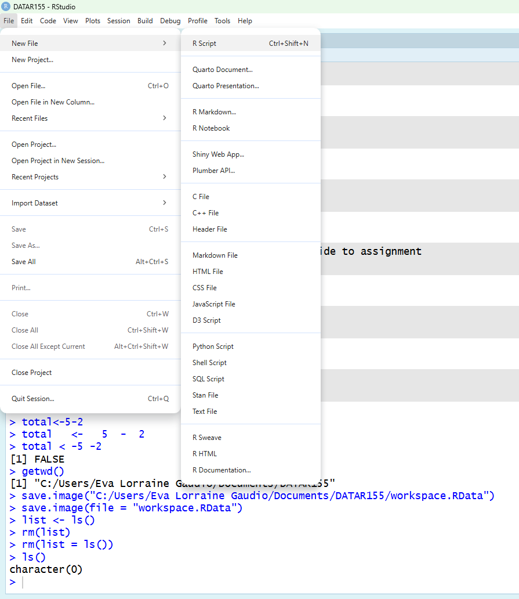
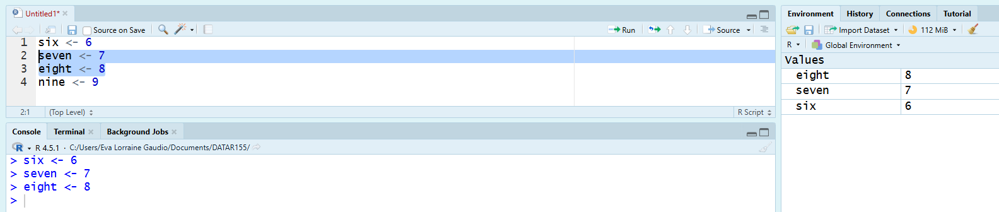
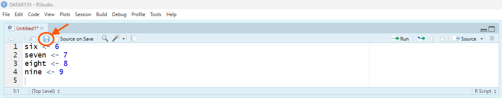

## Overview {#overview}

In Chapter 2, you will move from one-off Console commands to scripts, which are the durable record of your work: what you ran, in what order, and why. You will practice writing code in the Source pane and running it into the Console (line-by-line or in blocks) using RStudio’s Run tools and shortcuts. You will also learn how to use comments as memos to document errors and your troubleshooting process (tenacity). You will practice this as you build vectors of several basic types, checks with `mode()` and `length()`, and a simple data frame. 

In Chapter Two you will learn how to:

- 📝 Write and save R scripts.

- 📍 Run code from a script or the console.

- 💪 Practice tenacity by documenting challenges, what you tried, and what you learned in memos.

- 🛠 Build numeric, integer, character and logical vectors using `c()` and `seq()`

- 🔍 Check the mode and length of any vector object.

- 📊 Create a data frame from vectors.

---

## Script Editor (Source) {#script-editor}

Documenting your work allows you and others to understand how you came to your results. This book introduces R scripts, R Markdown documents, and Quarto documents as ways to document an analysis. These files preserve your code and comments, creating a record of how and why you arrived at your results. You can create, edit, and run these files in the Script Editor, also called the Source pane, in RStudio.

### Console vs Script Editor {#console-vs-script}

The [Console]{.glossary-term data-term="Console Pane"} is where you can type and run R commands one at a time. It is useful for quick calculations, testing small pieces of code, and exploring data interactively. RStudio may retain a history of Console commands, but that history is not an organized record of the analysis or the reasons behind your decisions.

An [R Script]{.glossary-term data-term="R Script"} is a plain text file that contains a series of R commands. The script acts as a static record of the analysis. If the data or method change later, the original script preserves the logic used for your initial findings. The inclusion of comments (lines that begin with `#`) allows you to explain the *why* behind your code, detailing assumptions, data transformations, and the rationale for specific analytical choices. 

Think of programming like writing a recipe. Using the Console is like adding ingredients on the fly without recording the steps. Using an R script is like writing the recipe step by step so you can return to it, revise it, and share the recorded process with others. Comments act as notes in the margins of the recipe card.

### Create an R Script {#create-script}

There are two primary ways to create a new R script in RStudio. You can use either method.

Method A. [File Menu]{.glossary-term data-term="File Menu"}

1. Go to the File menu at the top left of RStudio.

2. Select New File and then R Script. 



Method B. **Keyboard Shortcut**

1. Use the keyboard shortcut Ctrl + Shift + N (or Cmd + Shift + N on a Mac).

🎯 Open a new R Script.

```{r, eval=FALSE}
# Create a new script 
```

🗣 An empty script opens in the Script Editor (also called the Source pane). 

```{r, eval=FALSE}
# ⚡ Type this in your R Script
six <- 6
seven <- 7
eight <- 8
nine <- 9
```

### Run Code {#run-code}

🎯 Place your cursor on each line and click Run (or press Ctrl+Enter on Windows/Linux or Cmd+Return on macOS) to send that line to the Console where it executes.


```{r, eval=FALSE}
# Run one line
```

🎯 Select multiple lines to run them together.




```{r, eval=FALSE}
# Run multiple lines at the same time
```

🎯 Click Source to run the entire script at once.


```{r, eval=FALSE}
# Source the entire script
```

### Save Your Script {#save-script}

Saving your R script preserves the instructions (your code and comments), not the objects in your Environment. This matters because when you restart R or switch computers your Environment can disappear. Your script is a document of your work. A saved script preserves the code and comments needed to inspect and rerun the recorded steps.

R scripts use the `.R` file extension. This extension helps RStudio and your computer recognize the file as an R script.

There are two primary ways to save your script. You can use either method.

Method A. **Save icon**

1. Click the Save icon (floppy disk) in the toolbar of the Script Editor pane.



Method B. **File Menu**

1.  Go to the File menu at the top left of RStudio.

2. Select Save As....

```{r, eval=FALSE}
# Save your script in your course folder (e.g., DATA-R155)
# File name: chapter2_notes
# Save a type: R
```

> 🧐 **Notice:** The `.R` file extension identifies the file as an R script.

```{r eval=FALSE}
# ✅ Verify that `chapter2_notes.R` is in the right folder.
```

💡 **Tip:** “Working directory” controls where R looks for files when you use relative paths, but you can still accidentally save a script somewhere else if you choose the wrong folder in the Save dialog. Keep files for the same project together so you can find and rerun your work.

💡 **Tip:** When your script is unsaved, RStudio typically shows an asterisk (*) in the script tab and the file name is red, which means you have changes that are not saved yet. 

___ 

📖 **Review**

Recall that objects are names that store elements in R. You can use objects in calculations just like you would use numbers.

```{r, eval=FALSE}
# ⚡ Type this in your R Script
# The Incident: Why is 6 afraid?
seven_eight <- seven + eight

# The Result:
the_aftermath <- seven_eight - nine
```

```{r eval=FALSE}
# ✅ What number should be scared?
print(the_aftermath)
```

___

🎯 Run in order from top to bottom so that objects exist before you use them.

```{r, eval=FALSE}
# Select and run in order
```

🛠 **Break Things!** Order matters when editing and running code from a script. 

Pretend that you decided to change the name of `seven + eight` to `seven.eight`. 

🎯 Edit your script. 

```{r, eval=FALSE}
# Edit the object name
seven.eight <- seven + eight
the_aftermath <- seven.eight - nine
```

Go back to your script and run ONLY `the_aftermath` line (without running the lines above it).

```{r, eval=FALSE}
# Run only this line
the_aftermath <- seven.eight - nine
```

✍️  Error: object 'seven.eight' not found. 🗣 This is an error because `seven.eight` has not been created yet in this session.

🚧  [Errors]{.glossary-term data-term="Error"} prevent code from running. 

🤔 No Error? This example may not error if you already ran `seven.eight <- seven + eight` before `the_aftermath <- seven.eight - nine`. Another way you can produce the error is by clearing the Environment before testing. 🧹 Sweep your environment and run code out of order.

💡 **Tip:** A reliable script should run from top to bottom without unexpected errors. Regularly test your script by clicking Source to confirm that each object is created before it is used.

In R, an error message is not a judgment. It is the computer telling you exactly what it cannot do *yet*. Learning to read errors calmly and then adjusting your next step is a core part of learning to code. 

---

Next, you will learn how to use comments as memos to document when you encounter errors. 

## Memo in R Scripts {#memos}

To add comments in an R script, simply use the "#" symbol at the beginning of a line to indicate that the following text is a comment and should be ignored by the R interpreter.

You can add a line break to a long comment by using the # symbol on each new line. This is necessary because R interprets everything on a single line after the first # as part of the comment. For example:

```{r}
# This is a comment. Notice the "#" at the beginning of the line.

# Comments often explain something about the code or your thinking.
# Use comments like these to document your process.

# Break the comment into several lines to keep the message readable.
```

### Explain Your Thinking {#explain-thinking}

A study of students reading Java code examples found that those prompted to type self-explanations performed better on a code-comprehension task than those prompted only to read the code and predict its output (Rus et al., 2021). As you work through examples, document insights, hunches, hypotheses, and questions about how the code works. 

1. **Forethought** before action. Before running code, write a brief note about the 🎯 Goal the code should accomplish, make a 💬 Prediction about what you expect to happen, or identify a 🧠 motivational belief that supports persistence.

2. **Performance** monitoring during action. ⚡ Compose and run the code, then ✅ Check what happened. Use 🚀 code trials while debugging, and ✍️ keep a record of what you tried, even when it did not work.

3. **Self-reflection** after action. After getting the code to work, 🗣 Comment on what you learned, what surprised you, or what questions remain. 🪞 Reflect on your learning process and what you will do next time. 

Icons for these strategies appear throughout the chapters to model the process. Each chapter highlights particular memoing practices. This chapter focuses on documenting tenacity.

---

Now that you know how to write and run code in a script, you will likely encounter errors. Tenacity is the learning skill that helps you persist through those errors and learn from them.

## Tenacity {#tenacity}

To successfully learn R programming, you will need to persist through difficulties, revise code, and know when to seek help after genuine effort. Tenacity is the learning skill that shows up when you persist through obstacles (confusion, errors, frustration), revise your approach, and know when to seek help after genuine effort rather than quitting too early or grinding aimlessly (King, 2021; Baehr, 2022). Tenacity is not “never give up.” It’s productive persistence.

### Why R is Challenging {#why-r-challenging}

R requires precise syntax. Small mistakes, such as a missing parenthesis, a comma in the wrong place, or a misspelled object name, can produce errors. Those errors provide information about what R could not interpret or complete.

You may have already encountered friction in exactly the places beginners expect to be “simple”:

- Installing or updating R/RStudio

- Saving scripts in the intended folder and finding them again

- Creating objects and then getting object not found errors

If you treat every error as evidence you “can’t code,” you will stall. Tenacity is what keeps you moving long enough for the patterns to become familiar (King, 2021).

### Getting Stuck {#getting-stuck}

**Two Ways of Getting Stuck**

1) Giving up too early (irresolution).

This looks like skipping checks, continuing “halfway,” or abandoning the task the moment you feel lost (King, 2021). In R, that often becomes: running code you don’t understand, hoping it works, and stacking confusion.

2) Pushing too long (intransigence).

This looks like repeating the same approach for too long even though it isn’t working, refusing to change strategy, and refusing help (King, 2021). In R, that often becomes: re-running the same broken line 30 times.

Tenacity lives in the middle: persist, then recalibrate.

### Document Tenacity {#document-tenacity}

When you encounter a challenge, document your tenacity in a memo. Your memo will show a running log of what you tried and how you resolved the issue.

#### ✍️ Record what you tried {#record-what-you-tried}

Recording your learning process in a memo can help you avoid repeating unsuccessful attempts, understand why a solution worked, and preserve discoveries you did not anticipate.

When you encounter an error: 

1. **Comment out the code line(s) that produced the error** by adding a `#` at the beginning of the line. This is really important. You want to keep the code visible for reference, but your script must not produce an error.

2. **Copy and paste the error message** below the commented line.

3. **Comment out the error message** by adding a `#` at the beginning of each line.

4. **Add a brief comment explaining** what you think caused the error or how you will resolve it. This can come from your own reasoning or from external resources you consulted (peers, instructors, online resources, AI tools, etc.). Be sure to cite any resources you used. See the **Cite Your Resources** section below for guidance.

5. On a new line, compose the code that you believe will run without error. If the error is not resolved, repeat these steps with a different approach or decide that it is time to seek help.

___

🧩 **Memo Example**

Below is a common beginner error along with memos documenting the tenacity process.

```{r eval=FALSE}
# 🧩 Example 1
# 3.008+7*24)
# Error: unexpected ')' in "3.008+7*24)"
# memo: This error is because the ) is a typo. 
3.008+7*24
```

> 🧐 **Notice:** The student (1) ✍️ kept but commented out (`#`) the code with the error, (2) ✍️ copied and pasted the error from the console, (3) 🗣 composed a memo that recognized the unexpected parenthesis as a typo and (4) ⚡ composed new code that removed it to fix the error.

*Memo examples like this one are provided throughout the chapters.* 

___

💡 **Tip:** You can quickly comment/uncomment selected lines with Ctrl+Shift+C (Windows/Linux) or Cmd+Shift+C (macOS).

### 👀 Cite Your Resources {#cite-resources}

R syntax can be challenging, unforgiving even. Students often spend hours debugging simple issues. Knowing how R interprets your code helps avoid mistakes. Errors are usually simple but hard to spot alone. That’s normal.

Before you seek help, document three things in your script memo:

1. 🎯 State what you were trying to do.

2. ⚡ Preserve the code you tried, even if it did not produce the result you wanted. 

3. ✍️ State what you understand so far and what you are confused or curious about.

Once you decide to seek help, choose a resource that fits the problem: a peer, your instructor, R’s help files, reputable online documentation, or an AI tool. No matter what you use, cite it in your memo so your learning is traceable and your work is honest.

In your script, always include:

1. **Who/what helped you** (person, website, help file, AI tool, etc.).

2. **How it helped you** (what you changed, what you learned, what you verified).

Use external help to understand and learn. Follow your instructor’s guidelines for permitted assistance. When a resource suggests code, inspect it, type and test it yourself, and document how the resource helped you.

🧩 **Memo Example**

```{r eval=FALSE}
# 🧩 Example 2
# logicals2 <- c( 1>2, 3<5, 4=4 )
# error: Error: unexpected '=' in "logicals2 <- c( 1>2, 3<5, 4="
logicals2 <- c( 1>2, 3<5, 4==4 )
# memo: I wanted to compare 4 and 4, but I used = instead of ==.
# memo: I changed = to == because == compares two values.
logicals2
# memo: The Console returned [1] FALSE TRUE TRUE.
# memo: This means 1 > 2 is false, 3 < 5 is true, and 4 == 4 is true.
```

> 🧐 **Notice:** The student (1) ✍️ kept but commented out the code that produced the error, (2) ✍️ recorded the error message, (3) 🗣 explained what caused the error, (4) ⚡ revised the code, and (5) ✅ checked and explained the result.

___

We turn to building basic objects next. As you work through the exercises, practice documenting your tenacity in a memo whenever you encounter an error or do not fully understand.

## Vectors {#vectors}

So far, we have only stored single numbers in objects. These single-element numeric objects are often called [scalars]{.glossary-term data-term="Scalar"}. R can also store collections of values in a single object.

```{r, eval=FALSE}
# ⚡ Type this in your R Script
scalar <- 42
```

An [atomic vector]{.glossary-term data-term="Atomic Vector"} is a one-dimensional object that stores an ordered collection of values ([elements]{.glossary-term data-term="Element"}), all of the same basic type. For simplicity, I will simply use the word [vector]{.glossary-term data-term="Vector"}. A vector is like a row in a spreadsheet: a single dimension of related values.

Let's use `c()`, `:`, and `seq()` to create vectors of different storage types: numeric, integer, and character. 

### Numeric Vectors with `c()` {#numeric-vectors}

[Numeric vectors]{.glossary-term data-term="Numeric Vector"} store an ordered collection of numbers. So far, we have only stored single numbers in objects. 

Vector Method A. Use the `c()` function to combine (or "[concatenate]{.glossary-term data-term="Concatenate"}) values into a single vector.

🎯 Create a numeric vector named `numbers3` that contains three values, including decimals and a negative number, using the `c()` function.

```{r , eval=FALSE}
# ⚡ Type this (or something similar) in your R Script
numbers3  <- c(1.5, 2.5, -3.5)                # Numeric with decimals and negative
```
```{r , eval=FALSE}
# ✅ Check that numbers3 was created 
print(numbers3)
```

🗣 The output shows the three numbers stored in the `numbers3` vector.

> 🧐 **Notice:** The Environment pane displays `numbers3` as `num [1:3]`. `num` indicates that it is a numeric vector, and `[1:3]` indicates that it contains three elements. The elements appear in the order in which you entered them.

### Integer Vectors with `c()` {#integer-vectors}

[Integer vectors]{.glossary-term data-term="Integer Vector"} store an ordered collection of whole numbers. In R, integers are typically written with an `L` suffix.

🎯 Create a vector named `cursed_seq` that contains the integer values 4, 8, 15, 16, 23, and 42 using the `c()` function.

```{r , eval=FALSE}
# ⚡ Type this in your R Script
cursed_seq <- c(4L, 8L, 15L, 16L, 23L, 42L)          # Integer via c()
```

```{r , eval=FALSE}
# ✅ Check that cursed_seq was  created
print(cursed_seq)
```

🗣 The output shows the integer values stored in the `cursed_seq` vector. 🎬 Optional aside: Don't get *Lost* with these numbers that aren't a perfect mathematical progression.

### Sequences with `:` {#sequences}

Vector Method B. Use `:` to create a simple sequence that changes by 1.

🎯 Create a numeric vector named `combination` that contains the integer values from 1 to 5 using the `:` operator.

```{r , eval=FALSE}
# ⚡ Type this in your R Script
combination <- 1:5                             # integer via :
```
```{r , eval=FALSE}
# ✅ Check that combination contains 1, 2, 3, 4, and 5 in order.
print(combination)
```

🗣 The output shows 1 2 3 4 5 in order. 🎬 Optional aside: 1, 2, 3, 4, 5? That's amazing! I've got the same combination on my luggage. (Yes, it’s a famous movie joke. Ignore it if you don’t recognize it.)

Vector Method C. Use `seq()` for custom steps.

📜 The SYNTAX (basic): 

`seq(from = 1, to = 10, by = 1)`

🎯 Create a numeric vector named `travel_jumps` that contains the numbers from 1887 to 2052 with steps of 33 using the `seq()` function.

```{r , eval=FALSE}
# ⚡ Type this in your R Script
travel_jumps <- seq(from = 1887, to = 2052, by = 33)   # numeric via seq()
```

```{r , eval=FALSE}
# ✅ Check that travel_jumps contains the correct sequence.
print(travel_jumps)
```

🗣 The output shows the sequence of numbers stored in the `travel_jumps` vector. 🎬 Optional aside: Everything is connected. Everything is built on the number 33. It's Dark.


### Character Vectors with `c()` {#character-vectors}

[Character vectors]{.glossary-term data-term="Character Vector"} store text strings, which are sequences of characters enclosed in quotes. Character vectors can include letters, numbers, symbols, and spaces. They are often used to represent names, labels, or any other textual data.

Character values can be enclosed in double quotation marks `"` or single quotation marks `'`. Use matching quotation marks around each value. Commas that separate the vector’s elements belong outside the quotation marks.

🎯 Create a character vector named `activation_code` that contains the following words: Longing, Rusted, Seventeen, Daybreak, Furnace, Nine, Benign, Homecoming, One, and Freight Car using the `c()` function.

```{r , eval=FALSE}
# ⚡ Type this in your R Script
activation_code <- c("Longing", "Rusted", "Seventeen", "Daybreak", "Furnace", "Nine", "Benign", "Homecoming", "One", "Freight Car")
```

```{r , eval=FALSE}
# ✅ Check the activation_code vector
print(activation_code)
```

🗣 The output shows the ten words stored in the `activation_code` character vector. 🎬 Optional aside: Ready to comply? Does this word list make the example memorable?

R can use recognized color names stored as character values when specifying colors in plots and graphics.

🎯 Create a character vector named `rainbow` that contains six color names using the `c()` function.

```{r , eval=FALSE}
# ⚡ Type this in your R Script
rainbow <- c("red", "orange", "yellow", "green", "blue",  "violet")
```
```{r , eval=FALSE}
# ✅ Check the rainbow vector
print(rainbow)
```

🗣 The output shows the color names stored in the `rainbow` character vector.

### Adding Elements to Vectors {#adding-elements}

You can add to the end of a vector using the `c()` function.

🎯 Add the color "indigo" to the end of the existing `rainbow` vector.

```{r , eval=FALSE}
# ⚡ Type this in your R Script
rainbow_plus <- c(rainbow, "indigo")
```
```{r , eval=FALSE}
# ✅ Check the rainbow_plus vector
print(rainbow_plus)
```

🗣 The output shows the new `rainbow_plus` vector with `"indigo"` added to the end.

### Logical Vectors {#logical-vectors}

**Logical vectors** are used for conditions and comparisons. They can contain `TRUE`, `FALSE`, and missing values represented by `NA`.

🎯 Create a logical vector named `logicals` that contains the values TRUE, FALSE, and NA using the `c()` function.

```{r , eval=FALSE}
# ⚡ Type this in your R Script
logicals <- c(FALSE, TRUE, TRUE, FALSE, TRUE, TRUE, TRUE, TRUE, TRUE, NA)
```
```{r , eval=FALSE}
# ✅ Check the logicals vector
print(logicals)
```

🗣 The output shows the logical values stored in the `logicals` vector.

---

In the next section, you will learn how to inspect vectors to confirm what they are before using them in your analysis.

## Inspecting Vectors {#inspecting-vectors}

Before using data, we need to confirm *what* it is. 

### Mode of a Vector {#mode-of-vector}

The [mode]{.glossary-term data-term="Mode"} function, `mode()`, reports a broad category such as `"numeric"`, `"character"`, or `"logical"`. Both integer vectors and vectors containing decimal values have the mode `"numeric"`.
The `typeof()` function reports R’s internal storage type. It distinguishes integer values from double-precision numeric values.

🎯 Use the `mode()` function to check the data type of the `activation_code` vector.

```{r , eval=FALSE}
# ⚡ Type this in your R Script
mode(activation_code)
```

🗣 The output shows that the `activation_code` vector is of mode "character," indicating it stores text.

🚀 **Explore and Play:** Try checking the mode of other vectors you created, such as `numbers3`, `cursed_seq`, `combination`, `travel_jumps`, and `logicals`.

```{r , eval=FALSE}
# Check the mode of other vectors in your R Script
```

### Length of a Vector {#length-of-vector}

The [length]{.glossary-term data-term="Length"} function, `length()`, counts elements.

🎯 Use the `length()` function to find the number of elements in the `activation_code` vector.

```{r , eval=FALSE}
# ⚡ Type this in your R Script
length(activation_code)
```

🗣 The output shows the number of elements in the `activation_code` vector, which is 10.

🚀 **Explore and Play:** Try checking the length of other vectors you created, such as `numbers3`, `cursed_seq`, `combination`, `travel_jumps`, and `logicals`.

```{r , eval=FALSE}
# Check the length of other vectors in your R Script
```

## Data frames {#dataframes}

A [data frame]{.glossary-term data-term="Data Frame"} is a two-dimensional table made of rows and columns. Each column is a vector with one underlying type, while different columns can contain different types of values.

We can create a data frame by combining multiple vectors of the *same length* using the `data.frame()` function.

📜 The SYNTAX (basic): 

`data.frame(column1 = c(...), column2 = c(...), ...)`

🎯 Use three vectors created earlier to build a data frame. Each vector contains six elements, so each can become a column with six rows.

```{r , eval=FALSE}
# ✅  Review Vectors 
print(rainbow)
print(travel_jumps)
print(cursed_seq)
```

```{r , eval=FALSE}
# ⚡ Type this in your R Script
# Create the Data Frame
spectrum_shift <- data.frame(
  Vibe = rainbow,
  Year = travel_jumps,
  Code = cursed_seq
)
```

```{r , eval=FALSE}
# ✅ Check the spectrum_shift Data Frame
print(spectrum_shift)
```

🗣 The output shows the `spectrum_shift` data frame with three columns: `Vibe`, `Year`, and `Code`. Each column corresponds to one of the vectors we combined.

---

## Summary {#summary}

In Chapter 2, you learned how to work in an R script: create a new `.R` file in the Source pane, save it in the intended folder, run code in the Console, and use RStudio’s Run tools and shortcuts. You also practiced using comments as memos so your script documents what you tried, what went wrong, and how you responded when you encountered an error.

You built basic R objects, including numeric, integer, character, and logical vectors. You practiced creating vectors with `c()`, `:`, and `seq()`, adding an element to an existing vector, and checking objects with `mode()` and `length()` so you can confirm what kind of data an object contains and how many elements it stores.

Finally, you combined same-length vectors into a simple data frame using `data.frame()`. These skills support a reliable script-based workflow: write code, run it in order, check your objects, document your thinking, and save your work so you can inspect and rerun it later.

## Chapter Terms {#chapter-terms}

**Atomic Vector**: A one-dimensional R vector where all elements must be the same basic type (logical, integer, double/numeric, character, complex, or raw). If you combine different types, R will coerce them to a single type so the vector stays atomic.

**Character Vector**: A vector that stores text strings written in quotation marks, such as `"red"`, `"orange"`, or `"TARDIS Blue"`.

**Concatenate** `c()`: A function that combines values into a single vector. In this chapter, you use `c()` to create vectors and to add a new element to an existing vector.

**Console Pane**: The pane where R executes commands and prints output. Anything you type and run here is evaluated immediately, and messages, warnings, errors, and results appear here.

**Data Frame**: A rectangular table-like object in R. A data frame is made from columns, and each column is a vector. In this chapter, you create a simple data frame by combining vectors with the same length.

**Element**: One individual value stored inside a vector. For example, in `c("red", "blue", "green")`, each color name is an element.

**Error**: A message from R that means the command could not run successfully. Errors are useful information. They help you identify what R could not understand or complete.

**File Menu**: The menu in RStudio used to create, open, and save files. In this chapter, you use the File menu to create and save an R script.

**Hexadecimal Color Code**: A text code that represents a color, usually written with `#` followed by letters and numbers, such as `#FF0000` or `#003B6F`. In this chapter, hexadecimal color codes are stored as character values.

**Integer Vector**: A vector that stores whole numbers. In R, integers may be written with an `L` after the number, such as `4L` or `42L`.

**Length** `length()`: A function that counts how many elements are stored in an object. In this chapter, you use `length()` to check how many values are in a vector.

**Logical Vector**: A vector that stores logical values such as `TRUE`, `FALSE`, and sometimes `NA`.

**Memo**: A short comment in your script that explains your thinking, your goal, what the output shows, what went wrong, or what you tried to fix a problem.

**Mode** `mode()`: A function that reports the basic storage mode of an object, such as `"numeric"`, `"character"`, or `"logical"`. In this chapter, you use `mode()` to check what kind of values are stored in a vector.

**Numeric Vector**: A vector that stores numbers, including decimals and negative values.

**R Script**: A plain-text file with the `.R` extension that stores R code and comments. An R script gives you a reusable record of the code you wrote and the order it should run.

**Scalar**: A single-value object. In beginner terms, a scalar is one value stored in an object, such as `scalar <- 42`.

**Sequence Operator** `:`: An operator that creates a sequence of values by ones, such as `1:5`.

**Tenacity**: The learning habit of staying with a coding problem productively. In this chapter, tenacity means documenting errors, trying a reasonable fix, checking the result, and knowing when to seek help.

**Vector**: A one-dimensional object that stores an ordered group of values. In this chapter, vectors are used to store numbers, text, and logical values.

**Workspace**: The collection of objects currently stored in your R Environment. 

## 📝 Practice Space {#practice-space}

Fill in the blanks to complete the code in your R Script.

Before you begin:

1. Create a new R Script in RStudio.
2. Save it in your course folder as `chapter2_practice.R`.
3. Complete all Practice Space tasks in that script.
4. Save your [workspace]{.glossary-term data-term="Workspace"} as `chapter2_practice.RData`.

Files you should save:

- `chapter2_practice.R`
- `chapter2_practice.RData`

As you work, add short comments or memo notes explaining what your code is doing and what the output shows.

If you encounter an error, document your **tenacity** by briefly noting what happened, what you tried, and how you fixed it or what still confuses you.

Before you finish, clear your Environment and run the script from top to bottom. Objects need to be created in sequential order.

Follow your course’s guidelines for permitted AI use. If you use an AI tool, document how it helped you, inspect any suggested code, and verify that the code does what you intend. Type the final code into your script so you practice the syntax and can explain your work.

### Task 0 {#task-0}

Make sure you have created and saved a new R script in the Source pane. Clear the Environment before running the code. When you finish, source the complete script to confirm that it runs from top to bottom without unexpected errors.

Remember to document your **tenacity** in a memo if you encounter errors while completing the tasks.

Save your script before closing RStudio.

### Task 1 {#task-1}

Type this in your R Script. Fill in the blanks.

```{r , eval=FALSE}

# 🎯 Build a numeric vector named `exponents` that contains the numbers between 0.5 and 10 using the `seq()` function.


# ⚡ 
exponents <- __(from = _, to = __)

# ✅ Check the exponents vector
length(_______)
mode(________)

# 🗣 Add Comment: "# The output shows length _ and mode ____."
```

> 🧐 **Notice:** The sequence ends at 9.5 instead of 10. Because `by` is not specified, `seq()` uses a step of 1. After 9.5, the next value would be 10.5, which is beyond the `to = 10` limit.

### Task 2 {#task-2}

Type this in your R Script. Fill in the blanks.

```{r , eval=FALSE}
# 🎯 Create a numeric vector using `:` called `list_numbers` that contains the **integer** values from 1 to 10.


# ⚡
________ <- _ _ _

# ✅ Check the mode and length of the vector
____(list_numbers)
length(________)

# 🗣 Add Comment:  
 
# The length is ___ elements (values).
# The mode is ________.
                 
# 🗣 Add Comment: How does `mode()` report integers and decimals?

```
                 
### Task 3 {#task-3}

R can store hexadecimal color codes in character vectors. [Hexadecimal color codes ]{.glossary-term data-term="Hexadecimal Color Code"} are six-digit codes that represent colors in web design and digital graphics.

Type this in your R Script. Fill in the blanks.

```{r , eval=FALSE}
# 🎯 Create a character vector named `nerdy_palette` that contains the following hexadecimal color codes using the `c()` function.

# ⚡ 
______ __ _("#7F00FF", "#003B6F", "#663399", "#4F97A3", "#FFF8E7", "#000000", "#03A062", "#FF00FF", "#CC0000")

# ✅ Count the number of elements in the nerdy_palette vector 
______(nerdy_palette)


# 🗣 Comment: The output shows there are __ hexadecimal color code elements stored in the `nerdy_palette` vector.
```

### Task 4 {#task-4}

Type this in your R Script. Fill in the blanks.

```{r , eval=FALSE}
# 🎯 Add "#4D9E68" to the end of the existing `nerdy_palette` vector.


# ⚡
nerdy_palette <- c(____, ____)

# ✅ Check the number of elements in the nerdy_palette vector
length(____)
print(____)


# 🗣 Comment: The updated `nerdy_palette` vector contains __ elements. The new element was added to the ___ (beginning, middle, or end).
```

### Task 5 {#task-5}

Type this in your R Script. Fill in the blanks.

```{r , eval=FALSE}
# 🎯 Create a vector named `color_names` that contains the following names: "Octarine," "TARDIS Blue," "Rebeccapurple," "Hooloovoo," "Cosmic Latte," "Vantablack," "Matrix Green," "Source Engine Magenta," "Command Red," and "Impossible Green." Use the `c()` function.

# ⚡ 
color_names __  __(_______ _______ _______ _______ _______ _______ _______ _______ _______ _______)

# ✅ Check the number of elements in the color_names vector
length(________)


# 🗣 Comment: The output shows the __ color names stored in the `color_names` character vector.
```

### Task 6 {#task-6}

Type this in your R Script. Fill in the blanks.

```{r , eval=FALSE}
# 🎯 Create a vector named `origin` that contains "Discworld," "Doctor Who," "CSS/Web Development," "Hitchhiker's Guide to the Galaxy," "Astronomy," "Material Science," "The Matrix," "Video Gaming," "Star Trek," and "Visual Perception." Use the `c()` function.

# ⚡ 
______ __ c_"Discworld", "Doctor Who", "CSS/Web Development", "Hitchhiker's Guide to the Galaxy", "Astronomy", "Material Science", "The Matrix", "Video Gaming", "Star Trek", "Visual Perception"_

# ✅ Check the number of elements in the origin vector
length(_______)

# 🗣 Comment: The output shows the __ origins stored in the `origin` character vector.
```

### Task 7 {#task-7}

Type this in your R Script. Fill in the blanks.

```{r eval=FALSE}
# 🎯 Create a data frame using `data.frame()` named `nerdy_df` that contains three columns: "Color" (`color_names`), "Hex" (`nerdy_palette`), and "Origin" (`origin`). 

# ⚡ Type this in your R Script. Fill in the blanks.
nerdy_df <- ______(
  ______ = color_names,
  Hex _ nerdy_palette,
  Origin = ______
)

# ⚡ Type this in your R Script, Fill in the blanks
print(______)


# 🗣 Comment: The output shows the `nerdy_df` data frame with three columns: ______, ______, and ______. 
```


## References {#references}

Baehr, Jason. 2022. Deep in Thought: A Practical Guide to Teaching for Intellectual Virtues. Harvard Education Press.

King, N. L. (2021). The excellent mind: Intellectual virtues for everyday life. Oxford University Press.

Rus, V., Akhuseyinoglu, K., Chapagain, J., Tamang, L., & Brusilovsky, P. (2021). Prompting for free self-explanations promotes better code comprehension. In Joint Proceedings of the Workshops at the International Conference on Educational Data Mining 2021 (CEUR Workshop Proceedings, Vol. 3051).
