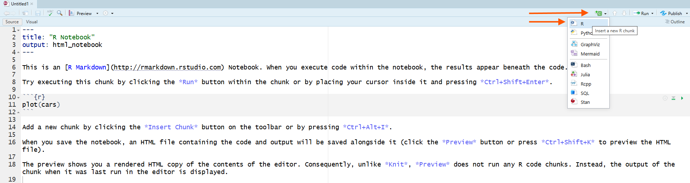
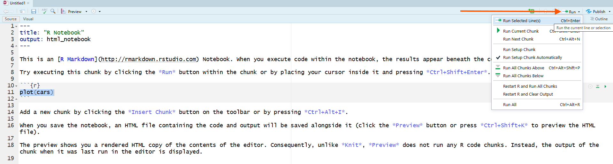
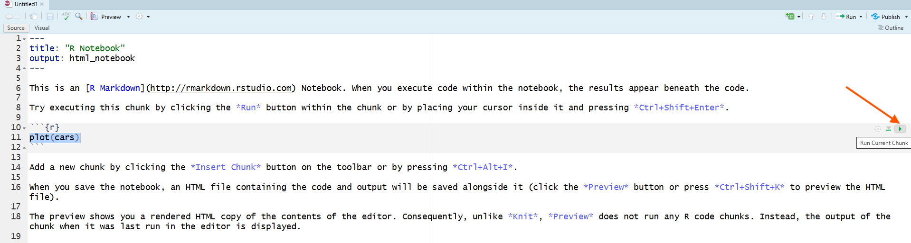
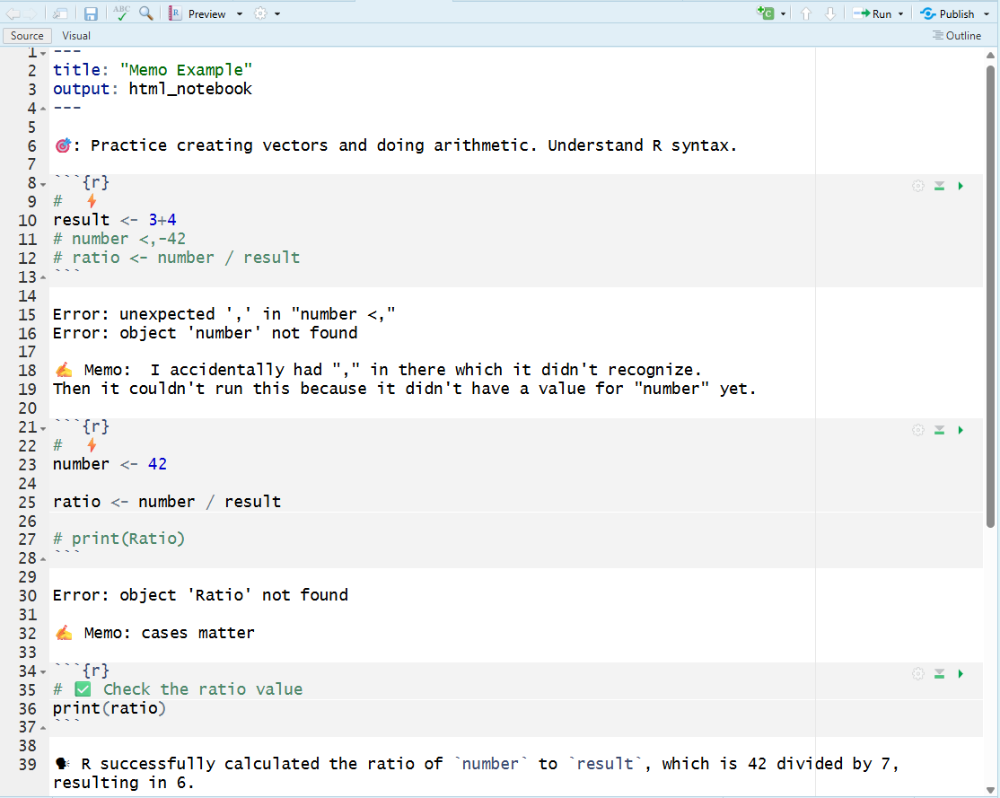
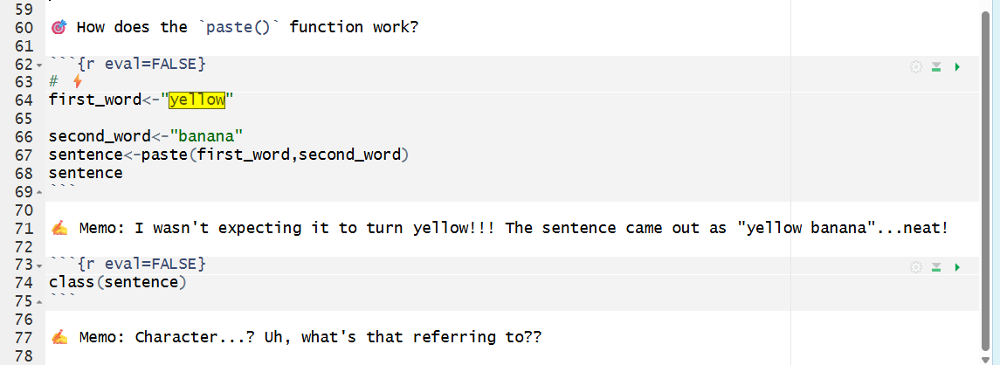

```{r setup, include=FALSE}
knitr::opts_chunk$set(echo = TRUE)
```

# Overview

Up to this point, you’ve been writing code in the Console and saving your work in R Scripts. In this chapter, you switch into an R Notebook (`.Rmd`): one document that combines your writing, your code, and the output produced by that code. This matters for research because the goal is not just to “get an answer,” but to leave a record that another person, or future-you, can follow, audit, and rerun. In other words, the notebook is your first step toward reproducible work.

You’ll also learn what “good memoing” looks like in a notebook. Instead of burying all of your thinking in # comments, you can write short notes near your code that explain what your code is doing and what the output shows. This is a research skill: it makes your work easier to check, easier to debug, and easier to explain.

The coding focus in this chapter is numeric vectors. You will build vectors, check their length, use arithmetic operators, create sequences, and practice vectorized math. These skills matter because vectors are one of the basic building blocks of R. Before working with larger datasets, you need to understand how R stores and works with groups of values.

By the end of Chapter 3, you should be able to start a notebook correctly, write short memos, build numeric vectors, perform vector arithmetic, run your notebook from top to bottom, and save the correct files for submission.

In Chapter Three, you will learn how to:

- 📝 Create, rename, and save an R Notebook (`.Rmd`).

- 📍 Run R code from code chunks.

- 🗣 Write short memo notes that explain what your code does and what the output shows.

- 🛠 Build numeric vectors using `c()`.

- 📏 Check the length of a vector using `length()`.

- 🧮 Perform arithmetic operations on numeric vectors.

- 🔢 Create numeric sequences using `:` and `seq()`.

- 📈 Use vectorized math to create new objects from existing vectors.

- ✨ Use exponents with numeric vectors.

- 🧹 Clear your Environment and run your notebook from top to bottom.

- 💾 Save and submit the correct `.Rmd` and `.RData` files.

----

# R Notebooks—Part 1

An [R Notebook]{.glossary-term data-term="R Notebook"} is an [R Markdown]{.glossary-term data-term="R Markdown"} (`.Rmd`) document where you can run code in [code chunks]{.glossary-term data-term="Code Chunks"} and immediately see the output *directly below the chunk*.

The utility is reproducible thinking: your code, your results, and your memo-style notes live in one place, in order, so someone else (including future-you) can follow what happened.

R Notebooks are similar to R Scripts but offer additional features such as:

- **Interactive Code Execution**: You can run code chunks individually and see the output immediately below the chunk.

- **Rich Text Formatting**: You can use Markdown to format text, add headings, lists, links, and images.

- **Output Display**: The output of code chunks, including plots and tables, is displayed directly in the notebook.

- **Reproducibility**: R Notebooks support reproducible research by allowing you to combine code and narrative in a single document.

## R Script vs R Notebook

In this course, the key advantage of an R Notebook over an R Script is memoing. A script can hold code + `#` comments, but an R Notebook is built for writing full memos (regular text) between code chunks without turning everything into comments. This supports a reproducible workflow (Course Objective CLO1).


| Feature                     | R Script                          | R Notebook                        |
|-----------------------------|----------------------------------|-----------------------------------|
| File Extension              | .R                               | .Rmd                              |
| Code Execution              | Run entire script or line-by-line| Run individual code chunks        |
| Output Display              | Console only                     | Output displayed below code chunks|
| Text Formatting             | Comments only (`#`)              | Full Markdown support             |
| Memoing                     | Limited to comments              | Full memos with text and code     |

## Open a New R Notebook

To open an R Notebook, you will need to install the `rmarkdown` package and then create a new R Notebook file in RStudio. 

### Step 0: Install the rmarkdown package

To use R Notebooks, you need the `rmarkdown` [package]{.glossary-term data-term="Package"} and then create a new R Notebook file in RStudio. A package is an installable bundle of tools—functions, documentation, and sometimes data—that extends what R can do. Most packages are downloaded from CRAN (the main public repository for R packages).

Method A. **Pane with Files tab**

1. In RStudio, go to the `Packages` tab in the bottom-right pane.

2. Click on 📥 `Install`.

3. In the dialog box that appears, type `rmarkdown` in the `Packages` field.

4. Make sure Install dependencies is checked.

5. Click `Install`.

🗣 If installation succeeds, you should see messages in the Console showing what was installed.

Method B. **Console Pane**

1. In RStudio, go to the `Console` pane (bottom-left).

2. Type the following command and press Enter:

```{r , eval=FALSE}
install.packages("rmarkdown")
```

```{r, eval=FALSE}
# After installation, confirm that rmarkdown is installed:
packageVersion("rmarkdown")
```

After installing, please comment out (`#`) the `install.packages()` function. The reason for this will be explained in later chapters. 

```{r , eval=FALSE}
# install.packages("rmarkdown")
```

### Step 1: Open an R Notebook

To create an R Notebook in RStudio:

1. Go to `File` > `New File` > `R Notebook`.

2. An .Rmd file opens in the Source pane.

💡 **Tip:** If your RStudio version does not show “R Notebook,” choose R Markdown. Select HTML Notebook as the output format. The end result is still an R Notebook stored as an `.Rmd` file. 


📖  For more information on R Notebooks, refer to the [Documentation on R Notebooks](https://bookdown.org/yihui/rmarkdown/notebook.html).

## The YAML Header

At the very top of your notebook you will see a block that looks like this:

```yaml
---
title: "Untitled"
output: html_notebook
---
```

This is called the [YAML header]{.glossary-term data-term="YAML Header"} (pronounced “YAM-ul”). It is document metadata—settings that control the notebook’s title and output type. Think of it as the document’s “front label,” not code. 

### Renaming the Notebook

🎯 Edit the title of the notebook to match the assignment

```yaml
---
title: "Chapter 3 Practice"
output: html_notebook
---
```

### Saving the Notebook

🎯 To save your R Notebook:

1. Go to `File` > `Save As...`.

2. Choose your course folder (e.g., `Data-R155`)

3. Name the file `chapter3_notes`.

4. Note that the file extension is `.Rmd`.

✅ Verify you can see `chapter3_notes.Rmd` in the **Files** pane.

## Code Chunks

A [code chunk]{.glossary-term data-term="Code Chunks"} is a fenced block where R code runs. It begins with three [backticks]{.glossary-term data-term="Backtick"} plus `{r}` and ends with three backticks: <code>&#96;&#96;&#96;{r}</code> … <code>&#96;&#96;&#96;</code>.


<code>&#96;&#96;&#96;{r}</code>

\# your R code

<code>&#96;&#96;&#96;</code>

🗣 Code chunks the runnable R code sections inside an R Notebook. Put your code inside of the code chunks, and when you run the chunk, the output will appear directly below it. 

Memos are the notes you write to explain your code and results. In an R Notebook, write memos as regular text between code chunks, without needing to comment them out with `#`. This allows you to keep your code, results, and memos together in one document. 

### Inserting Code Chunks

Method A. **Toolbar Button**

Click the **Insert Chunk** button in the toolbar and choose R from the drop-down list.

In RStudio, the insert chunk button usually looks like a green button with a C or an icon depending on version.



Method B. **Keyboard Shortcut**

Press `Ctrl + Alt + I` (Windows/Linux) or `Cmd + Option + I` (macOS).

Method C. **Manually Type**

Type the following lines in your R Notebook:

<code>&#96;&#96;&#96;{r}</code>

\# your R code

<code>&#96;&#96;&#96;</code>

💡 **Tip:** Remember that these are [backticks]{.glossary-term data-term="Backtick"} and not single quotes. The backtick is located on the same key as the tilde (`~`) on most keyboards, just above the tab button.
  

## Run Code Chunks

Like so many things in R, there are several ways you can run code chunks. 

Method A. **Run Menu**

Click the `Run` menu at the top of RStudio and select `Run Current Chunk` or `Run All Chunks`.



Method B. **Play Button**

Click the green play button (▶) at the top-right of the chunk. 



Method C. **Keyboard Shortcut**

Placing your cursor inside the chunk and pressing `Ctrl + Shift + Enter` (Windows/Linux) or `Cmd + Shift + Enter` (macOS).

### Example: Vector Arithmetic

[Vectorization]{.glossary-term data-term="Vectorization"} is when R applies an operation to each [element]{.glossary-term data-term="Element"} of a vector.

🎯 Insert a code chunk then type and run the following R code to do vector arithmetic. 

```{r}
# ⚡ Type this in your R Notebook
x <- c(2, 4, 6)
y <- c(1, 3, 5)

x + y     # We should see three values: 3, 7, and 11
```


🎯 Click the green play button in the chunk (top-right of the chunk), or use the Run menu to run the current chunk / all chunks.

🗣 There is an output in the code chunk that shows the result of adding the two vectors element-wise: (2 + 1 = **3**; 4 + 3 = **7**; 6 + 5 = **11**).

```{r eval=FALSE}
#  ⚡ Type this in your R Notebook
x * 2
x / y
```

```
[1]  4  8 12
[1] 2.000000 1.333333 1.200000
```

🗣 When including two calculations in the same code chunk, both results are shown in order, below the code chunk. 

🎯 Try creating a sequence of powers of 3 using the exponent operator `^`. Create a vector named `small_exponents` that contains the integers from 0 to 4, then create a new vector named `powers_of_three` that raises 3 to the power of each element in `small_exponents`.

```{r}
# ⚡ Type this in your R Notebook
small_exponents <- 0:4
powers_of_three <- 3 ^ small_exponents

powers_of_three
length(powers_of_three)
```

🗣 R reads `3 ^ small_exponents` as “raise 3 to each value stored in `small_exponents`.” The vector `small_exponents` tells R which exponents to use. The length tells us how many powers were created, not how large the biggest value is.

---

🌳 For more information on R Markdown code chunks, refer to the [R Notebook documentation](https://bookdown.org/yihui/rmarkdown/notebook.html#using-notebooks).

----


As you practice R programming in the R Notebook, please keep a record of your learning process. Memoing is a lot easier in R Notebooks than in R Scripts! 🥳


# Memoing in R Notebooks

The code chunk is like a mini R Script. Inside a code chunk, memo text must start with # or R will try to run it as code (and may error). Treat `#` like a “do not execute” marker for the computer.

> 🧐 **Notice:** Text outside code chunks does not have `#` because it is regular paragraph writing. R will not try to run it as code.

We use [Markdown]{.glossary-term data-term="Markdown"} in this course so you can write memos as readable paragraphs instead of a wall of `#` comments. Markdown is a simple formatting syntax that allows you to create headings, lists, links, and more in plain text. In R Notebooks, you will write Markdown text **between** code chunks to explain your thought process, document your findings, and provide context for your code.

🎯 Click on a blank line outside the chunk and type something like:

- 🎯 Goal: Practice creating vectors and doing arithmetic.

- ✅ Verify: I should see three outputs: `x + y`, `x * 2`, and `x - y`.

- ✍ Memo: Document your learning process. What did you discover? What challenges did you run into?

- 🗣 Explain: Vector math happens element-by-element, so the first result adds the first elements together, then the second, then the third.

___

💬 What does this look like in practice?

🧩 **Memo Example**



> 🧐 **Notice:** The student (1) ✍️ kept but commented out (`#`) the code with the errors, (2) ✍️ copied the error message and saved it in the notebook as a memo so the troubleshooting process was easily documented, (3) 🗣 composed memos that identified the issues (a typo with a comma, using an object before it was created, and case sensitivity), and (4) ⚡ revised the code to fix the errors. 

___

Now that you can write code in code chunks and memos in regular text, practice recycling vectors while keeping a transparent [research journal]{.glossary-term data-term="Research Journal"}.

### Example: Recycling Vectors

When you perform arithmetic on two vectors of different lengths, R will [recycle]{.glossary-term data-term="Recycling"} the shorter one to match the longer one.

🎯 Create a new vector named `recycled_result` by adding the `combination` vector to the `numbers3` vector.

```{r}
# ⚡ Type this in your R Notebook
numbers3 <- c(1.5, 2.5, -3.5)     # length of 3 elements
combination <- c(1, 2, 3, 4, 5)   # length of 5 elements
recycled_result <- numbers3 + combination
```

⚠️ A **Warning** message may appear indicating that the longer vector length is not a multiple of the shorter vector length. This warning is expected in this example because the longer vector length is not a multiple of the shorter vector length. The code still runs, but in real data analysis this warning is often a sign that you should stop and check whether the vector lengths are what you intended.

```{r}
# ✅ Check the recycled_result vector
print(recycled_result)
```

🗣 R recycles `numbers3` by repeating it as needed: `1.5, 2.5, -3.5, 1.5, 2.5`. Then R adds element-by-element: `1 + 1.5`, `2 + 2.5`, `3 + -3.5`, `4 + 1.5`, and `5 + 2.5`.

___

🧩 **Memo Example**

 

> 🧐 **Notice:** The student 👀 cited the specific AI tool used to help her deepen her understanding and 🗣 explained the final results in her own words.

___

Learning to use an AI tool is part of becoming a modern researcher. However, it is essential to use these tools ethically and [transparently]{.glossary-term data-term="Transparency"}, as discussed in more detail in the next chapter.

---

Next, let's explore how R uses metadata to determine how to treat different types of vectors.

# Vector Types and Classes

In this section you will learn how [class]{.glossary-term data-term="Class"} affects how R interprets an object and decides how it should behave.

## Class and behavior

Recall from chapter 2 that [vectors]{.glossary-term data-term="Vector"} are collections of elements *of one underlying type*. Some vectors also carry a class attribute that changes how R treats them. Classes are built on top of types. `class()` reports the attribute that controls *how* R treats an object and which methods to use when functions are applied to it. It is the semantic type of the object, what the vector is considered to be. The class of an object affects printing, method selection, and how many functions behave. 

For example, an object created with `as.Date()` has the class "Date," which tells R to treat it as a date, even though its underlying mode is numeric.

🎯 Store a date in a variable named today using `as.Date()`. Then use `mode()`, `typeof()`, and `class()` to compare the underlying storage with the way R treats the object.

```{r, eval=FALSE}
# ⚡ Type this in your R Notebook
today <- as.Date("2026-01-01")
print(today)
```

```{r, eval=FALSE}
# ⚡ Type this in your R Notebook
mode(today)
typeof(today)
class(today)
```

🗣 The object `today` is stored underneath as a number, but its class is `"Date"`. The class tells R to print it and work with it as a date.

Why does this matter? Even though the date is stored underneath as a number, R does not treat it like an ordinary number because its class is `"Date"`.

🎯 What date will it be in one week?

```{r, eval=FALSE}
# ⚡ Type this in your R Notebook
today + 7
```

🗣 R treats `7` as seven days and returns the date one week after `today`.

## Types vs Classes

Every object has an [underlying type]{.glossary-term data-term="Underlying Type"}; some objects also have a class attribute that changes behavior. So far, you've seen numeric, integer, and character underlying types. `class()` often matches the underlying type label. 

**Common Atomic Vector Types:**

- **double**: numeric numbers (e.g., `1`, `3.14`)

- **integer**: whole numbers (e.g., `1L`, `2L`)

- **character**: text strings (e.g., `"Hello World", "R is fun"`)

- **logical**: `TRUE` or `FALSE` values

- **complex**: complex numbers (e.g., `1 + 2i`)


**Other object structures you will see later:**

- **numeric**: includes both double and integer types (e.g., `42`, `3.14`)

- **Date**: dates (e.g., `as.Date("2026-01-01")`)

- **[factor]{.glossary-term data-term="Factor Class"}**: categorical data (e.g., `"red"`, `"blue"`) is
  a special type of character vector used for categorical data.
  
- **list**: a collection of objects (e.g., `list(a = 1, b = "text")`)
  
- **matrix**: a two-dimensional array (e.g., `matrix(1:6, nrow = 2)`)

- **array**: a multi-dimensional array (e.g., `array(1:12, dim = c(2, 3, 2))`)

- **data.frame**: a table-like structure (e.g., `data.frame(name = c("Alice", "Bob"), age = c(25, 30))`)

## Character strings

A character string{.glossary-term data-term="Character String"} is a sequence of characters (text) enclosed in quotes. They are used to represent text data in R.

The `paste()` function in R is used to concatenate (combine) strings together. It takes multiple string arguments and combines them into a single string, with an optional separator between them.

___

🧩 **Memo Example**



> 🧐 **Notice:** The student (1) 🗣 composed a memo expressing confusion about the term "character." This is a useful memo because the student identified a specific point of confusion instead of skipping over it. A strong next step would be to review the course materials, ask a peer or instructor, or use an approved AI tool and document what helped. Then return to the practice space and document what was discovered.

___


`paste()` works across vectors too, combining elements element-wise.

🎯 Create two character vectors named `first_names` and `last_names`, then use the `paste()` function to combine them into a new vector named `full_names`.

```{r , eval=FALSE}
# ⚡ Type this in your R Notebook
first_names <- c("Demi", "Snoop", "Ed")
last_names <- c("Moore", "Dogg", "Sheeran")
full_names <- paste(first_names, last_names)
```

```{r , eval=FALSE}
# ✅ Check the full_names vector
print(full_names)
```

🗣 The output shows the full names created by combining the first and last names element-wise.

🌳 If you don't want spaces, try `paste0(first_names, last_names)`.

## Factor Vectors (Categorical Data)

A [factor]{.glossary-term data-term="Factor Class"} is R’s way of storing categorical data. Factors store values that come from a fixed set of categories, such as “freshman,” “sophomore,” “junior,” and “senior.” Factors are common in data analysis because they help R treat categories correctly in tables, summaries, and models.

A factor often looks like a character vector, but it is not the same thing. In fact, object *type* will sometimes surprise you!

### Creating Factors

The function `factor()` is used to create factor vectors from character vectors.

📜 The SYNTAX (basic): 

`factor(x)`

Here, `x` is the vector you want to convert into a factor.

🎯 Create a factor vector named `grades` that contains the following letter grades: "A", "B", "C", "A", "B", "A" using the `factor()` function.

```{r}
# ⚡ Type this in your R Notebook
grades <- c("A", "B", "C", "A", "B", "A")
grades <- factor(grades)
```

🗣 The object `grades` is overwritten as a factor using the `factor()` function because the same name is used in the assignment process `grades <-`.

```{r , eval=FALSE}
# ✅ Check the grades factor
mode(grades)
typeof(grades)
class(grades)
print(grades)
```
```
[1] "numeric"
[1] "integer"
[1] "factor"
[1] A B C A B A
Levels: A B C
```

🗣 The output shows that the `grades` object has class `"factor"`. Underneath, R stores the factor using integer codes, even though it prints the category labels. 

### Levels and Ordering

The printed output above displays the [levels]{.glossary-term data-term="Factor Levels"} of the factor, which are the unique categories present in the vector. R may automatically assign levels in alphabetical order unless you specify a different order when creating the factor.

Even though factors print labels that look like text, R stores them underneath as integer codes. `typeof()` shows this precise storage type as `"integer"`. `mode()` may report `"numeric"` because integers are part of R’s broader numeric mode. **Levels** are the distinct categories a factor can take, ordered in a specific way. By default, R usually orders factor levels alphabetically. You can override this default ordering by specifying the levels when creating the factor.

🎯 Create a factor vector named `sizes` with levels ordered as "Small," "Medium," and "Large" using the `factor()` function.

```{r , eval=FALSE}
# ⚡ Type this in your R Notebook
sizes <- c("Medium", "Large", "Small", "Medium", "Large")
sizes <- factor(sizes, levels = c("Small", "Medium", "Large"))
```

```{r , eval=FALSE}
# ✅ Check the sizes factor
print(sizes)
```

🗣 The output shows the `sizes` factor with levels ordered as "Small," "Medium," and "Large," as specified in the `factor()` function.

___

**🧩 Memo Example**


> 🧐 **Notice:** The student (1) ✅ confirmed the original object’s class (character) and then created a factor version, (2) 🔎 checked multiple diagnostics (mode(), typeof(), and levels()) to investigate what changed, (3) ✍️ wrote a memo that pinpointed the exact contradiction (“stored as numbers but prints words”) instead of hand-waving, and (4) 🤖 used an AI tool to research the mechanism and then summarized the explanation accurately in their own words (integer codes + levels labels).

This is a high-quality memo because it captures confusion, gathers diagnostic evidence, and then resolves the confusion with a correct explanation. 

___


Another type of attribute that vectors can have is names. Let's look at named vectors more closely.

### Data Coercion

An atomic vector stores elements of one type. If you try to mix types, R will coerce (convert) them to a common type based on a hierarchy of flexibility.

🎯  What happens if you mix numbers and characters?

```{r , eval=FALSE}
mixed <- c("candy", 4, "book", 92)

# ✅ Check the mixed vector
print(mixed)
class(mixed)
```

🗣  4 and 92 print as character values (in quotes) because the whole vector was coerced to character.

A vector can only hold *one* type. Mixing types triggers [coercion]{.glossary-term data-term="Coercion"} to a common type. For the types used here, R generally moves from logical to numeric to character.


#### Converting Between Types

You can explicitly convert between types using functions like `as.numeric()`, `as.character()`, and `as.logical()`. 

The `as.numeric()` function tries to convert characters to numbers. If it can't, it returns [NA]{.glossary-term data-term="NA"} (not available).

📜 The SYNTAX (basic): 

`as.numeric(x)`


🎯 Try converting a character vector of numbers to numeric using the `as.numeric()` function.

```{r , eval=FALSE}
as.numeric(c("1", "2", "3")) # character → numeric: text converts to numbers
```

🗣 The output shows the numeric values 1, 2, and 3 successfully converted from character strings.


🎯 Try converting the `mixed` vector to numeric using the `as.numeric()` function.

```{r , eval=FALSE}
# ⚡ Type this in your R Notebook
as.numeric(mixed)            # character → numeric: text converts to NA
```

🗣 The output shows `NA` for `"candy"` and `"book"` because those text values cannot be converted to numbers. The character values `"4"` and `"92"` can be converted to numeric values, so they become `4` and `92`.

R will also give a warning because some values could not be converted. A [Warning]{.glossary-term data-term="Warning"} message may appear indicating that the longer vector length is not a multiple of the shorter vector length.


---

# Summary

In this chapter, you learned to create an R Notebook (`.Rmd`), rename and save it correctly, and use code chunks to run R code with output shown directly beneath your work. You practiced memoing in a notebook by writing short, clear notes about what your code does and what the output shows.

You also strengthened your work with numeric vectors. You created vectors with `c()`, checked vector length with `length()`, used arithmetic operators on vectors, and created sequences with `:` and `seq()`. You practiced vectorized math by subtracting one vector from another and using exponents to generate powers of 2.

Finally, you practiced an important reproducible workflow habit: clearing your Environment, running the notebook from top to bottom, checking that your objects are created in the correct order, and saving both your `.Rmd` file and `.RData` workspace for submission.

You should be able to create a basic R Notebook, write short memo notes about your work, build numeric vectors, perform vector arithmetic, and prepare your notebook files for submission. You are ready to test your understanding with the practice exercises.

# Chapter Terms

**Backtick**: The &#96; character (above the Tab key) used for code-related formatting and quoting. In **Markdown**, single backticks mark *inline code* and triple backticks create *fenced code blocks*; in **R Markdown**, backticks also mark *inline R code* (<code>&#96;r ...&#96;</code>), including inside YAML fields like <code>date: "&#96;r Sys.Date()&#96;"</code>, which gets evaluated when you render the document. In R, backticks can also quote non-syntactic names (e.g., names with spaces) so they can be used safely in code.

**Coercion**: The process by which R converts values of different types to a common type when they are combined in a vector. For example, if you combine numbers and characters, R will coerce the numbers to characters.

**Comparison Operators**: Operators that create or combine logical elements. The most common are comparison operators—`==`, `!=`, `<`, `>`, `<=`, `>=`—which return `TRUE`/`FALSE`

**Character Indexing**: Indexing a named vector using element names (character strings) instead of numbers. Names must match exactly; a missing name returns `NA`.

**Character String**: A single piece of text in R, stored as a character value and written in quotes (for example, "My favorite color is yellow!" or "Who stole the cookie from the cookie jar?"). 

**Class** `class()`: A function that reports the object’s class, which tells R how to interpret the object and which methods to use when functions are applied to it. For example, `class(3.14)` returns `"numeric"`, and `class(mtcars)` returns `"data.frame"`.

**Code Chunks**: Fenced blocks in an R Markdown/Notebook document where R code is written and executed, usually starting with ```{r}. Only code inside a chunk runs, and its output (including plots and tables) appears directly below the chunk when executed.

**Element Names**: The individual labels assigned to elements inside a named vector (for example, `"Octarine"` or `"TARDIS Blue"`). Element names let you index by label (e.g., `nerdy_palette["Octarine"]`) to retrieve specific values.

**Factor Class**: An R object class for categorical data, where each value is stored as an integer code that points to a category label. Factors help R handle categories correctly in tables, plots, and statistical models, even though they may print like text.

**Factor Levels**: The distinct category labels a factor can take (for example, `"freshman"`, `"sophomore"`, `"junior"`, `"senior"`). Levels define the set and order of categories, and each factor value is internally stored as the index of its level.

**Indexing Operator**: The square-bracket indexing operator `[` or `[[` are used to extract or replace parts of an object in R (for example, `x[i]`). For vectors, it selects one or more elements and returns the same kind of object as `x` (a vector).

**Logical Vector**: A vector that stores Boolean elements: `TRUE` or `FALSE` (and sometimes `NA` for missing). Logical vectors are commonly produced by comparisons (for example, `x > 0`) and are heavily used for filtering and conditional code.

**Markdown**: A lightweight plain-text formatting syntax used to write structured documents (headings, lists, links, emphasis, code) in a way that stays readable as plain text and can be rendered into formats like HTML on many platforms and tools.

**NA**: A special constant that marks a missing value (“Not Available”)—meaning the data point is unknown or not recorded. R also provides typed missing values like `NA_integer_`, `NA_real_`, `NA_character_`, and `NA_complex_` to match the underlying data type.

**Named Vectors**: Vectors that have labels attached to their elements via the `names()` attribute, so you can refer to values by name instead of only by position. Named vectors are useful as simple lookup tables (for example, retrieving a hex code by a color name).

**Object Name**: The variable name you assign with `<-` that refers to the entire object in your environment. You use the object name to print, modify, or pass the whole object to functions.

**Openness**: Making your analysis inspectable and reproducible by sharing the inputs and decisions that produced your results (data source, packages, code, and key assumptions). In this course, openness means you provide others with enough details so thay are able to rerun your work and get the same outputs.

**Package**: An installable collection of R code—functions, documentation, and sometimes datasets—that adds new features beyond base R. Packages are commonly installed from CRAN and then loaded with `library()` so you can use their tools in your session.

**Positional Indexing**: Indexing a vector using numeric positions (for example, `x[1]` for the first element or `x[c(1, 3)]` for the first and third). Positions are based on the current order of the vector.

**R Markdown**: A document format (`.Rmd`) that mixes plain-text writing (Markdown) with embedded R code chunks, so you can generate reports that combine narrative, code, and computed output. You can render an R Markdown file into finished formats like HTML, PDF, or Word.

**R Notebook**: An `.Rmd` (R Markdown) document that lets you run code in chunks and see the results (output, tables, plots) immediately below each chunk. It’s designed for reproducible work because it keeps your code, results, and explanatory notes together in the same file.

**Recycling**: R’s rule for handling vector operations when the vectors have different lengths. The shorter vector is repeated (recycled) to match the length of the longer vector, then the operation is performed element-by-element. Recycling is safe only when the longer length is an exact multiple of the shorter; otherwise R issues a warning and the result may be unreliable.

**Research Journal**: A running record of your R analysis process. This inlcudes what question you asked, what code you tried (including failed attempts), what outputs you got, and what decisions you made along the way. In practice, it’s maintained in an R script or R Markdown/Notebook with dated notes, comments, and citations so you (or someone else) can retrace, verify, and reproduce the work.

**Transparency**: The practice of clearly disclosing your methods, materials, assumptions, tools, values, and sources so another person can follow your workflow, reproduce your results, and evaluate your claims. In this course, transparency supports explanatory power (you can explain what your code does and why) and originality/accountability (you produce and attribute work honestly, including documenting if and how you used AI).

**Vector**: A one-dimensional object that stores an ordered sequence of elements of the same basic type (for example, all numeric, all character, or all logical). Vectors are the core building block of many R objects, and you create them with functions like `c()`; you can subset them by position or by logical conditions.

**Vector Arithmetic**: Performing mathematical operations directly on vectors. In R, operations like` +`, `-`, `*`, `/`, and `^` are applied element-by-element, so `c(1, 2, 3) + c(10, 20, 30)` returns `c(11, 22, 33)`.

**Vectorization**: R’s behavior of applying a function to an entire vector at once, producing results element-by-element without writing an explicit loop. For example, `paste(first, last)` combines the first elements together, then the second, then the third, returning a vector of full names.

**Warning**: A console message indicating that R did run the command but detected a potential problem. Execution continues and a result is produced, but the output may be incomplete, unexpected, or based on an assumption (for example, coercing types, removing missing elements, or using a function in a way that may not behave as intended).

**YAML Header**: The metadata section at the top of an R Markdown or Quarto document, written between `---` lines, that controls document settings like the title, author, date, output format (HTML/PDF/Word), and options for rendering.

# 📝 Practice Space

Fill in the blanks to complete the code in your R Notebook.

Before you begin:

1. Create a new R Notebook in RStudio.
2. Save it in your course folder as `chapter3_practice.Rmd`.
3. Complete all Practice Space tasks in that notebook.
4. Save your workspace as `chapter3_practice.RData`.

Required files to submit:

- `chapter3_practice.Rmd`
- `chapter3_practice.RData`

As you work, add short comments or memo notes explaining what your code is doing and what the output shows.

- 🗣 **Add Comments** asks you to explain what the code or output shows.
- 🪞 **Reflect** asks you to explain your thinking process, what confused you, what changed in your understanding, or what strategy you would use next.

These are there to help you practice the habit of writing memos as you work. Keep responses short: 1–3 thoughtful sentences is enough. For this Practice Space, answer the 🗣 **Add Comments** prompt for each coding task. Then answer 🪞 **Reflect** prompts where your thinking, prediction, confusion, or troubleshooting changed.

If you encounter an error, document your **tenacity** by briefly noting what happened, what you tried, and how you fixed it or what still confuses you. Document how you troubleshot the error and what resource(s) you used to help you resolve the issue (**transparency**).

You may ask an AI to explain an error or provide you with more details to a curiosity. Do not ask AI to rewrite or complete any part of the report for you. You may quote AI output only when you clearly mark it as quoted text, either with quotation marks or a block quote using `>`. Then hand-type your own explanation of why you are including that quote.

Before you finish, clear your Environment and run the notebook from top to bottom. Then knit to HTML to check that the notebook works in order.

## Task 1

🛠 **Build numeric vectors**

🎯 Build two numeric vectors where both vectors are the same length.

1.  Create a vector called `sales_q1` with FOUR numbers of **your choice** values.

```{r eval=FALSE}
# ⚡ Type this in your R Notebook, Fill in the blanks
sales_q1 <- c(___, ___, ___, ___)
```

2.  Create a vector called `sales_q2` with FOUR numbers of **your choice** values.

```{r eval=FALSE}
# ⚡ Type this in your R Notebook, Fill in the blanks
sales_q2 <- c(___, ___, ___, ___)
```

```{r , eval=FALSE}
# ✅ Check the sales_q1 and sales_q2
print(___)
___(sales_q2)

length(___)
___(sales_q2)
```

🗣 Add Comment:  # The output shows __________

## Task 2

📈 **Vector arithmetic**

Using [vector arithmetic]{.glossary-term data-term="Vector Arithmetic"}, create an object named `growth` that stores the difference between `sales_q2` and `sales_q1`. _💡 **Tip:** An operator is be one of the missing characters._

```{r , eval=FALSE}
# ⚡ Type this in your R Notebook, Fill in the blanks
growth <- ______ _ ______
```

```{r , eval=FALSE}
# ✅ Check the growth vector
print(growth)
```

🗣 Add Comment:  # The output shows __________


## Task 3

🔢 **Exponents and vectorized math**

🎯 Create a numeric vector named `binary_powers` that contains the powers of 2 from \(2^0\) through \(2^{10}\).

First, create a vector that stores the exponent values. Then use that vector on the right side of the `^` operator. 💡 **Tip:** Do not build the exponent vector out of powers. The `exponents` vector will store the exponent positions.

```{r, eval=FALSE}
# ⚡ Type this in your R Notebook, Fill in the blanks

# Step 1: create the exponent values 0 through 10
exponents <- 0:10

# Step 2: raise the base to each exponent value
binary_powers <- 2 ___ exponents
```

```{r , eval=FALSE}
# ✅ Check the length of the binary_powers vector
_____(binary_powers)
print(binary_powers)
```

🗣 Add Comment:  "# The output shows ___ elements (values) in the `binary_powers` vector."

🗣 Add Comments: In 1–3 sentences, explain what `length(binary_powers)` and `print(binary_powers)` show. Include how many values are in the vector and why the first value is 1.

🪞 Reflect: Before running the code, did you expect `2 ^ exponents` to create one answer or many answers? In 1–3 sentences, explain how this task changed or confirmed your understanding of vectorized math in R.

## Task 4

📈 **Subtract one vector from another**

🎯 Find the `anomaly` by subtracting the `cursed_seq` vector from the `travel_jumps` vector. We'll recreate vectors seen in Chapter 2 and then subtract them.

```{r , eval=FALSE}
# ⚡ Type this in your R Notebook
cursed_seq <- c(4L, 8L, 15L, 16L, 23L, 42L)          # Integer via c()
``` 

```{r , eval=FALSE}
# ⚡ Type this in your R Notebook
travel_jumps <- seq(from = 1887, to = 2052, by = 33)   # numeric via seq()
```


```{r , eval=FALSE}
# ⚡ Type this in your R Notebook, Fill in the blanks
anomaly <- __________ - __________
```

```{r , eval=FALSE}
# ✅ Check the anomaly vector
print(anomaly)
```

🗣 Add Comment:  # The output shows __________

_These are just playful example vectors. The important skill is subtracting one vector from another._

## Task 5

🔎 **Check type and class**

A [class]{.glossary-term data-term="Class"} tells R how to interpret an object and how functions should treat it. The `mode()` and `typeof()` functions help you inspect what kind of data R is storing.

🎯 Use `mode()`, `typeof()`, and `class()` to inspect different R objects.

```{r eval=FALSE}
# ⚡ Type this in your R Notebook
lucky_numbers <- c(3, 7, 11, 42)

values <- c("curious", "careful", "honest", "open")
```

```{r eval=FALSE}
# ✅ Check lucky_numbers
mode(__________)
typeof(__________)
class(__________)
```

```{r eval=FALSE}
# ✅ Check values
mode(__________)
typeof(__________)
class(__________)
```

🗣 Add Comments: In 1–3 sentences, explain what `mode()`, `typeof()`, and `class()` showed for `lucky_numbers` and `values`.

🪞 Reflect: Did R treat the number vector and the word vector the same way or differently? In 1–3 sentences, explain what this helped you notice about how R stores objects.

## Task 6

🏷️ **Create and check a factor**

A [factor]{.glossary-term data-term="Factor Class"} helps R treat values as categories instead of ordinary text. [Factor levels]{.glossary-term data-term="Factor Levels"} are the allowed category labels stored inside a factor.

🎯 Create a factor for categorical data, then inspect its class and levels.

```{r eval=FALSE}
# ⚡ Type this in your R Notebook. Fill in the blank.
course_path <- c("Core", "Advanced", "Core", "Core", "Advanced", "Core")

course_path_factor <- ______(course_path)
```

```{r eval=FALSE}
# ✅ Check the factor
class(__________________)
levels(__________________)
print(__________________)
```

🗣 Add Comments: In 1–3 sentences, explain what `class(course_path_factor)` and `levels(course_path_factor)` show.

🪞 Reflect: Why might R need a special class for categorical values instead of treating everything as ordinary character text? Keep your answer to 1–3 sentences.

## Task 7

🧠 **Reflect on coercion**

A single atomic vector can only store one basic data type at a time. When numbers and text are mixed in the same vector, R has to choose one type that can hold all the values. This process is called [coercion]{.glossary-term data-term="Coercion"}.

🎯 Explain why numeric values may be coerced to character values if you mix them inside a single vector.

```{r eval=FALSE}
# ⚡ Type this in your R Notebook
mixed_vector <- c(10, 20, "thirty", 40)
```

```{r eval=FALSE}
# ✅ Check whether coercion happened
print(mixed_vector)
mode(mixed_vector)
typeof(mixed_vector)
class(mixed_vector)
```

🗣 Add Comments: Why does R turn numeric values into character values when numbers and text are mixed inside one vector?

🪞 Reflect: What would you check in R to confirm that coercion happened? Name one function or output you would use.

## Task 8

✅ **Final checks before submitting**

🎯 **Step 1: Sweep your Environment. Start clean.**  
Click the 🧹 **broom icon** in the Environment pane to clear objects.

🎯 **Step 2: Run everything top-to-bottom.**  
Use **Run → Run All** to execute every chunk in order. If an error appears, document what happened, what you tried, and how you resolved it or what still confuses you.

🎯 **Step 3: Knit to HTML.**  
Knit your notebook to HTML to check that the report works from beginning to end.

🎯 **Step 4: Save and submit.**  
After your notebook runs without errors, save your notebook (`.Rmd`) and save your workspace (`.RData`) for submission, as directed.

# References

Resnik, D. B., & Elliott, K. C. (2023). Science, values, and the new demarcation problem. Journal for General Philosophy of Science, 54(2), 259–286.

Thomas, P. A. (2023). Wikipedia and large language models: Perfect pairing or perfect storm? Library Hi Tech News, 40(10), 6–8.
