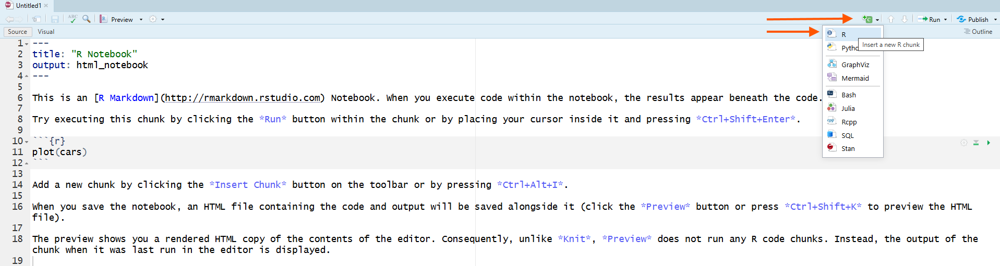
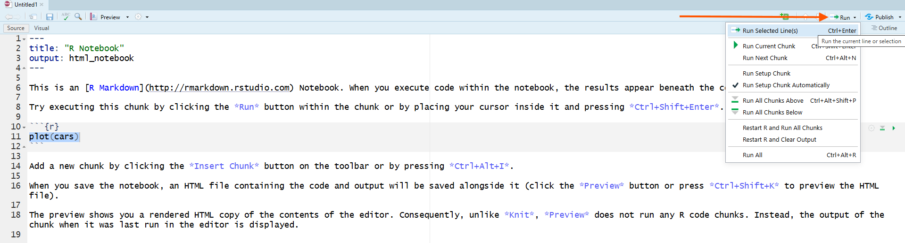
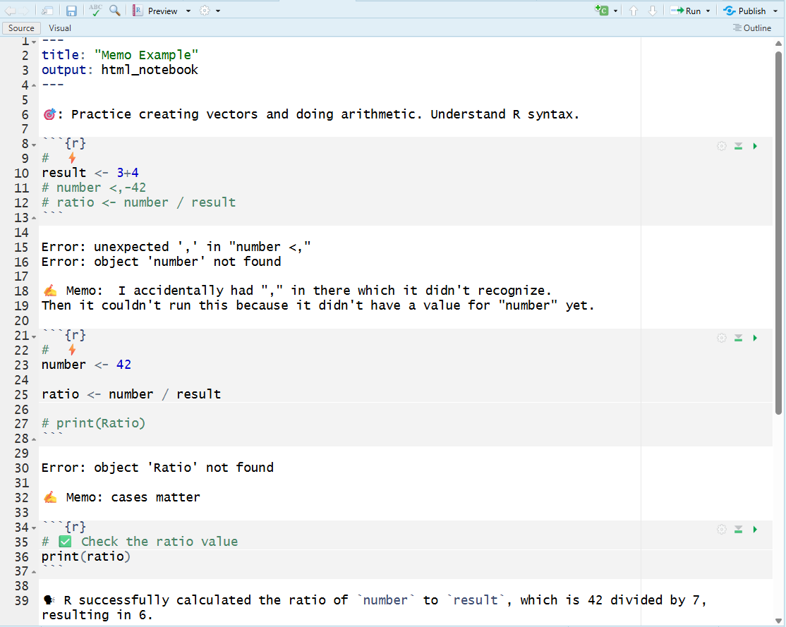
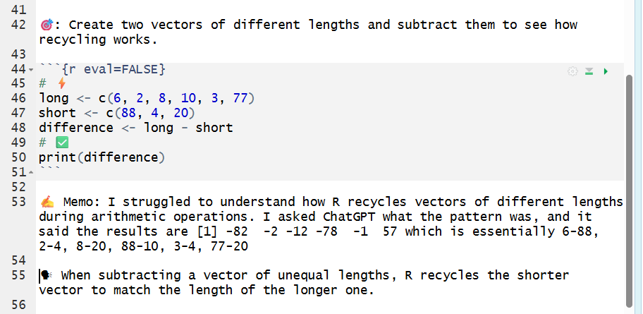
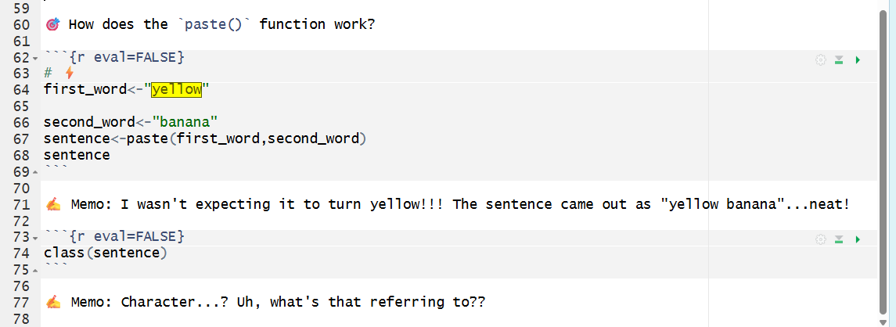

## Overview {#overview}

Up to this point, you have been writing code in the Console and saving your work in R Scripts. In this chapter, you begin working in an R Notebook (`.Rmd`). An R Notebook keeps your writing and code together and lets you view the output alongside them. This record helps another person, or your future self, follow, check, and rerun your work.

You will practice transparency by writing short memos near your code. These memos explain your goal, what the code does, what the output shows, what you checked, and what you are still working to understand. The notebook becomes a record of both your analysis and your learning.

The coding focus is vectors. You will build numeric vectors, perform vectorized arithmetic, create sequences, and work with exponents. You will then examine how `mode()`, `typeof()`, and `class()` describe R objects. Dates, character vectors, factors, and coercion show how an object’s type and class affect the way R stores, prints, and works with its values.

By the end of the chapter, you should be able to create and rerun an R Notebook, document your work with short memos, work with several kinds of vectors, and use checks to explain how R is storing and interpreting your objects.

In this chapter, you will learn how to:

- 📝 Create, rename, and save an R Notebook (`.Rmd`).

- 📍 Run R code from code chunks.

- ✍️ Practice transparency with 🗣 **Comment**, 🪞 **Reflect**, and 👀 **Cite** memos that make your code, output, checks, learning, and resource use visible.

- 🛠 Build numeric vectors with `c()` and check them with `length()`.

- 🧮 Use arithmetic operators, sequences, and exponents with numeric vectors.

- 📈 Explain vectorization and recognize when R recycles a shorter vector.

- 🔎 Use `mode()`, `typeof()`, and `class()` to inspect how R stores and interprets objects.

- 🔤 Create and combine character vectors.

- 🏷️ Create factors and inspect their levels.

- 🔄 Explain coercion and use conversion functions to change an object’s type.

- 🧹 Clear your Environment, run your notebook from top to bottom, and knit it to HTML to verify that the notebook works in order.

----

## R Notebooks—Part 1 {#r-notebooks-part-1}

An [R Notebook]{.glossary-term data-term="R Notebook"} is an [R Markdown]{.glossary-term data-term="R Markdown"} (`.Rmd`) document that combines Markdown writing with R code organized in [code chunks]{.glossary-term data-term="Code Chunks"}. You can run the code interactively and keep your code, output, and explanatory text together in one document.

The utility is reproducible thinking: your code, your results, and your memo-style notes live in one place, in order, so someone else (including future-you) can follow what happened.

R Notebooks are similar to R Scripts but offer additional features such as:

- **Interactive Code Execution**: You can run individual lines, selected lines, or complete code chunks.

- **Rich Text Formatting**: You can use Markdown to format text, add headings, lists, links, and images.

- **Output Display**: Depending on your RStudio settings, output can appear below the chunk or in the Console, Plots, Viewer, or another relevant pane.

- **Reproducibility**: R Notebooks support reproducible research by allowing you to combine code and narrative in a single document.

### R Script vs R Notebook {#r-script-vs-r-notebook}

An R Notebook provides more room for memoing than an R Script. A script can hold code and short `#` comments. An R Notebook also allows full Markdown memos between code chunks. This supports an inspectable and reproducible workflow.

| Feature | R Script | R Notebook |
|---|---|---|
| File Extension | `.R` | `.Rmd` |
| Code Execution | Run individual lines, selected lines, or the entire script | Run individual lines, selected lines, or complete chunks |
| Output Display | Console, Plots, Viewer, or another relevant RStudio pane | Below code chunks or in another RStudio pane, depending on settings |
| Explanatory Writing | `#` comments inside the script | Markdown prose between chunks and `#` comments inside chunks |
| Memoing | Short comments placed near code | Formatted memos placed alongside code and output |

### Open a New R Notebook {#open-a-new-r-notebook}

To open an R Notebook, you will need to install the `rmarkdown` package and then create a new R Notebook file in RStudio. 

#### Step 0: Install the rmarkdown package {#install-rmarkdown-package}

To use R Notebooks, you need the `rmarkdown` [package]{.glossary-term data-term="Package"} and then create a new R Notebook file in RStudio. A package is an installable bundle of tools—functions, documentation, and sometimes data—that extends what R can do. Most packages are downloaded from CRAN (the main public repository for R packages).

Method A. **Packages Tab**

1. In RStudio, go to the `Packages` tab in the bottom-right pane. It is in the same area as the `Files` tab.

2. Click on 📥 `Install`.

3. In the dialog box that appears, type `rmarkdown` in the `Packages` field.

4. Make sure Install dependencies is checked.

5. Click `Install`.

✅ **Check:** If installation succeeds, you should see messages in the Console showing what was installed.

Method B. **Console Pane**

1. In RStudio, go to the `Console` pane (bottom-left).

2. Type the following command and press Enter:

```{r , eval=FALSE}
install.packages("rmarkdown")
```

```{r, eval=FALSE}
# After installation, confirm that rmarkdown is installed:
packageVersion("rmarkdown")
```

> 🧐 **Notice:** `install.packages()` is a setup command. Run it in the Console when the package is not installed. Do not add it to code that runs whenever the notebook runs.

```{r , eval=FALSE}
# install.packages("rmarkdown")
```

#### Step 1: Open an R Notebook {#open-an-r-notebook}

To create an R Notebook in RStudio:

1. Go to `File` > `New File` > `R Notebook`.

2. An .Rmd file opens in the Source pane.

💡 **Tip:** If your RStudio version does not show “R Notebook,” choose R Markdown. Select HTML Notebook as the output format. The end result is still an R Notebook stored as an `.Rmd` file. 

### The YAML Header {#the-yaml-header}

At the very top of your notebook you will see a block that looks like this:

```yaml
---
title: "Untitled"
output: html_notebook
---
```

This is called the [YAML header]{.glossary-term data-term="YAML Header"} (pronounced “YAM-ul”). It is document metadata—settings that control the notebook’s title and output type. Think of it as the document’s “front label,” not code. 

#### Renaming the Notebook {#renaming-the-notebook}

🎯 Edit the title so it describes the work in this notebook.

```yaml
---
title: "Chapter 3 Guided Activity"
output: html_notebook
---
```

#### Saving the Notebook {#saving-the-notebook}

🎯 To save your R Notebook:

1. Go to `File` > `Save As...`.

2. Choose a folder where you keep your R work (e.g., `Data-R155`).

3. Name the file `chapter3_notes`.

4. Note that the file extension is `.Rmd`.

✅ **Check:** Confirm that `chapter3_notes.Rmd` appears in the **Files** pane.

### Code Chunks {#code-chunks}

A [code chunk]{.glossary-term data-term="Code Chunks"} is a fenced block where R code runs. It begins with three [backticks]{.glossary-term data-term="Backtick"} plus `{r}` and ends with three backticks: <code>&#96;&#96;&#96;{r}</code> … <code>&#96;&#96;&#96;</code>.

<code>&#96;&#96;&#96;{r}</code>

\# your R code

<code>&#96;&#96;&#96;</code>

Code chunks are the sections of an R Notebook that contain runnable R code. Put R code inside a chunk. When you run the chunk, RStudio displays the result in the notebook or in another relevant pane, depending on your output settings.

Memos are the notes you write to explain your code and results. In an R Notebook, write memos as regular text between code chunks, without needing to comment them out with `#`. This allows you to keep your code, results, and memos together in one document. 

#### Inserting Code Chunks {#inserting-code-chunks}

Method A. **Toolbar Button**

Click the **Insert Chunk** button in the toolbar and choose R from the drop-down list.

In RStudio, the insert chunk button usually looks like a green button with a C or an icon depending on version.



Method B. **Keyboard Shortcut**

Press `Ctrl + Alt + I` (Windows/Linux) or `Cmd + Option + I` (macOS).

Method C. **Manually Type**

Type the following lines in your R Notebook:

<code>&#96;&#96;&#96;{r}</code>

\# your R code

<code>&#96;&#96;&#96;</code>

💡 **Tip:** Remember that these are [backticks]{.glossary-term data-term="Backtick"} and not single quotes. The backtick is located on the same key as the tilde (`~`) on most keyboards, just above the tab button.
  

### Run Code Chunks {#run-code-chunks}

Like so many things in R, there are several ways you can run code chunks. 

Method A. **Run Menu**

Click the `Run` menu at the top of RStudio and select `Run Current Chunk` or `Run All Chunks`.



Method B. **Play Button**

Click the green play button (▶) at the top-right of the chunk. 


Method C. **Keyboard Shortcut**

Place your cursor inside the chunk and press `Ctrl + Shift + Enter` (Windows/Linux) or `Cmd + Shift + Enter` (macOS).

#### Example: Vector Arithmetic {#vector-arithmetic}

[Vectorization]{.glossary-term data-term="Vectorization"} allows an operation to work directly with a vector instead of requiring you to process one element at a time. In the arithmetic examples below, R applies the operation element by element.

🎯 Insert a code chunk then type and run the following R code to do vector arithmetic. 

```{r}
# ⚡ Type this in your R Notebook
x <- c(2, 4, 6)
y <- c(1, 3, 5)

x + y     # We should see three values: 3, 7, and 11
```


🎯 Click the green play button in the chunk (top-right of the chunk), or use the Run menu to run the current chunk / all chunks.

🗣 **Modeled Comment:** The output shows the result of adding the two vectors element by element: 2 + 1 = **3**, 4 + 3 = **7**, and 6 + 5 = **11**.

```{r eval=FALSE}
#  ⚡ Type this in your R Notebook
x * 2
x / y
```

```
[1]  4  8 12
[1] 2.000000 1.333333 1.200000
```

🗣 **Modeled Comment:** The code chunk contains two calculations, and the results appear in the same order as the calculations.

🎯 Try creating a sequence of powers of 3 using the exponent operator `^`. Create a vector named `small_exponents` that contains the integers from 0 to 4, then create a new vector named `powers_of_three` that raises 3 to the power of each element in `small_exponents`.

```{r}
# ⚡ Type this in your R Notebook
small_exponents <- 0:4
powers_of_three <- 3 ^ small_exponents

powers_of_three
length(powers_of_three)
```

🗣 **Modeled Comment:** R reads `3 ^ small_exponents` as “raise 3 to each value stored in `small_exponents`.” The vector `small_exponents` tells R which exponents to use. The length tells us how many powers were created, not how large the biggest value is.

✍️ **Transparency:** Keep a visible record of your learning as you work. The examples below model 🗣 **Comment**, 🪞 **Reflect**, and 👀 **Cite** memos in Markdown outside code chunks.

## Memoing in R Notebooks {#memoing-in-r-notebooks}

The code chunk is like a mini R Script. Inside a code chunk, memo text must start with # or R will try to run it as code (and may error). Treat `#` like a “do not execute” marker for the computer.

> 🧐 **Notice:** Text outside code chunks does not have `#` because it is regular paragraph writing. R will not try to run it as code.

A 🗣 **Comment** prompt asks for a Markdown memo **outside** the code chunk unless the instructions say otherwise. This differs from an R code comment, which begins with `#` inside a chunk.

[Markdown]{.glossary-term data-term="Markdown"} lets you write memos as readable paragraphs instead of a wall of `#` comments. Markdown is a simple formatting syntax for creating headings, lists, links, and other structured text. In R Notebooks, you can write Markdown text **between** code chunks to explain your thought process, document your findings, and provide context for your code.

Click on a blank line outside the chunk and type a short memo like this:

✍️ **Transparency memo**

- 🎯 **Goal:** Practice creating vectors and doing arithmetic.

- ✅ **Check:** I should see three outputs: `x + y`, `x * 2`, and `x / y`.

- 🗣 **Comment:** The three outputs each contain one result for every position in `x`. R added `x` and `y` element by element, multiplied each value in `x` by 2, and divided each value in `x` by the matching value in `y`.

- 🪞 **Reflect:** I initially expected `x + y` to produce one total. Seeing three values helped me understand that vector arithmetic works position by position.

If a resource helped you understand or troubleshoot the example, add a 👀 **Cite** memo that identifies the resource and explains what it contributed.

___

💬 What does this look like in practice?

✍️ **Transparency Memo Example**



> 🧐 **Notice:** This is a ✍️ transparent record because the student kept the unsuccessful code and error messages visible, wrote memos explaining what caused the errors, revised the code, used ✅ **Check** to run the corrected code, and added a 🗣 **Comment** explaining the final result.

___

Now that you can write code in code chunks and memos in regular text, practice recycling vectors while keeping a transparent [research journal]{.glossary-term data-term="Research Journal"}.

### Example: Recycling Vectors {#recycling-vectors}

When you perform arithmetic on two vectors of different lengths, R will [recycle]{.glossary-term data-term="Recycling"} the shorter one to match the longer one.

🎯 Create a new vector named `recycled_result` by adding the `combination` vector to the `numbers3` vector.

```{r}
# ⚡ Type this in your R Notebook
numbers3 <- c(1.5, 2.5, -3.5)     # length of 3 elements
combination <- c(1, 2, 3, 4, 5)   # length of 5 elements
recycled_result <- numbers3 + combination
```

⚠️ A **Warning** message appears because the longer vector length is not a multiple of the shorter vector length. R still completes the calculation by recycling the shorter vector, but the warning tells you to stop and verify that both vector lengths are what you intended.

```{r}
# ✅ Check the recycled_result vector
print(recycled_result)
```

🗣 **Modeled Comment:** R recycles `numbers3` by repeating it as needed: `1.5, 2.5, -3.5, 1.5, 2.5`. Then R adds element-by-element: `1 + 1.5`, `2 + 2.5`, `3 + -3.5`, `4 + 1.5`, and `5 + 2.5`.

___

✍️ **Transparency Memo Example**

 

> 🧐 **Notice:** The student used 🪞 **Reflect** to identify what was confusing, used 👀 **Cite** to name ChatGPT and explain how it helped, and then added a 🗣 **Comment** explaining in her own words how R recycled the shorter vector.

___

---

Next, examine how R describes an object’s underlying storage and how its class affects the way R prints and works with it.

## Vector Types and Classes {#vector-types-and-classes}

In this section you will learn how [class]{.glossary-term data-term="Class"} affects how R interprets an object and decides how it should behave.

### Class and Behavior {#class-and-behavior}

Recall from Chapter 2 that an atomic vector contains elements of one underlying type. R can describe an object at different levels. `typeof()` reports its specific internal storage type, `mode()` reports a broader storage category, and `class()` reports how R interprets the object and selects methods for it. Some objects, such as dates and factors, have a class that adds meaning to their underlying storage.

For example, an object created with `as.Date()` has class `"Date"`, underlying type `"double"`, and mode `"numeric"`. The `"Date"` class tells R to print and work with the object as a date.

🎯 Store any date in a variable named `start_date` using `as.Date()`. Then use `mode()`, `typeof()`, and `class()` to compare the underlying storage with the way R treats the object.

```{r, eval=FALSE}
# ⚡ Type this in your R Notebook
start_date <- as.Date("2026-08-24")
print(start_date)
```

```{r, eval=FALSE}
# ⚡ Type this in your R Notebook
mode(start_date)
typeof(start_date)
class(start_date)
```

🗣 **Modeled Comment:** `mode(start_date)` returns `"numeric"`, `typeof(start_date)` returns `"double"`, and `class(start_date)` returns `"Date"`. The class tells R to print and work with the object as a date.

Why does this matter? R uses the `"Date"` class to apply date-specific behavior even though the object is stored underneath as a double.

🎯 What date was it one week after `start_date`?

```{r, eval=FALSE}
# ⚡ Type this in your R Notebook
start_date + 7
```

🗣 **Modeled Comment:** R treats `7` as seven days and returns the date one week after `start_date`.

### Types, Modes, and Classes {#types-vs-classes}

Every object has an underlying type. `typeof()` reports the specific internal storage type. `mode()` reports a broader storage category. For example, integer and double vectors both have mode `"numeric"`.

`class()` reports how R should interpret an object. For an ordinary double vector, `typeof()` returns `"double"` while `class()` returns `"numeric"`. For an object with a special class, such as a date or factor, the class adds meaning and affects how functions print and work with it.

**Common Atomic Vector Types:**

- **double**: numbers such as `1` and `3.14`

- **integer**: whole numbers explicitly marked with `L`, such as `1L` and `2L`

- **character**: text strings such as `"Hello World"` and `"R is fun"`

- **logical**: `TRUE`, `FALSE`, or `NA`

- **complex**: complex numbers such as `1 + 2i`

**Classes Used in This Chapter:**

- **Date**: a class for dates, usually built on double storage, such as `as.Date("2026-01-01")`

- **[factor]{.glossary-term data-term="Factor Class"}**: a class for categorical data, built on integer codes and a set of category labels called levels

### Character Strings {#character-strings}

A [character string]{.glossary-term data-term="Character String"} is a sequence of characters enclosed in quotes. Character strings are used to represent text data in R.

The `paste()` function in R is used to concatenate (combine) strings together. It takes multiple string arguments and combines them into a single string, with an optional separator between them.

___

✍️ **Transparency Memo Example**



> 🧐 **Notice:** The student used 🪞 **Reflect** to record an unexpected result and a specific question about the word `"character"`. A useful next step would be to review the chapter, ask a peer or instructor, or consult another resource allowed for the work. If a resource helps, use 👀 **Cite** to identify it and explain what it contributed.

___

`paste()` works across vectors too, combining elements element-wise.

🎯 Create two character vectors named `first_names` and `last_names`, then use the `paste()` function to combine them into a new vector named `full_names`.

```{r , eval=FALSE}
# ⚡ Type this in your R Notebook
first_names <- c("Demi", "Snoop", "Ed")
last_names <- c("Moore", "Dogg", "Sheeran")
full_names <- paste(first_names, last_names)
```

```{r , eval=FALSE}
# ✅ Check the full_names vector
print(full_names)
```

🗣 **Modeled Comment:** The output shows the full names created by combining the first and last names element-wise.

🌳 If you don't want spaces, try `paste0(first_names, last_names)`.

### Factor Vectors (Categorical Data) {#factor-vectors-categorical-data}

A [factor]{.glossary-term data-term="Factor Class"} is R’s way of storing categorical data. Factors store values that come from a fixed set of categories, such as “freshman,” “sophomore,” “junior,” and “senior.” Factors are common in data analysis because they help R treat categories correctly in tables, summaries, and models.

A factor often prints labels that look like character values, but its internal storage and class are different. R stores a standard factor using integer codes and uses its levels to connect those codes with category labels.

#### Creating Factors {#creating-factors}

The function `factor()` creates a factor from a vector. Character input is common because the vector values become category labels.

📜 The SYNTAX (basic): 

`factor(x)`

Here, `x` is the vector you want to convert into a factor.

🎯 Create a factor vector named `grades` that contains the following letter grades: "A", "B", "C", "A", "B", "A" using the `factor()` function.

```{r}
# ⚡ Type this in your R Notebook
grades <- c("A", "B", "C", "A", "B", "A")
grades <- factor(grades)
```

🗣 **Modeled Comment:** The object `grades` is overwritten as a factor using the `factor()` function because the same name is used in the assignment process `grades <-`.

```{r , eval=FALSE}
# ✅ Check the grades factor
mode(grades)
typeof(grades)
class(grades)
print(grades)
```
```
[1] "numeric"
[1] "integer"
[1] "factor"
[1] A B C A B A
Levels: A B C
```

🗣 **Modeled Comment:** The output shows that the `grades` object has class `"factor"`. Underneath, R stores the factor using integer codes, even though it prints the category labels. 

#### Levels and Ordering {#levels-and-ordering}

The printed output above displays the [levels]{.glossary-term data-term="Factor Levels"} of the factor. Levels are the possible category labels a factor can contain. A factor can retain a level even when no current element uses it. Unless you specify `levels`, R generally creates levels from the observed values and orders character labels alphabetically.

Even though factors print category labels, R stores a standard factor underneath as integer codes. `typeof()` reports the internal type as `"integer"`, `mode()` reports the broader mode as `"numeric"`, and `class()` reports `"factor"`. You can control the possible categories and their order by supplying the `levels` argument when creating the factor.

🎯 Create a factor vector named `sizes` with levels ordered as `"Small"`, `"Medium"`, and `"Large"` using the `factor()` function.

```{r , eval=FALSE}
# ⚡ Type this in your R Notebook
sizes <- c("Medium", "Large", "Small", "Medium", "Large")
sizes <- factor(sizes, levels = c("Small", "Medium", "Large"))
```

```{r , eval=FALSE}
# ✅ Check the sizes factor
print(sizes)
```

🗣 **Modeled Comment:** The output shows the `sizes` factor with levels ordered as `"Small"`, `"Medium"`, and `"Large"`, as specified in the `factor()` function.

___

✍️ **Transparency Memo Example**


> 🧐 **Notice:** This is a ✍️ transparent record because the student used ✅ **Check** to compare class, mode, type, and levels; used 🪞 **Reflect** to record the contradiction between integer storage and printed words; and used 👀 **Cite** to identify ChatGPT and summarize what it contributed to the final understanding.

This is a high-quality memo because it captures confusion, gathers diagnostic evidence, and then resolves the confusion with a correct explanation. 

___

Next, examine what happens when values of different types are combined in one atomic vector.

### Data Coercion {#data-coercion}

An atomic vector stores elements of one type. If you try to mix types, R will coerce (convert) them to a common type based on a hierarchy of flexibility.

🎯  What happens if you mix numbers and characters?

```{r , eval=FALSE}
mixed <- c("candy", 4, "book", 92)

# ✅ Check the mixed vector
print(mixed)
class(mixed)
```

🗣 **Modeled Comment:** The values 4 and 92 print as character values because the entire vector was coerced to character.

An atomic vector stores elements of one underlying type. Mixing types triggers [coercion]{.glossary-term data-term="Coercion"} to a common type. A common coercion order is `logical` → `integer` → `double` → `complex` → `character`. R moves toward a type that can represent all the elements.

#### Converting Between Types {#converting-between-types}

You can explicitly convert between types using functions like `as.numeric()`, `as.character()`, and `as.logical()`. 

The `as.numeric()` function tries to convert characters to numbers. If it can't, it returns [NA]{.glossary-term data-term="NA"} (not available).

📜 The SYNTAX (basic): 

`as.numeric(x)`

🎯 Try converting a character vector of numbers to numeric using the `as.numeric()` function.

```{r , eval=FALSE}
as.numeric(c("1", "2", "3")) # character → numeric: text converts to numbers
```

🗣 **Modeled Comment:** The output shows the numeric values 1, 2, and 3 successfully converted from character strings.

🎯 Try converting the `mixed` vector to numeric using the `as.numeric()` function.

```{r , eval=FALSE}
# ⚡ Type this in your R Notebook
as.numeric(mixed)            # character → numeric: text converts to NA
```

🗣 **Modeled Comment:** The output shows `NA` for `"candy"` and `"book"` because those text values cannot be converted to numbers. The character values `"4"` and `"92"` can be converted to numeric values, so they become `4` and `92`.

R also gives the [warning]{.glossary-term data-term="Warning"} `NAs introduced by coercion` because some character values could not be converted to numbers. The warning tells you to inspect the new `NA` values and determine which conversions failed.

---

## Summary {#summary}

In this chapter, you began using an R Notebook to keep writing, code, and output in one inspectable workflow. You practiced transparency by adding short memos that record what your code does, what the output shows, what you checked, and what you learned.

You created numeric vectors with `c()`, checked their length, used arithmetic operators, built sequences with `:` and `seq()`, and applied exponents. You also examined vectorization and recycling, including the warning R gives when vector lengths do not align evenly.

You then used `mode()`, `typeof()`, and `class()` to investigate how R stores and interprets objects. Dates, character vectors, factors, levels, and coercion demonstrated how underlying type and class affect behavior. You finished by clearing the Environment, running the notebook from top to bottom, and knitting it to HTML to verify that the record works in order.

## Chapter Terms {#chapter-terms}

**Backtick**: The &#96; character (above the Tab key) used for code-related formatting and quoting. In **Markdown**, single backticks mark *inline code* and triple backticks create *fenced code blocks*; in **R Markdown**, backticks also mark *inline R code* (<code>&#96;r ...&#96;</code>), including inside YAML fields like <code>date: "&#96;r Sys.Date()&#96;"</code>, which gets evaluated when you render the document. In R, backticks can also quote non-syntactic names (e.g., names with spaces) so they can be used safely in code.

**Coercion**: The process by which R converts values of different types to a common type when they are combined in a vector. For example, if you combine numbers and characters, R will coerce the numbers to characters.

**Character String**: A single piece of text in R, stored as a character value and written in quotes (for example, "My favorite color is yellow!" or "Who stole the cookie from the cookie jar?"). 

**Class** `class()`: A function that reports the object’s class, which tells R how to interpret the object and which methods to use when functions are applied to it. For example, `class(3.14)` returns `"numeric"`, and `class(mtcars)` returns `"data.frame"`.

**Code Chunks**: Fenced blocks in an R Markdown or Quarto document that contain executable code, usually beginning with <code>&#96;&#96;&#96;{r}</code> and ending with three backticks. Code can be run interactively or during rendering. Depending on RStudio settings, output may appear below the chunk or in another relevant pane.

**Factor Class**: An R object class for categorical data, where each value is stored as an integer code that points to a category label. Factors help R handle categories correctly in tables, plots, and statistical models, even though they may print like text.

**Factor Levels**: The distinct category labels a factor can take (for example, `"freshman"`, `"sophomore"`, `"junior"`, `"senior"`). Levels define the set and order of categories, and each factor value is internally stored as the index of its level.

**Markdown**: A lightweight plain-text formatting syntax used to write structured documents (headings, lists, links, emphasis, code) in a way that stays readable as plain text and can be rendered into formats like HTML on many platforms and tools.

**NA**: A special constant that marks a missing value (“Not Available”)—meaning the data point is unknown or not recorded. R also provides typed missing values like `NA_integer_`, `NA_real_`, `NA_character_`, and `NA_complex_` to match the underlying data type.

**Object Name**: The variable name you assign with `<-` that refers to the entire object in your environment. You use the object name to print, modify, or pass the whole object to functions.

**Package**: An installable collection of R code—functions, documentation, and sometimes datasets—that adds new features beyond base R. Packages are commonly installed from CRAN and then loaded with `library()` so you can use their tools in your session.

**R Markdown**: A document format (`.Rmd`) that mixes plain-text writing (Markdown) with embedded R code chunks, so you can generate reports that combine narrative, code, and computed output. You can render an R Markdown file into finished formats like HTML, PDF, or Word.

**R Notebook**: An `.Rmd` document that combines Markdown writing with R code chunks. You can run code interactively and view results below chunks or in another relevant pane, depending on your RStudio settings. Rendering creates a finished document that combines narrative, code, and computed output.

**Recycling**: R’s rule for handling vector operations when vectors have different lengths. R repeats the shorter vector as needed and then performs the operation element by element. If the longer length is not an exact multiple of the shorter length, R issues a warning. If it is an exact multiple, recycling occurs silently, so you should still verify that recycling was intentional.

**Research Journal**: A running record of your analysis and learning process. This includes the questions you asked, code you tried, outputs you received, resources you consulted, and decisions you made. In practice, you can maintain this record in an R Script or R Notebook using notes, comments, checks, and citations.

**Transparency**: The practice of disclosing the methods, materials, assumptions, values, and interests that shaped the work. In an R Notebook, transparency means keeping relevant code, output, decisions, checks, and resource use visible so the process can be examined.

**Vector**: A fundamental R data structure. Atomic vectors store elements of one underlying type, while lists can contain elements of different types and lengths. In this chapter, vector refers primarily to atomic vectors created with functions such as `c()`.

**Vector Arithmetic**: Performing mathematical operations directly on vectors. In R, operations such as `+`, `-`, `*`, `/`, and `^` are applied element by element, so `c(1, 2, 3) + c(10, 20, 30)` returns `c(11, 22, 33)`.

**Vectorization**: Writing an operation so it works directly with a vector instead of processing one element at a time in an explicit loop. In element-wise operations, R pairs corresponding elements and returns a vector of results. Other vectorized functions may summarize or otherwise transform the complete vector.

**Warning**: A console message indicating that R did run the command but detected a potential problem. Execution continues and a result is produced, but the output may be incomplete, unexpected, or based on an assumption (for example, coercing types, removing missing elements, or using a function in a way that may not behave as intended).

**YAML Header**: The metadata section at the top of an R Markdown or Quarto document, written between `---` lines, that controls document settings like the title, author, date, output format (HTML/PDF/Word), and options for rendering.

## 📝 Practice Space {#practice-space}

Fill in the blanks to complete the code in your R Notebook.

Before you begin:

1. Create a new R Notebook in RStudio.
2. Save it in the folder where you keep your Intro to R work as `chapter3_practice.Rmd`.
3. Complete all Practice Space tasks in that notebook.
4. Save your workspace as `chapter3_practice.RData` where you keep your Intro to R work.

✍️ **Transparency:** Write your memo responses as Markdown text outside the code chunks. Keep them near the code and output they explain.

- 🗣 **Comment:** Explain what the code, output, evidence, or decision means.
- 🪞 **Reflect:** Record what you learned, what confused you, what changed in your understanding, or what you would do next.
- 👀 **Cite:** If you use help from a peer, instructor, documentation, website, or AI tool, identify the resource and explain what it contributed. Follow the policies that apply to your work.

Keep each memo focused. One to three thoughtful sentences is enough. Complete each 🗣 **Comment** prompt and the 🪞 **Reflect** prompts included with selected tasks.

If you encounter an error, practice tenacity by choosing an informed next step and transparency by recording what happened, what you tried, what you checked, and what remains unclear. If a resource helped you troubleshoot, include a 👀 **Cite** memo near that work.

Before you finish, clear your Environment and run the notebook from top to bottom. Then knit to HTML to check that the notebook works in order.

### Task 1 {#task-1}

🛠 **Build numeric vectors**

🎯 Build two numeric vectors where both vectors are the same length.

1.  Create a vector called `sales_q1` with FOUR numbers of **your choice** values.

```{r eval=FALSE}
# ⚡ Type this in your R Notebook, Fill in the blanks
sales_q1 <- c(___, ___, ___, ___)
```

2.  Create a vector called `sales_q2` with FOUR numbers of **your choice** values.

```{r eval=FALSE}
# ⚡ Type this in your R Notebook, Fill in the blanks
sales_q2 <- c(___, ___, ___, ___)
```

```{r , eval=FALSE}
# ✅ Check the sales_q1 and sales_q2
print(___)
___(sales_q2)

length(___)
___(sales_q2)
```

🗣 **Comment:** In 1–3 sentences, explain what `print()` and `length()` show for `sales_q1` and `sales_q2`. State how you verified that the vectors have the same length.

### Task 2 {#task-2}

📈 **Vector arithmetic**

Using [vector arithmetic]{.glossary-term data-term="Vector Arithmetic"}, create an object named `growth` that stores the difference between `sales_q2` and `sales_q1`. 

_💡 **Tip:** One of the missing characters is an operator._

```{r , eval=FALSE}
# ⚡ Type this in your R Notebook, Fill in the blanks
growth <- ______ _ ______
```

```{r , eval=FALSE}
# ✅ Check the growth vector
print(growth)
```

🗣 **Comment:** In 1–3 sentences, explain what each value in `growth` represents and how it was calculated from `sales_q1` and `sales_q2`.

### Task 3 {#task-3}

🔢 **Exponents and vectorized math**

🎯 Create a numeric vector named `binary_powers` that contains the powers of 2 from \(2^0\) through \(2^{10}\).

First, create a vector that stores the exponent values. Then use that vector on the right side of the `^` operator. 💡 **Tip:** Do not build the exponent vector out of powers. The `exponents` vector will store the exponent positions.

```{r, eval=FALSE}
# ⚡ Type this in your R Notebook, Fill in the blanks

# Step 1: create the exponent values 0 through 10
exponents <- 0:10

# Step 2: raise the base to each exponent value
binary_powers <- 2 ___ exponents
```

```{r , eval=FALSE}
# ✅ Check the length of the binary_powers vector
_____(binary_powers)
print(binary_powers)
```

🗣 **Comment:** In 1–3 sentences, explain what `length(binary_powers)` and `print(binary_powers)` show. Include how many values are in the vector and why the first value is 1.

🪞 **Reflect:** Before running the code, did you expect `2 ^ exponents` to create one answer or many answers? In 1–3 sentences, explain how this task changed or confirmed your understanding of vectorized math in R.

### Task 4 {#task-4}

📈 **Subtract one vector from another**

🎯 Find the `anomaly` by subtracting the `cursed_seq` vector from the `travel_jumps` vector. We'll recreate vectors seen in Chapter 2 and then subtract them.

```{r , eval=FALSE}
# ⚡ Type this in your R Notebook
cursed_seq <- c(4L, 8L, 15L, 16L, 23L, 42L)          # Integer via c()
``` 

```{r , eval=FALSE}
# ⚡ Type this in your R Notebook
travel_jumps <- seq(from = 1887, to = 2052, by = 33)   # numeric via seq()
```


```{r , eval=FALSE}
# ⚡ Type this in your R Notebook, Fill in the blanks
anomaly <- __________ - __________
```

```{r , eval=FALSE}
# ✅ Check the anomaly vector
print(anomaly)
```

🗣 **Comment:** In 1–3 sentences, explain how R produced the values in `anomaly` by pairing `travel_jumps` with `cursed_seq`.

_These are just playful example vectors. The important skill is subtracting one vector from another._

### Task 5 {#task-5}

🔎 **Check type and class**

A [class]{.glossary-term data-term="Class"} tells R how to interpret an object and how functions should treat it. The `mode()` and `typeof()` functions help you inspect what kind of data R is storing.

🎯 Use `mode()`, `typeof()`, and `class()` to inspect different R objects.

```{r eval=FALSE}
# ⚡ Type this in your R Notebook
lucky_numbers <- c(3, 7, 11, 42)

values <- c("curious", "careful", "honest", "open")
```

```{r eval=FALSE}
# ✅ Check lucky_numbers
mode(__________)
typeof(__________)
class(__________)
```

```{r eval=FALSE}
# ✅ Check values
mode(__________)
typeof(__________)
class(__________)
```

🗣 **Comment:** In 1–3 sentences, explain what `mode()`, `typeof()`, and `class()` showed for `lucky_numbers` and `values`.

🪞 **Reflect:** Did R treat the number vector and the word vector the same way or differently? In 1–3 sentences, explain what this helped you notice about how R stores objects.

### Task 6 {#task-6}

🏷️ **Create and check a factor**

A [factor]{.glossary-term data-term="Factor Class"} helps R treat values as categories instead of ordinary text. [Factor levels]{.glossary-term data-term="Factor Levels"} are the allowed category labels stored inside a factor.

🎯 Create a factor for categorical data, then inspect its class and levels.

```{r eval=FALSE}
# ⚡ Type this in your R Notebook. Fill in the blank.
course_path <- c("Core", "Advanced", "Core", "Core", "Advanced", "Core")

course_path_factor <- ______(course_path)
```

```{r eval=FALSE}
# ✅ Check the factor
class(__________________)
levels(__________________)
print(__________________)
```

🗣 **Comment:** In 1–3 sentences, explain what `class(course_path_factor)` and `levels(course_path_factor)` show.

🪞 **Reflect:** Why might R need a special class for categorical values instead of treating everything as ordinary character text? Keep your answer to 1–3 sentences.

### Task 7 {#task-7}

🪞 **Reflect on coercion**

A single atomic vector can only store one basic data type at a time. When numbers and text are mixed in the same vector, R has to choose one type that can hold all the values. This process is called [coercion]{.glossary-term data-term="Coercion"}.

🎯 Explain why numeric values may be coerced to character values if you mix them inside a single vector.

```{r eval=FALSE}
# ⚡ Type this in your R Notebook
mixed_vector <- c(10, 20, "thirty", 40)
```

```{r eval=FALSE}
# ✅ Check whether coercion happened
print(mixed_vector)
mode(mixed_vector)
typeof(mixed_vector)
class(mixed_vector)
```

🗣 **Comment:** In 1–3 sentences, explain why R turns the numeric values into character values when numbers and text are combined in one atomic vector.

✅ **Check:** Name one function or output you would use to confirm that coercion happened.

🪞 **Reflect:** In 1–3 sentences, explain what this task clarified or changed in your understanding of how an atomic vector stores mixed values.

### Task 8 {#task-8}

✅ **Final checks**

🎯 **Step 1: Sweep your Environment. Start clean.**  
Click the 🧹 **broom icon** in the Environment pane to clear objects.

🎯 **Step 2: Run everything top-to-bottom.**  
Use **Run → Run All** to execute every chunk in order. If an error appears, document what happened, what you tried, and how you resolved it or what still confuses you.

🎯 **Step 3: Knit to HTML.**  
Knit your notebook to HTML to check that the report works from beginning to end.

🎯 **Step 4: Save your work.**  
After your notebook runs without errors, save the `.Rmd` file and review the rendered HTML.

## References {#references}

Resnik, D. B., & Elliott, K. C. (2023). Science, values, and the new demarcation problem. Journal for General Philosophy of Science, 54(2), 259–286.

Thomas, P. A. (2023). Wikipedia and large language models: Perfect pairing or perfect storm? Library Hi Tech News, 40(10), 6–8.
