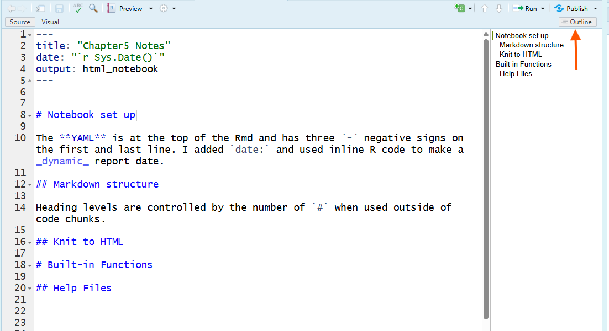
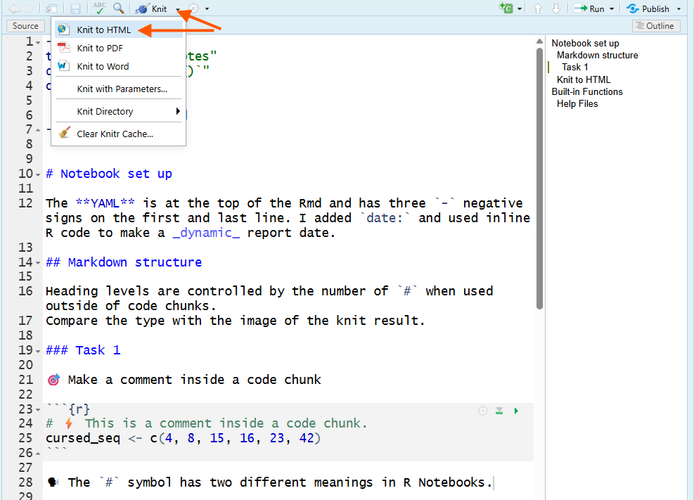
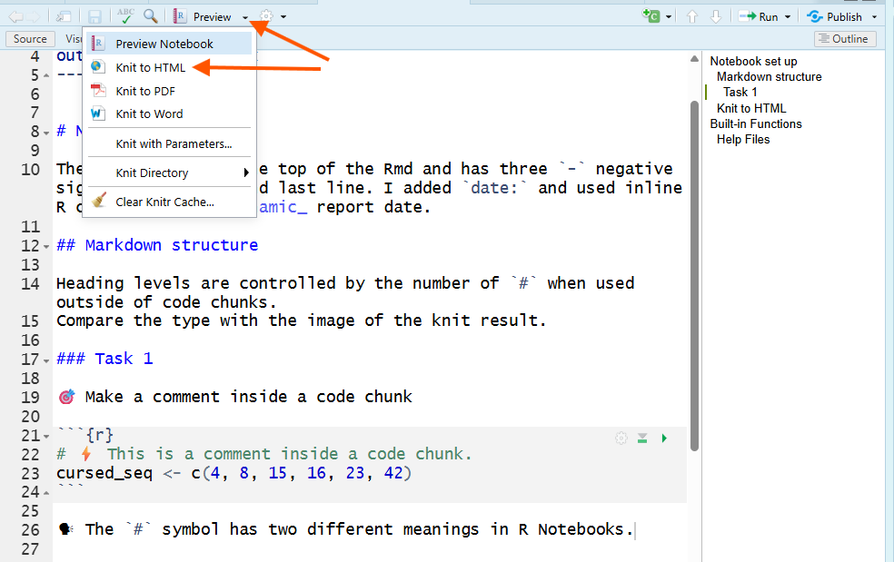
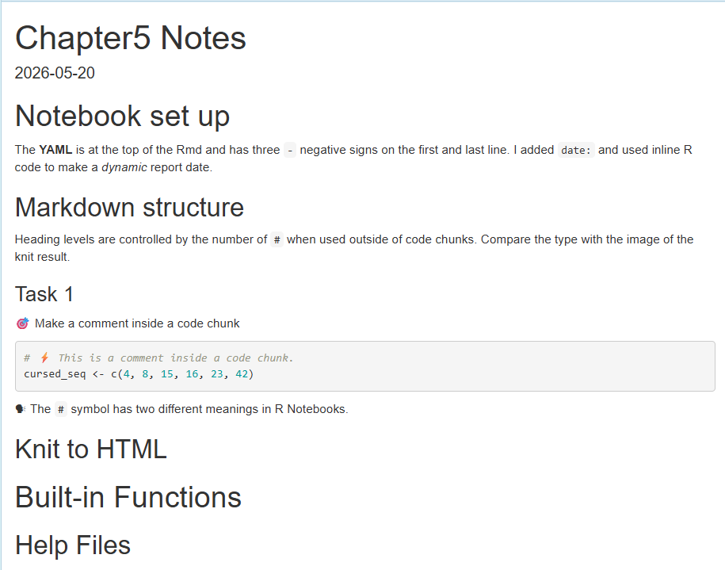

## Overview {#overview}

Chapter 5 focuses on making your R Notebook organized, reproducible, and shareable.

You will learn how to use Markdown and YAML to structure your notebook, then knit it into an HTML report that someone else can read without opening RStudio. You will also practice using R help files to understand functions, arguments, and examples.  

The main goal of this chapter is to build confidence with the normal problem-solving process in R. Instead of trying to memorize everything, you will learn how to use help resources, and document what you learned in a shareable report.

In Chapter Five, you will practice how to:

- #️⃣ Format your R Notebook using Markdown headings.

- 🧾 Add basic document information in the YAML header.

- 📤 Knit an R Notebook into a shareable HTML report.

- ⚠️ Recognize common reasons a notebook fails to knit.

- 🛠 Use error messages and help files to troubleshoot problems.

- 🔎 Open and read R help pages for functions.

- 🧮 Identify required arguments and default arguments.

- ✅ Use help pages to solve a problem with missing values.

- ✍️ Document the help you used and explain how it improved your code.

---

## R Notebook -> HTML Report {#notebook-html}


In this chapter, you will learn how to turn your R Notebook into a shareable [HTML]{.glossary-term data-term="HTML"} report. Data analysis reports are not just for sharing results. They are also for sharing the process of getting to those results. In this course, your R reports are more than a place to type code. They are where you practice being brave enough to try, notice when something is wrong, and keep going instead of hiding the mess. Courage here means documenting where you got stuck, asking for help when needed, and showing the learning process that helped you move forward. 

🎯 Please open a new R Notebook and save it in your course folder named `chapter5_notes.Rmd`. Use this document to take notes and practice the chapter content. 

1. Open RStudio → File → New File → R Notebook.

2. Save it in your course folder as: `chapter5_notes.Rmd`.

3. Remove the default content.

> 🧐 **Notice:** When a new R Notebook opens, RStudio automatically includes sample text and example code. Delete all of that default template content before you begin your own report. 

4. In your **YAML header** at the top, make sure the title matches this chapter. More details about how to do that is next.

### YAML Date Field {#yaml-date}

The [YAML header]{.glossary-term data-term="YAML Header"} is the metadata “label” for your notebook. It controls document settings like the title, date, and output format.

Good document labels help future-you, your peers, collaborators, and *your instructor* understand what the file is, when it was created, and what kind of output RStudio should build. This is a small documentation habit, but it matters when you are trying to keep your work organized.

A basic YAML header looks like this:

```yaml
---
title: "Untitled"
output: html_notebook
---
```

🎯  Add a date to your notebook by editing the YAML header to include a `date:` field. 

Method A. **Hard Code**

Manually type the date you created the notebook. Include quotation marks around the date.

```yaml
---
title: "Chapter 5 Notes"
date: "May 25, 2026"
output: html_notebook
---
```

Method B. **Dynamic Date**

Use R code to generate the current date automatically each time you knit the document. The [inline R]{.glossary-term data-term="Inline R"} expression <code>&#96;r Sys.Date()&#96;</code> retrieves the current date from your computer’s operating system. This follows the syntax: backtick (<code>&#96;</code>), then <code>r</code>, a space, <code>Sys.Date()</code>, and a closing backtick (<code>&#96;</code>). The backtick is located above the Tab key on most keyboards.

```{r echo=FALSE, results='asis'}
cat("```yaml
---
title: \"Chapter 5 Notes\"
date: \"`r Sys.Date()`\"
output: html_notebook
---
```")
```

The **Inline R** works in YAML when written exactly as above. Notice the backticks around the letter `r` and the `Sys.Date()` function and that it is wrapped in quotes \`"`r Sys.Date()`"\`. You can learn more about inline R in the 📝 Notebook Advanced Activity, but for now, you can copy and paste the above YAML section to add a dynamic date to your YAML header. Each time you [knit]{.glossary-term data-term="Knit"} the document, the date will update to the current date. 

---

You'll learn how to **knit** soon, but first, you need a clear structure inside the document. That is where Markdown headings come in.

##### Heading levels {#heading-levels}

Headings create the outline of your notebook. The number of `#` symbols controls the heading level.

```markdown
# Biggest heading

Text here will be in paragraph font.

## Main section heading

Text here will be in paragraph font.

### Subsection heading

Text here will be in paragraph font.
```

All Chapter HTMLs in this course were created using RStudio. You can see how headings create a structured outline and how the font sizes change with heading level from "2.1 YAML Date Field" to "2.1.0.1 Heading levels."

🎯 Add headings to your Chapter 5 Notes. 

```markdown
# Notebook set up

[Add any memos or notes here to help you remember how to set up your notebook, such as how to add a date to the YAML header.]

## Markdown structure

[Add any memos or notes here to help you remember how to format and navigate your report in RStudio.]

## Knit to HTML

# Built-in Functions

## Help Files
```

🎯  Work to complete the sections under each heading as you go through the chapter content. You can also add more headings and subheadings as needed to organize your notes and code.

##### Outline Menu {#outline-menu}

The "outline pane" in RStudio uses your Markdown headings to create a clickable map of your document. This document outline or [outline menu]{.glossary-term data-term="Outline Menu"} in the Source pane shows your headings/subheadings. They act as "Jump To" menus, helping you move between tasks without scrolling through the whole notebook.

---



---

Figure 1 shows a screenshot of an RStudio R Notebook showing a Markdown section heading (e.g., `## Markdown structure`) in the editor and the Outline menu on the right listing all headings. Markdown headings create a structured outline. The orange arrow points to the Outline button used to show/hide that heading-based outline. 💡 **Tip:** Clicking in the outline menu jumps you view in the report to that section.

In the above example, the `# Notebook set up` heading creates a main section heading. The outline menu on the right lists all headings in the document, allowing you to navigate quickly between sections. 

#### The most common beginner mistake with `#` {#common-mistake}

Put spacing between the `#` symbols and the heading text to paragraph text ensures heading formatting works correctly. 

For example, `##Task 1` will not format as a heading, but `## Task 1` will.

**The `#` symbol means two different things depending on where you type it.**

1. **Outside a code chunk**, `#` creates a Markdown heading.

🎯  Type `### Task 1` under `## Markdown structure` to create a subsection heading.

```markdown
## Markdown structure

Heading levels are controlled by the number of `#` when used outside of code chunks. 

### Task 1
```

2. **Inside a code chunk**, `#` creates an R comment. R ignores the comment when it runs the code.

🎯 Type "`# This is a comment inside a code chunk.`" inside a code chunk to create a comment. 💡 **Tip:** Click the Insert Chunk button in the toolbar (green C with plus sign) and choose R from the drop-down list.

```{r, echo=FALSE, results='asis'}
chunk_open <- paste0("```", "{r}")
chunk_close <- "```"

example_text <- paste(
  "## Markdown structure",
  "",
  "Heading levels are controlled by the number of `#` when used outside of code chunks.",
  "Compare the type with the image of the knit result.",
  "",
  "### Task 1",
  "",
  "🎯 Make a comment inside a code chunk",
  "",
  chunk_open,
  "# ⚡ This is a comment inside a code chunk.",
  "cursed_seq <- c(4, 8, 15, 16, 23, 42)",
  chunk_close,
  "",
  "🗣 The `#` symbol has two different meanings in R Notebooks.",
  sep = "\n"
)

cat("<pre><code>")
cat(htmltools::htmlEscape(example_text))
cat("</code></pre>")
```

> 🧐 **Notice:** Write notes about your code, type `#` inside the code chunk. Write result memos and learning reflections outside the code chunk without `#`.

---

Now that you have the basics of Markdown structure, you will test whether the whole notebook is ready to become an HTML report.

## Knit to HTML {#knit-html}

When you 🧶**Knit** to HTML, RStudio creates a shareable, static report that includes your formatted headings and text, your code, and the output produced when the code runs. The HTML is not a website and you cannot share it by sharing a URL. It is a file on your computer that you can open in a web browser and share with others by sharing the file itself.

Knitting is not the same as “running a chunk.” Running a chunk uses your current R session. This means that running a code chunk can succeed even if you wrote code out of order or if objects used already exist in your Environment.

Knitting is a stronger test. It runs the entire notebook from top to bottom in a *fresh* session, then builds an HTML report.

#### How to Knit {#how-to-knit}

RStudio UI varies. Some of you will have a 🧶[Knit button]{.glossary-term data-term="Knit Button"}, others will use **Preview menu** drop.

Option 1: **Knit button**

In the Source pane, click the Knit button (it looks like a ball of yarn with a knitting needle 🧶).

---



---

Figure 2 is a screenshot of RStudio showing the 🧶Knit button on the toolbar (highlighted by an orange arrow), which students can click to knit the R Notebook into an HTML document.

Option 2: **Preview menu**

In the Source pane, click the the **Preview menu** drop down button and select Knit to HTML. 

---



---

Figure 3 is a screenshot of RStudio with the Preview menu opened; orange arrows highlight the Preview dropdown button and the Knit to HTML option, showing how to knit an R Notebook into a shareable HTML document (not just run a single code chunk).

Below is the result you get after knitting to HTML

---



---

Figure 4 is a screenshot of the knitted HTML output in a web browser showing the notebook title (“Chapter5 Notes”), the subsection heading (“Task 1”), memos as regular paragraph text, and an R code chunk, demonstrating what you get after you Knit to HTML.

When you knit, RStudio automatically does three things:

1. Starts a fresh R session (your Environment does not count).

2. Runs your notebook from top to bottom in order.

3. Produces an HTML file you can view and share.

This is why knitting is the real test of “does this notebook work?” If it knits, someone else (including future-you) can see the workflow and results without needing to open RStudio.

🧭 Your notebook must create every object it uses in the notebook itself. Your Environment does not count. Knitting may reveal a code error you did not notice. That is useful information about the *first place* your workflow that needs attention.

---

#### Sharing the HTML File {#sharing-html}

The HTML file is automatically saved in the same folder as your R Notebook, with the same name but an `.html` extension instead of `.Rmd`. If you have not yet saved your R Notebook, RStudio will prompt you to do so before knitting.

Example:

- `chapter5_notes.Rmd`

- `chapter5_notes.html`

or

- `chapter5_notes.nb.html`

> 🧐 **Notice:** The HTML opens in your browser, but the browser address is a local file path on your computer. You **cannot** submit a browser link.

When you open an HTML, it uses your web browser to display a nicely formatted version of your notebook, including code, output, and memos. You cannot share the HTML by sharing the web address (URL) in your browser because it is a local file on your computer. 

To share (e.g., submit), 📤 upload the `.html` file. 

💡 **Tip:** Check the HTML first to make sure it is correct and shows the correct formatting.

#### Knit Errors {#knit-errors}

When you select to knit, the bottom left pane shows progress messages in the [Render tab]{.glossary-term data-term="Render Tab"} as R runs your notebook from top to bottom. 

A successful knit has three visible signs:

1. The Render tab shows the process finishing without an error message.

2. A browser window opens (or Viewer in File Pane) showing your notebook as a formatted web page.

3. An `.html` file appears in the same folder as your `.Rmd` file.

If knitting fails, do not fear. This is an opportunity to discover where your notebook needs revision. 

1. Read the error message in the Render tab.
2. Find the line or chunk that caused it. The error usually names a chunk or shows a line number.
3. Fix the first error you see. Many later errors are just “domino effects.”
4. Knit again.

🧭 A knit error is a "Not yet" signal. It shows where your notebook needs revision. What is the specific problem R is naming?

Common reasons knitting fails:

- You wrote the code out of order, so an object exists in your Environment but is not created earlier in the notebook.
- You forgot to include setup code, such as creating objects, loading packages, or setting a working directory.
- A chunk contains an error you did not notice because you never ran that chunk.

Some errors are tricky. If you get stuck, bring the error message, the chunk, and what you already tried to a peer, office hours, or another approved course resource.

Next, you will shift from building the report to writing code inside it. 

💡 **Tip:** Knit after any meaningful formatting or code change. It is easier to find an error when it was caused by your most recent edit.

## Built-in Functions {#built-in-functions}

Now that your notebook can become an HTML report, you need code worth documenting inside it.

Many built-in summary functions take a whole vector as input and return one summary value, or a small set of values. These are summary functions because they reduce many values down to a smaller result.

In this section, you will practice calling a function and noticing the difference between the stored function object and the function call that actually runs.

### Function Objects vs. Function Calls {#function-objects-vs-calls}

A [function object]{.glossary-term data-term="Function Object"} is the stored code that performs a task. For example, `mean` is a function object that calculates the average of a numeric vector. The stored code sums the values and divides by the number of values.

🎯 Run `mean` in a code chunk to see the stored function object. Add the code chunk under `# Built-in Functions`

```{r}
# ⚡ Type mean in your R Notebook inside a code chunk
mean
```

🗣 R prints the instructions stored inside `mean`. You do not need to read every detail yet. For now, notice that typing `mean` by itself shows the stored recipe R uses when you later call `mean()` on data.

To make the function do its job, you have to _call it_. A [function call]{.glossary-term data-term="Function Call"} runs the stored code. To call a function, you type the function name followed by parentheses `()`. Inside the parentheses, you must provide any [required arguments]{.glossary-term data-term="Required Arguments"}. For example, to calculate the mean of a numeric vector, you call the `mean()` function and provide the vector as an argument. The vector is a [required argument]{.glossary-term data-term="Required Arguments"} because the function needs it to perform the calculation.

📜 The SYNTAX (basic): 

`mean(x)`

where `x` is the numeric vector you want to summarize.

🎯 Calculate the mean of the cursed sequence. 

```{r}
# 📖 Review
cursed_seq <- c(4, 8, 15, 16, 23, 42)  

mean(cursed_seq)                     
```

🗣 The `mean()` function calculates the average of the numbers in the `cursed_seq` vector by summing them up and dividing by the count of numbers.

## Help Files {#help-files}

Nobody memorizes every function or every argument. Looking in help is one way you stay engaged when you do not already know what to do or you have a question. Skilled R users look things up.

`?[function_name]` opens the help file for that function. The Files pane usually contains several tabs, including the [Help tab]{.glossary-term data-term="Help Tab"}, which displays documentation for R functions.

🎯 Use `?mean` to open the help file for the `mean()` function. Add the code chunk under `## Help Files`

```{r, eval=FALSE}
# ⚡ Type this in your R Notebook
?mean
```

💡 Test knit.

🚀 **Explore and Play:** As we move through the remainder of the chapter, add meaningful headings and subheadings to your notebook to organize your notes and code as you wish. 

### No Required Arguments {#no-required-arguments}

Some functions do not have a required argument. For example, the `Sys.Date()` function returns the current date without needing any input.

🎯 Call the `Sys.Date()` function to get the current date from your computer's operating system. 

```{r}
# ⚡ Type this in your R Notebook
Sys.Date()
```

🗣 The `Sys.Date()` function retrieves the current date from the system clock and returns it as a Date object.

🎯 Open the help file for the `Sys.Date()` function.

```{r, eval=FALSE}
# ⚡ Type this in your R Notebook
?Sys.Date
```

🗣 The `Sys.Date` [help page]{.glossary-term data-term="Help Page"} opens in the [help tab]{.glossary-term data-term="Help Tab"} in the files pane. Note that `Sys.Date()` has no required arguments.

Scroll through the help file to find information about the function's usage, arguments, and examples.

- [Usage]{.glossary-term data-term="Examples Section"}: shows the function signature and defaults.

- [Arguments]{.glossary-term data-term="Arguments"}: what each argument does.

- [Examples]{.glossary-term data-term="Examples Section"}: copy/run examples to learn patterns.

---

`Sys.Date()` is a friendly first example because it does not require an input. Most functions you use for data analysis will need at least one argument. Next, you will compare this to `mean()`, which needs a vector to summarize.

### Required Arguments {#required-arguments}

[Required argument]{.glossary-term data-term="Required Arguments"} are what a function needs to do its job. 

🎯 Open the help file for the `mean()` function. Scroll through the help file to find information about the function's usage, arguments, and examples.

```{r, eval=FALSE}
# ⚡ Type this in your R Notebook
?mean   
help(mean)
```

🗣 The `mean` help page opens in the Help tab in the Files pane. `mean.default(x, trim = 0, na.rm = FALSE, …)` shows that `x` is a required argument, while `trim` and `na.rm` have default values.

### Default Arguments {#default-arguments}

[Default arguments]{.glossary-term data-term="Default Arguments"} are inputs that a function uses in situations when you did not provide that argument. For example, the `trim` argument in the `mean()` function allows you to exclude a certain percentage of the lowest and highest values before calculating the mean.

The SYNTAX (with one default argument):
 
 `mean(x, trim = 0)`

🎯 Calculate the trimmed mean of the cursed sequence, removing 20% of the lowest and highest values before computing the mean.
 
```{r}
# ⚡ Type this in your R Notebook
mean(cursed_seq, trim = 0.2)  # drop 20% from each end first
```

🗣 The `mean()` function first removes 20% of the lowest and highest values from the `cursed_seq` vector, then calculates the mean of the remaining values. With 6 values and `trim = 0.2`, R trims 4 and 42, then averages 8, 15, 16, and 23.

---

🧭 How can you tell which arguments are required?

The main clue that `x` is required is that it has no `=` sign or default value next to it in the usage section. The other arguments have `=` signs, showing the default values that R will use if you don't provide your own.

Some functions use `...` (dot-dot-dot). That means “additional optional arguments may be allowed,” not required ones. For now, ignore `...` until you are more advanced.

📜 Argument clue:

- no `=` → usually required
- `=` → R has a default value
- `...` → extra optional arguments may be allowed; ignore this for now

---

This clue helps you read help pages faster. You do not need to understand the whole page before you can use one useful part of it.

## Reading R Help Pages {#reading-help-pages}

Help pages are useful, but they are not written like beginner tutorials. They are written like reference pages. That means your job is not to read every word. Your job is to know where to look first when you are trying to write, fix, or explain code. This section gives you a reading strategy for reading the help pages.

### Open Help Page {#open-help-page}

If you know the function name, type a question mark before the function name.

```{r, eval=FALSE}
# ⚡ Type this in your R Notebook
?mean
```

You can also use the `help()` function.

```{r, eval=FALSE}
# ⚡ Type this in your R Notebook
help(mean)
```

🗣 The help page usually opens in the help tab in the bottom-right area of RStudio. That area contains several tabs, such as Files, Plots, Packages, Help, and Viewer. 

### Reading Order {#reading-order}

Help pages can look overwhelming. That is normal. This page is not readily accessible to beginners. 

When you open a help page, use this reading order:

1. **Description**: What does this function do?
2. **Usage**: What does the function call look like?
3. **Arguments**: What goes inside the parentheses?
4. **Examples**: What is one working pattern I can test?

For now, you may skim or skip sections like **Details**, **Value**, **References**, and **See Also**.

### The Usage Section {#usage-section}

The **Usage** section shows the basic recipe for writing the function call.

Open the help page for `mean()`.

```{r, eval=FALSE}
# ⚡ Type this in your R Notebook
?mean
```

In the **Usage** section, you may see something like this:

```{r, eval=FALSE}
## Default S3 method:
mean(x, trim = 0, na.rm = FALSE, ...)
```

Read the usage line like this:

| Part | What it means |
|---|---|
| `mean()` | Required. This is the function name. |
| `x` | Required. This is the object you want R to average. |
| `trim = 0` | Optional. R uses `0` unless you choose a different value. |
| `na.rm = FALSE` | Optional. R keeps missing values unless you choose `TRUE`. |
| `...` | Extra options may be allowed. Ignore this for now. |

---

In summary, 

- a [required argument]{.glossary-term data-term="Required Arguments"} is an input the function needs before it can do its job.

- a [default argument]{.glossary-term data-term="Default Arguments"} is an input R already has a value for. You can use the default value, or you can replace it with your own value.

📜 The basic rule:

- No `=` sign usually means the argument is required.
- An `=` sign means R has a default value.
- A default argument is optional, but it may still be important to consider for your task.

🗣 In `mean(x, trim = 0, na.rm = FALSE, ...)`, the argument `x` is required because it does not have a default value. The arguments `trim` and `na.rm` are optional because R already has default values for them.

---

### Use the Help Page to Solve a Problem {#use-help-to-solve}

Let's use the help page for a troubleshooting task. We'll create a vector with a missing value, try a calculation, notice an issue with the result, and then use the help page to decide which argument needs to change.

🎯 Create a vector with one missing value. 

```{r}
# ⚡ Type this in your R Notebook
messy_scores <- c(80, 90, NA, 100)

print(messy_scores)
```

🗣 The value `NA` means the data value is missing. It is not character or numeric value. It means the third entry is empty. 

🎯 Try to calculate the mean of `messy_scores` using only default arguments. 💬 Prediction: What do you think R will return?

```{r}
# ⚡ Type this in your R Notebook
mean(messy_scores)
class(messy_scores)
```

🗣 R returns `NA` because the vector contains a missing value. By default, `mean()` does not remove missing values before calculating the average.

But we haven't learned how that affects the calculation. This is the moment to use the help page.  

🎯 Open the help page for `mean()`.

```{r, eval=FALSE}
# ⚡ Type this in your R Notebook
?mean
```

✅ Check: In the [Arguments]{.glossary-term data-term="Arguments"} section, find the argument named `na.rm`.

Ask yourself:

- What does `na.rm` control?
- What default value does R use?
- What value should I use if I want R to remove missing values?

🎯 Try the code again using `na.rm = TRUE`.

```{r}
# ⚡ Type this in your R Notebook
mean(messy_scores, na.rm = TRUE)
```

🗣 The argument `na.rm = TRUE` tells R to remove missing values before calculating the mean. This does not delete the missing value from your original vector. It only tells `mean()` how to handle the missing value during this calculation.

---

Next, you will see how help-page examples can give you working patterns even when they are not your exact assignment answer.

### Examples {#examples}

The [Examples section{.glossary-term data-term="Examples Section"} is often one of the most useful parts of a help page. Examples show working patterns. Your job is to adapt the pattern to your own object.

You are using the example to understand a structure, then applying that structure to your own task.

🎯 Run R's built-in examples for `mean()`.

```{r, eval=FALSE}
# ⚡ Type this in your R Notebook
example(mean)
```

🗣 The `example()` function runs examples from the help page. You do not need to understand every line. 


🧭 Look for one pattern that helps you understand how the trim argument is used in the `mean()` function.


### Unknown Function Name {#unknown-function-name}

So far, we _knew_ the function name: `mean()`.

Sometimes you know the topic, but you do not know the function name. For example, you might know you need help with missing values, but you may not know which function or argument to search for. In that case, use `??` or `help.search()`.

🎯 Search for help pages related to "missing values" using `??` and `help.search()`.

```{r, eval=FALSE}
# ⚡ Type this in your R Notebook
??"missing values"
```

```{r, eval=FALSE}
# ⚡ Type this in your R Notebook
help.search("missing values")
```

🗣 Use `?[function_name]` when you already know the function name. Use `??["search words"]` or `help.search(["search words"])` when you know the topic but not the exact function.

| Situation | What to type |
|---|---|
| I know the function name. | `?mean` |
| I know the function name and want another option. | `help(mean)` |
| I know the topic but not the function name. | `??"missing values"` |
| I want to search help pages for a phrase. | `help.search("missing values")` |
| I want to run built-in examples. | `example(mean)` |

---

## Document Help {#document-help}

In this course, troubleshooting is part of the work. Documenting your troubleshooting efforts is how you show that work. When you use a resource, digital or human, document where you went, why, and what you discovered.

🎯 Add a short help note to your memo to your report.

Type the resource note, check, and comment as regular Markdown text. Put only the runnable R code inside the code chunk.

```

I used `?mean` to read about the `na.rm` argument.

The help page showed that `na.rm` defaults to `FALSE`.

I changed `na.rm` to `TRUE` because my vector contained an `NA` value.
```
```{r}
# ⚡ Code
messy_scores <- c(80, 90, NA, 100)
# ✅ Check
mean(messy_scores, na.rm = TRUE)
```

```markdown
🗣 The result is `90` because R averaged `80`, `90`, and `100` after removing `NA` from the calculation.


🗣I learned that a default argument can be optional but still important. In this case, `na.rm` had a default value, but I needed to change it for my data.

```

💡 Test knit.

---

This is transparent coding. A future reader can see what problem you had, what resource you used, what you changed, and why the change made sense.


## Summary {#summary}

In this chapter, you strengthened your R Notebook habits by learning how to create a complete, shareable HTML report. You practiced editing the YAML header, using Markdown headings to organize your notebook, knitting your work to HTML, and submitting the actual `.html` file rather than a browser link.

You also learned that knitting is the real test of whether your notebook works. Running a single chunk only checks part of the code in your current R session, but knitting runs the whole notebook from top to bottom in a fresh session. When knitting fails, the error message is feedback that helps you find what needs to be fixed next.

Finally, you learned how to use built-in R functions and help files. You practiced the difference between a function object and a function call, identified required and default arguments, used `?function_name`, `help()`, `example()`, and `help.search()` to find information, and changed `na.rm = TRUE` to handle missing values in a calculation.

Your main takeaway is that strong R work depends on organized notebooks, successful knitting, and the courage to use errors and help files as part of the coding process.

---

## Chapter Terms {#chapter-terms}

**Arguments**: Inputs that you provide to functions to customize their behavior. Arguments are specified within the parentheses of a function call and can modify how the function operates or what data it processes.

**Default Arguments**: Inputs that already have a preset value in the function definition and are used automatically when you don’t provide your own (e.g., `mean(..., na.rm = FALSE)` by default).

**Examples Section**: The part of an R help page that shows runnable code examples for how a function is used in practice. This section is often the fastest place to learn because it shows the function in context: what inputs go inside the function call, what the code looks like, and what kind of output to expect. In R, many help-page examples can also be run with the `example()` function.

**Function Call**: The act of running a function by writing its name followed by parentheses, optionally supplying arguments inside (e.g., `mean(x)`). 

**Function Object**: A function stored as an R object (functions are “first-class” in R, meaning you can assign them to names, pass them to other functions, and inspect them). 

**Help Page**: Documentation for R functions and packages that provides information on usage, arguments, and examples. Accessed using `?function_name` or `help(function_name)`.

**Help Tab**: Located in the Files/Plots/Packages/Help pane, this tab provides access to R documentation, package vignettes, and search functionality to find help topics related to R functions and packages.

**HTML**: A web page file type (`.html`) written in **HyperText Markup Language** that a web browser can open and display as a formatted document. In this course, Preview/Knit/Render can create an HTML file (often `.html` or `.nb.html`) that shows your notebook’s text, code, and output in the browser; because it opens from your computer (a local `file://` path), you can’t submit it by copying the browser address. Upload the HTML file itself.

**Inline Code**: Code-style text placed within a sentence by surrounding the text with single backticks, such as `penguins`. In Quarto and Markdown, inline code is used to mark object names, function names, file names, or short code expressions so they appear in a monospace code font in the rendered report. This formatting signals to the reader, “treat this as code or a code-related name,” not as ordinary prose. 

**Inline R**: A short R expression written inside backticks with the prefix `r` (for example, <code>&#96;r Sys.Date()&#96;</code>) that is evaluated when you knit/render the document and replaced with its result in the output. Inline R is used to insert dynamic values (dates, computed statistics, labels) directly into your narrative text, and it can also be used in YAML fields like <code>date: "&#96;r Sys.Date()&#96;"</code> when supported.

**Knit**: In RStudio, the action that renders an `.Rmd` (including an R Notebook) into a finished output file (such as HTML, PDF, or Word) by running the document’s code chunks, inserting their results, and converting the document to the chosen format. Clicking the Knit button typically calls `rmarkdown::render()` in a new, clean R session, so everything needed to reproduce the result must be created or loaded in the document itself, and the output file is saved alongside the `.Rmd`.

**Knit Button**: The toolbar button in RStudio that renders an R Markdown file (`.Rmd`) into a finished output (e.g., HTML, PDF, Word) by calling `rmarkdown::render()` and running the document’s code to generate results. The output file is saved next to the `.Rmd` (same base name), and the button’s drop-down lets you choose among available output formats (shortcut: Ctrl/Cmd + Shift + K).

**Outline Menu**: A navigation tool in RStudio that uses your Markdown headings to create a clickable map of an `.Rmd` or `.qmd` document. The outline shows the structure of the notebook by heading level, so you can jump between sections without scrolling through the whole file. In RStudio, open it from the Outline button/menu in the Source pane toolbar.

**Render Tab**: A temporary tab that appears in RStudio’s Console pane when you Knit/Render an R Markdown (`.Rmd`) or Quarto (`.qmd`) document. It shows the rendering log—progress messages, warnings, and errors—separately from your interactive Console, and typically includes a Stop control so you can interrupt a failed or long render.

**Required Arguments**: Inputs a function needs because they have no default value in the function definition; you must supply them in the call (or the function can’t do its job). 

**YAML Header**: The metadata section at the top of an R Markdown or Quarto document, written between `---` lines, that controls document settings like the title, author, date, output format (HTML/PDF/Word), and options for rendering.

---

## 📝 Practice Space {#practice-space}

This Practice Space has two parts.

First, you will answer short multiple-choice questions that check whether you can organize an R Notebook, read an R help page, use a function argument, and explain why knitting is an important reproducibility check.

Second, you will practice troubleshooting a broken R Markdown file. The goal is to see how code can appear to work in your RStudio Environment but still fail when you knit because knitting starts from a cleaner version of the workflow.

### Part 1: Check your understanding {#check-understanding}

Choose the best answer for each question in this section.

### Part 2: Troubleshoot a broken R Markdown file {#troubleshoot-rmd}

Download these two files and save them in the same course folder:

* <a href="downloads/ch05-help/ch05-practice-space.Rmd" download>ch05-practice-space.Rmd</a>
* <a href="downloads/ch05-help/ch05-practice-space.RData" download>ch05-practice-space.RData</a>

Then complete the troubleshooting workflow:

1. Open `ch05-practice-space.Rmd` in RStudio.
2. Load `ch05-practice-space.RData` into RStudio.
3. Run the code chunks from top to bottom and notice what happens.
4. Knit the R Markdown file to HTML.
5. Use the Render/Knit error message to identify what needs to be fixed.
6. Make one testable change at a time.
7. Add a short memo near each place where you corrected code.
8. Knit again after each meaningful correction so you know whether your edit fixed the problem.

Optional support: Use the reading on troubleshooting knit errors with an LLM as a strategy example. Ask for help interpreting the error, identifying likely causes, or making a checklist of what to inspect. Do not ask the LLM to rewrite or complete the report for you.

---

### Task 1 {#task-1}

🧾 **YAML header**

Which YAML header is the best match for a Practice Space Notebook that should knit to an HTML notebook?

A.

```{r echo=FALSE, results='asis'}
cat("```yaml
---
title: \"Chapter 5 Notes\"
date: \"`r Sys.Date()`\"
output: html_notebook
```")
```


B.

```yaml
--
title = "Chapter 5 Practice"
date = Sys.Date()
output = html_notebook
--
```

C.

```{r echo=FALSE, results='asis'}
cat("```yaml
---
title: \"Chapter 5 Notes\"
date: \"`r Sys.Date()`\"
output: html_notebook
---
```")
```

D.


```{r echo=FALSE, results='asis'}
cat("```yaml
---
\"Chapter 5 Notes\"
\"`r Sys.Date()`\"
html_notebook
---
```")
```


---

### Task 2 {#task-2}

\#️⃣ **Markdown headings**

Which line correctly creates a level 2 Markdown heading called `Help Pages`?

A. `##Help Pages`

B. `## Help Pages`

C. `# # Help Pages`

D. `Help Pages ##`

---

### Task 3 {#task-3}

💬 **Markdown heading vs. R comment**

Which statement correctly explains the difference between `#` outside a code chunk and `#` inside a code chunk?

A. Outside a code chunk, `#` creates an R comment. Inside a code chunk, `#` creates a Markdown heading.

B. Outside a code chunk, `#` creates a Markdown heading. Inside a code chunk, `#` creates an R comment.

C. `#` always creates a Markdown heading no matter where it appears.

D. `#` always causes an error in R Notebooks.

---

### Task 4 {#task-4}

🧩 **Required arguments and default arguments**

The `mean()` help page may show a usage line like this:

```r
mean(x, trim = 0, na.rm = FALSE, ...)
```

Which answer correctly identifies the required argument and one default argument?

A. `x` is required; `na.rm = FALSE` is a default argument.

B. `trim = 0` is required; `x` is a default argument.

C. `...` is required; `x` should be ignored.

D. `na.rm = FALSE` is required; `trim = 0` is not an argument.

---

### Task 5 {#task-5}

🧮 **Use a help-page argument to handle missing values**

You create this vector:

```r
daily_steps <- c(5000, 7500, NA, 10000)
```

Then you run:

```r
sum(daily_steps)
```

R returns `NA`.

In the function `sum()`, which argument handles the missing value before adding the numbers?

A. `sum(daily_steps, na.rm = TRUE)`

B. `sum(daily_steps, remove.NA = TRUE)`

C. `sum(daily_steps, missing = FALSE)`

D. `sum(daily_steps, delete = NA)`

---

### Task 6 {#task-6}

📤 **Reproducibility check**

Which is a a stronger reproducibility check: knitting an R Notebook to HTML or running every code chunk?

A. Running each code chunk is stronger because it checks only the selected code without rerunning earlier chunks.

B. Knitting is stronger because it checks Markdown formatting and creates an HTML file, but it does not rerun the code.

C. Knitting is stronger because it reruns the notebook from top to bottom in a clean session, so needed objects must be created in the document in the correct order.

D. Running each code chunk is stronger because it uses the objects already saved in the Environment, so the final report shows the most recent results.

---