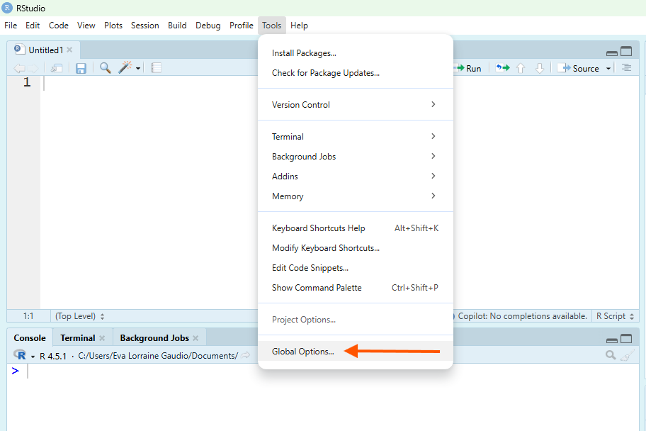
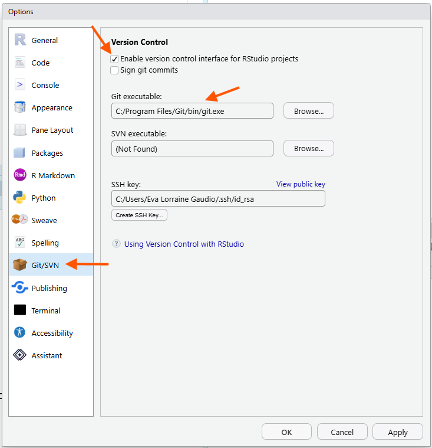
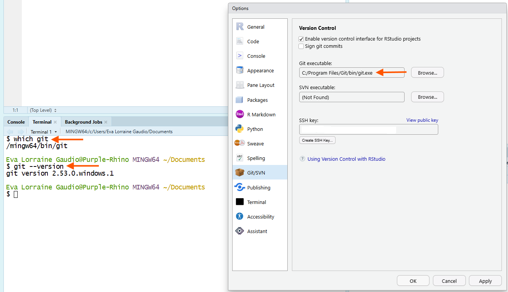
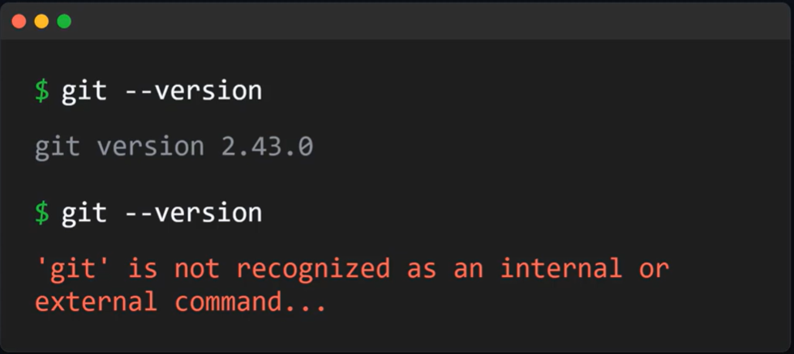
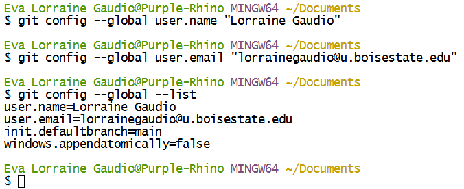
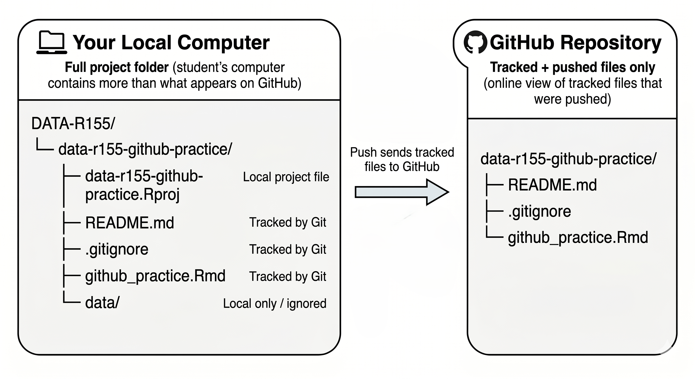

## Overview {#overview}

In this guided activity, you will connect GitHub, Git, and RStudio so they can work together. You will create a small GitHub repository, clone it into RStudio as a project, make changes locally, commit those changes, push them to GitHub, and practice pulling a change back down from GitHub.

In this course, you are not expected to learn how to write Git commands from memory. Git can be confusing at first, so the chapter keeps things simple with low-tech workarounds when useful. RStudio provides a beginner-friendly way to use Git, but its built-in Git tools are limited, so learning Git commands is necessary to take full advantage of Git. *To learn more about Git, check out the 1 credit hour course CS 155 - Introduction to Version Control.*

By the end of this activity, you will 

- 🐙 have a working GitHub repository that proves your setup works.

- 🐙 understand the relationship between GitHub, Git, and RStudio.

- 🐙 know the workflow: Open Project → Pull → Edit → Save → Stage → Commit → Push.

- 🐙 know where to go to find Git and GitHub support on Campus.

### Step up Order {#setup-order}

GitHub setup challenges novice coders because **skipping one small step can break the set up**. Just like when you are writing R code, GitHub setup includes verification steps. **Verify each action** was successful before moving on. Do not skip ahead. If you complete tasks out of order, you may have to start over! 

🎯 In this guided activity, you will:

1. Learn how [GitHub, Git, and RStudio](#github-git-and-rstudio) work together.
2. [Update R and RStudio](#update-r-and-rstudio) if needed.
3. Check that RStudio can find [Git](#git).
4. [Install Git](#install-git) or verify you have Git.
5. [Configure your Git identity](#configure-git-identity).
6. Create a GitHub account and log into [GitHub](#github).
7. [Configure SSH keys](#configure-ssh-keys).
8. [Create a GitHub repository](#make-github-repo) and [clone that repository into RStudio](#clone-github-via-rstudio).
9. Practice [local changes](#local-changes) and the full [workflow](#workflow)
10. Review your [final repository structure](#final-repository-structure).
11. Create a `.gitignore` file to support [data privacy and organization](#data-privacy-and-organization).


💡 **Tip**: If something does not work, and you're stuck, use the course support options to get help. You can do hard things!

---

## GitHub, Git, and RStudio {#github-git-and-rstudio}

[GitHub]{.glossary-term data-term="GitHub"} is the online place where your [repository]{.glossary-term data-term="Repository"} lives. [Git]{.glossary-term data-term="Git"} is the [version control]{.glossary-term data-term="Version Control"} tool that tracks changes. RStudio is where you will edit your files and use the [Git pane]{.glossary-term data-term="Git Pane"} to commit and push your work.

You are using three connected locations:

| Place           | What it means                                | What you do there                            |
| --------------- | -------------------------------------------- | -------------------------------------------- |
| GitHub.com      | The online copy of your project              | Create the repository and verify pushed work |
| Your computer   | The local copy of your project folder        | Store and organize files                     |
| RStudio Project | The R working space connected to that folder | Edit files, commit changes, pull, and push   |


> GitHub is the online copy. Your computer has the local copy. RStudio helps you work inside the local project folder.

**Version control** means tracking changes to files over time. It is like save checkpoints in a video game. Git lets you save meaningful checkpoints called [commits]{.glossary-term data-term="Commit"}. As you make progress, you create checkpoints you can return to if something breaks or you want to try a different path.  

Version control is basically a time machine for files. You can rewind to earlier versions, compare changes over time, or restore something that was accidentally deleted. Commits let you safely experiment without losing earlier work. 

---

## Update R and RStudio {#update-r-and-rstudio}

R and RStudio are updated frequently. From time to time, when you open RStudio, you will be notified in a pop up window that you need to download the latest versions installed. Having the most up-to-date version will ensure compatibility with Git and GitHub. 💡 **Tip**: It is good practice to always update R or RStudio when prompted. Outdated versions of R can result is incompatibilities with downloaded packages, Git and GitHub. 

[Download R and RStudio at https://posit.co/download/rstudio-desktop/](https://posit.co/download/rstudio-desktop/){target="_blank" rel="noopener noreferrer"}


## Git {#git}

As you are beginning to understand, **Git** is the tool that tracks file changes. RStudio can use Git, but Git must be installed on your computer first. 

Git tools appear after version control is enabled for an RStudio Project.

Before downloading anything, check whether RStudio can already find Git. If RStudio can find Git, you do not need to install it again.

**RStudio Git integration** means RStudio can use Git inside an RStudio Project. When this works, RStudio knows where Git is installed on your computer.

### Step 1 {#step-1-git-check}

**Open version control settings**

🎯 From the **Tools** menu, click **Global Options**.



🗣 This opens the Global Options window. On the left side of the window is a list of settings.

### Step 2 {#step-2-git-check}

**View Git/SVN settings**

🎯 Click the **Git/SVN** tab.



🎯 Make sure the box for **Enable version control interface for RStudio projects** is **checked.**

🎯 Look for the box labeled **Git executable**.

✅ Verify what you see:

- If you see a file path in the **Git executable** box, RStudio has found Git.
- If the Git executable box is empty, or RStudio says Git was not found, you need to install Git.

🗣 The Git executable path tells RStudio where Git lives on your computer. 

💡 **Tip:** Do not worry if your path looks different from someone else’s. Windows, Mac, and Linux store Git in different places.

### Step 3 {#step-3-git-check}

**Save the setting**

🎯 If the **Enable version control interface for RStudio projects** box was not checked, check it now.

🎯 Click **Apply**.

🎯 Click **OK**.

✅ Verify that the Global Options window closes.

🗣 You have now checked whether RStudio is ready to use Git.

## RStudio Terminal Check {#rstudio-terminal-check}

The Git/SVN tab is the main check for this activity. The Terminal check is optional, but it can help confirm that Git works.

 

In Figure 4, the Git/SVN option window in Global Options shows the path to the Git executable as well, confirming that Git is installed and recognized by RStudio. The Terminal pane shows the command which git and the output is /mingw64/bin/git, which indicates that Git is installed and located at that path. Your path will likely be different, but the key is that it shows a path to Git rather than an error message. The git --version command also shows the version of Git installed. If Git is not installed, it will return an error message, such as git: command not found.

### Step 1 {#step-1-terminal-check}

🎯 In RStudio, open the **Terminal** tab.

If you do not see the Terminal tab, go to:

```text
Tools > Terminal > New Terminal
```

### Step 2 {#step-2-terminal-check}

🎯 Type `git --version` in the terminal to check if Git is installed.

```bash
git --version
```
### Step 3 {#step-3-terminal-check}

✅ Verify what happens:

- If you see a Git version number, Git is installed.
- If you see an error message, Git may not be installed or RStudio may not be able to find it.



🗣 The Terminal check confirms whether Git responds to a command. The Git/SVN tab confirms whether RStudio knows where Git is installed.


---

## Checkpoint: Do You Need to Install Git? {#checkpoint-git}

✅ If RStudio shows a Git executable path, skip the install directions and continue to [Configure Git Identity](#configure-git-identity).


✅ If RStudio does not show a Git executable path, continue to the install directions for your operating system:

- [macOS: Install Git](#install-git-macos)
- [Linux: Install Git](#install-git-linux)
- [Windows: Git Bash](#install-git-windows)

---

## Install Git {#install-git}

Installation depends on your operating system: Windows users should install Git for Windows/Git Bash. If needed, Mac users should install Git through Xcode Command Line Tools, and Linux users can install Git through their package manager.

If you found that you do not have Git installed, navigate to the section that describes how to install Git for your operating system. 

### macOS: Install Git {#install-git-macos}

Most Macs have git. If for some reason you do not have Git installed, follow this 3 step process.

Most Mac computers can install Git through **Xcode Command Line Tools**. For this installation step, use the **Mac Terminal app**, not RStudio. You do **not** need to install the full Xcode app from the App Store for this course. 

#### Step 1 {#step-1-install-git-macos}

**Open the Mac Terminal app**

🎯  Here's how:

1. Press `Command + Space` to open Spotlight Search.
2. Type `Terminal`.
3. Press `Return`.

#### Step 2 {#step-2-install-git-macos}

**Type the command to install Git**

🎯 In the Mac Terminal app, type:

```bash
xcode-select --install
```

**Complete the installation process**

🎯 When the installation window appears:

1. Click Install.
2. Agree to the license terms.
3. Wait for the installation to finish.
4. Click Done when prompted.

#### Step 3 {#step-3-install-git-macos}

**✅ Verify Git installed correctly.**

🎯 Close the Mac Terminal app, reopen it, and type:

```bash
git --version
```
You should see a Git version number.

🗣 If you see a Git version number, Git is already installed. Return to RStudio and continue to [Configure Git Identity](#configure-git-identity).

💡 **Tip**: The Mac Terminal app and the RStudio Terminal tab look similar because both let you type commands. For installing Git on a Mac, you start with the Mac Terminal app, but after Git is installed, please use the RStudio Terminal for the remainder of the set up activity.


### Linux: Install Git {#install-git-linux}

Most Linux computers either already have Git installed or can install it through the Linux system's **package manager**. A package manager is the tool Linux uses to install and update software.

For this installation step, use your **Linux Terminal app**, not RStudio. After Git is installed, return to RStudio and check whether RStudio can find it.

#### Step 1 {#step-1-install-git-linux}

**Open the Linux Terminal app**

🎯 Open the Terminal app on your Linux computer.

How you open Terminal depends on your Linux version, but common options include:

- Press `Ctrl + Alt + T`
- Open the application menu and search for `Terminal`
- Right-click on the desktop and choose `Open Terminal`, if that option appears

#### Step 2 {#step-2-install-git-linux}

**Check whether Git is already installed**

🎯 In the Linux Terminal app, type:

```bash
git --version
```

✅ Verify what happens:

- If you see a Git version number, Git is already installed. Return to RStudio and continue to the **Configure Git Identity** section.
- If you see an error such as git: command not found, Git is not installed yet. Continue with the installation steps below.

#### Step 3 {#step-3-install-git-linux}

**Choose the command for your Linux version**

Linux has different versions, called distributions. The installation command depends on your distribution.

🎯 Use the command that matches your Linux system.

**Ubuntu or Debian**

```bash
sudo apt update
sudo apt install git
```

**Fedora**

```bash
sudo dnf install git
```

**Red Hat, CentOS, or older Fedora systems**

```bash
sudo yum install git
```

**Arch Linux**

```Bash
sudo pacman -S git
```

**openSuSE**

```bash
sudo zypper install git
```

#### Step 4 {#step-4-install-git-linux}

**Complete the installation process**

🎯 If Terminal asks for your password, type your computer password and press `Enter`.

You may not see the password characters while you type. That is normal.

🎯 If Terminal asks whether you want to continue, type:

```bash
y
```

Then press `Enter`.

#### Step 5 {#step-5-install-git-linux}

**✅ Verify Git installed correctly**

🎯 Close the Linux Terminal app, reopen it, and type:

```bash
git --version
```

You should see a Git version number.

🗣 If you see a Git version number, Git is installed on your Linux computer. Return to RStudio and continue to [Configure Git Identity](#configure-git-identity).

💡 Tip: The Linux Terminal app and the RStudio Terminal tab look similar because both let you type commands. For installing Git on Linux, start with the Linux Terminal app. After Git is installed, please use the RStudio Terminal for the remainder of the setup activity.

### Windows: Git Bash {#install-git-windows}

Most Windows computers do not come with Git already installed. Windows users usually need to install **Git for Windows**, which includes **Git Bash**. Here is how to install Git on your Windows computer when it is not already installed.

▶️ Watch the demonstration video if you want a visual walkthrough:

[Lorraine's Demonstration Video. Watch an RStudio Update and Git install on a Windows computer.](https://boisestate.hosted.panopto.com/Panopto/Pages/Viewer.aspx?id=21199429-d002-49ac-be8b-b3fa0017c302){target="_blank" rel="noopener noreferrer"}


#### Step 1 {#step-1-install-git-windows}

🎯 Go to the official Git for Windows download page:

[Link to Download Git for Windows](https://git-scm.com/install/windows){target="_blank" rel="noopener noreferrer"}

#### Step 2 {#step-2-install-git-windows}

🎯 Click the download link for the current 64-bit Git for Windows Setup.

💡 **Tip:** Choose the regular installer, not the portable version.

#### Step 3 {#step-3-install-git-windows}

Move through the installation process:

🎯 Open the downloaded installer file.

It will usually have a name like: `Git-2.XX.X-64-bit.exe`

🎯 Work through the installer screens.

For this course, keep the default options unless your computer gives you a clear reason not to.

- Keep the default installation location. It is usually something like "`C:\Program Files\Git`"
- Choosing the default editor used by Git.
- Keep the recommended/default PATH environment option.
- Keep the default HTTPS transport backend.
- Keep the default line ending conversions.
- Keep the default terminal emulator option.
  
🎯 Click Install.

🎯 When the installer finishes, click Finish.

#### Step 4 {#step-4-install-git-windows}

✅ Verify that Git Bash was installed.

1. Click the Windows Start menu.
2. Search for Git Bash.
3. Open Git Bash.
4. Type:

```bash
git --version
```

You should see a Git version number.

🗣 If Git Bash opens and shows a Git version number, Git is installed on your Windows computer. Return to RStudio and continue to [Configure Git Identity](#configure-git-identity).

---

Now that we all have Git installed, we need to configure our Git identity.

## Configure Git Identity {#configure-git-identity}

Your [Git Identity]{.glossary-term data-term="Git Identity"} means the name and email Git attaches to your commits. This labels your work.

### Step 1 {#step-1-configure-git-identity}

🎯 Click the Terminal tab in the bottom left pane (next to the Console). 

If you do not see the Terminal tab, go to:

```text
Tools > Terminal > New Terminal
```

---

### Checkpoint: RStudio Terminal Check {#rstudio-terminal-check-2}

🎯 In RStudio, go to the Terminal tab and type:

```bash
git --version
```

✅ Verify you see a Git version number. See Figure 4 for more details. If you see a version number, Git is installed. If you see an error, Git is not installed correctly yet or RStudio cannot find it. 

💡**Tip:** After installing Git, you may need to restart RStudio before RStudio recognizes it.

Without Git installed, you cannot progress forward with the activity. Reach out for help. You can use the activity support options to get help with Git installation.

---

### Step 2 {#step-2-configure-git-identity}

**"Introduce" yourself to Git** 

In the Terminal, type in the following commands, replacing the name and email with your own. 💡**Tip:** Use the email associated with your GitHub account. 


```bash
git config --global user.name "Your Name"
git config --global user.email "example@u.boisestate.edu"
```

✅ Verify you see your `user.name `and `user.email.`

```bash    
git config --global --list
```

🗣 This tells Git who is making the commits on your computer.



In Figure 5, the Terminal tab in RStudio shows the commands used to set the Git identity. The command `git config --global user.name "Your Name"` sets the user name for Git commits, and `git config --global user.email "example@u.boisestate.edu"` sets the email address. The command `git config --global --list` displays the current Git configuration, confirming that the user name and email have been set correctly. The output shows the user name and email that will be associated with Git commits made from your computer. 

The `init.defaultBranch` is also shown, which indicates the default branch name for new Git repositories which is often set to `main` or `master` depending on the Git version and configuration. In this example, `windows.appendatomically=false` is also shown, which is a Git configuration specific to Windows that controls how Git handles file updates on Windows systems. 

You do not need to worry about the `init.defaultBranch` or `windows.appendatomically` settings for this activity. The key is that your user name and email are correctly set in the Git configuration.

---

Now that Git is installed, your Git identity is configured, and RStudio is ready, we can connect your local R workflow to GitHub.

## GitHub {#github}

**GitHub** is the website that will host your online repository. A repository is a project folder that Git can track. In this course, you will use GitHub so your RStudio project can have an online copy.

Before you continue, make sure Git is installed, your Git identity is configured, and RStudio can find Git.

### Step 1 {#step-1-github}

**Open the GitHub sign-up page**

🎯 If you do not already have a GitHub account, go to the GitHub sign-up page:

[Sign up for GitHub: https://github.com/signup](https://github.com/signup){target="_blank" rel="noopener noreferrer"}

🎯 Keep this activity page open in another tab so you can return to the directions.

✅ Verify that you are on the GitHub sign-up page.

### Step 2 {#step-2-github}

**Create your account**

🎯 Follow the GitHub prompts to create a free personal account.

You will usually be asked for:

1. An email address.
2. A password.
3. A username.

💡 **Tip:** Use an email address you can access right now. GitHub may send a verification email before your account is fully ready.

### Step 3 {#step-3-github}

**Choose a username**

Your GitHub username may be visible on your public repositories, commits, and profile. Choose a username you would not mind showing to a professor, research mentor, internship supervisor, or future employer.

💡 **Tip**: A good username is:

- short,
- professional,
- memorable,
- timeless,
- easy to type,
- all lowercase if possible,
- separated with a hyphen `-` or underscore `_` if needed.

Examples of reasonable username styles:

```text
firstname-lastname
firstnamelastname
firstinitial-lastname
lastname-data
```
💡 **Tip**: Avoid usernames that are too silly, hard to spell, tied to a temporary joke, too personal, likely to embarrass you later.

🗣 Your GitHub username should be professional enough for academic or career use.

### Step 4 {#step-4-github}

**✅ Verify your email address**

🎯 Check the email account you used to sign up for GitHub.

🎯 Look for an email from GitHub.

🎯 Follow the verification instructions in that email.

✅ Verify that your GitHub email address is confirmed.

🗣 If your email is not verified, some GitHub features may not work correctly.

💡 **Tip**: If you do not see the email, check your spam, junk, promotions, or clutter folder.

### Step 5 {#step-5-github}

**Log into GitHub**

🎯 Go to [Github](https://github.com/login){target="_blank" rel="noopener noreferrer"} and log in.

🎯 Log in with the account you created.

✅ Verify that you can see your GitHub dashboard or profile menu.

🗣 If you can log in and see your GitHub account, you are just about ready to configure SSH keys.

### Step 6 {#step-6-github}

**Keep your GitHub information available**

🎯 Write down or save your GitHub username somewhere safe.

✅ Verify that you know your GitHub username.

🗣 You will need your GitHub username later when you create and submit your repository link.

💡 **Tip:** Set up dual authentication to keep your account secure. 

---


## Configure SSH Keys {#configure-ssh-keys}

**SSH keys** help your computer prove to GitHub that it is allowed to connect to your account. This lets RStudio and GitHub communicate without asking for your GitHub password every time.

An SSH key setup creates two related files on your computer:

| Key file | What it does | Should you share it? |
|---|---|---|
| Private key | Stays on your computer and proves your identity | No. Never share it. |
| Public key | Gets copied into GitHub | Yes. This is the one GitHub needs. |

🗣 The public key is like a lock you give to GitHub. The private key is like the matching key that stays on your computer.

💡 **Tip:** Never paste your private key into Canvas, email, a discussion board, ChatGPT, or a shared document.

Official GitHub reference pages:

- [Generate a new SSH key](https://docs.github.com/en/authentication/connecting-to-github-with-ssh/generating-a-new-ssh-key-and-adding-it-to-the-ssh-agent){target="_blank" rel="noopener noreferrer"}
- [Add a new SSH key to GitHub](https://docs.github.com/en/authentication/connecting-to-github-with-ssh/adding-a-new-ssh-key-to-your-github-account){target="_blank" rel="noopener noreferrer"}
- [Test your SSH connection](https://docs.github.com/en/authentication/connecting-to-github-with-ssh/testing-your-ssh-connection){target="_blank" rel="noopener noreferrer"}

---

### Step 1 {#step-1-configure-ssh-keys}

**Open the correct terminal**

For this step, use a terminal that can run Git and SSH commands.

🎯 Open the correct terminal for your operating system:

| Operating system | Use this terminal |
|---|---|
| Windows | Git Bash |
| macOS | Mac Terminal app or RStudio Terminal |
| Linux | Linux Terminal app or RStudio Terminal |

✅ Verify that you have a terminal window open.

💡 **Tip:** Windows users should use **Git Bash** for this step. It was installed when you installed Git for Windows.

---

### Step 2 {#step-2-configure-ssh-keys}

**Check whether you already have an SSH key**

Before creating a new key, check whether your computer already has one.

🎯 In the terminal, type:

```bash
ls -al ~/.ssh
```
✅ Look for files with names like: `id_rsa` and `id_rsa.pub` or `id_ed25519` and `id_ed25519.pub`.

🗣 Files ending in .pub are public keys. Files without .pub are private keys.

If you already see `id_ed25519` and `id_ed25519.pub`, you may already have an SSH key. You can still continue carefully, but do not delete existing keys.

### Step 3 {#step-3-configure-ssh-keys}

**Generate a new SSH key**

🎯 In the terminal, type the command below. Replace the email address with the email you used for your GitHub account.


```bash
ssh-keygen -t ed25519 -C "your_email@example.com"
```

If your computer says `Ed25519` is not supported, use this backup command instead:

```bash
ssh-keygen -t rsa -b 4096 -C "your_email@example.com"
```

✅ Verify that the command starts the key creation process.

🗣 Git is creating a public/private key pair on your computer.

### Step 4 {#step-4-configure-ssh-keys}

**Accept the default file location**

When you run the `ssh-keygen` command, it will ask where to save the key files.

After you run the command, Terminal will ask where to save the key.

You will see something like:

```text
Enter file in which to save the key (/Users/yourname/.ssh/id_ed25519):
```

or on Windows: 

```text
Enter file in which to save the key (/c/Users/yourname/.ssh/id_ed25519):
```

🎯 Press `Enter` to accept the default location.

✅ Verify that you did not type a new file name.

💡 **Tip**: The default location is the easiest choice. Do not rename the file unless you already know what you are doing.

### Step 5 {#step-5-configure-ssh-keys}

**Choose a passphrase**

Terminal may ask for a passphrase.

You may see:

```text
Enter passphrase (empty for no passphrase):
```
🎯 Choose one option:

For stronger security, type a passphrase you can remember.
For fewer setup complications in this beginner activity, press Enter to leave it empty.

If you type a passphrase, Terminal will ask you to type it again.

✅ Verify that the SSH key was created.

🗣 If the key was created successfully, you should see a message that includes the file location and a fingerprint.

💡 **Tip**: If you type a passphrase, you may need to enter it again later when using Git. That is normal.

### Step 6 {#step-6-configure-ssh-keys}

**Copy the public key**

You need to copy the public key. The public key file ends in `.pub`.

Use the command for your operating system.

**Windows using Git Bash**

🎯 Type:

```bash
cat ~/.ssh/id_ed25519.pub
```

**macOS**

🎯 Type:

```bash
pbcopy < ~/.ssh/id_ed25519.pub
```

**Linux**

🎯 Type:

```bash
cat ~/.ssh/id_ed25519.pub
```
Then carefully highlight and copy the full output.

✅ Verify that you copied the public key, not the private key.

🗣 The public key usually starts with ssh-ed25519 and ends with your email address.

💡 **Tip**: Copy the whole public key as one long line. Do not add spaces, line breaks, or extra text.

### Step 7 {#step-7-configure-ssh-keys}

**Open GitHub SSH key settings**

🎯 In your browser, go to [GitHub](https://github.com/login){target="_blank" rel="noopener noreferrer"}

🎯 Make sure you are logged in.

🎯 Click your profile picture or icon in the top-right corner.

🎯 Click Settings.

🎯 In the left menu, click SSH and GPG keys.

✅ Verify that you are on the SSH and GPG keys page.

### Step 8 {#step-8-configure-ssh-keys}

**Add the SSH key to GitHub**

🎯 Click `New SSH key`.

🎯 In the `Title` box, type a name that helps you recognize this computer.

Examples: 

```text
My laptop
Windows laptop
MacBook for DATA-R155
Home computer
Purple Rhino  # This is the name of my computer
```
🎯 For Key type, choose `Authentication Key`.

🎯 In the Key box, paste the public key you copied.

🎯 Click Add SSH key.

GitHub may ask you to confirm your password.

✅ Verify that the new key appears in your SSH keys list.

🗣 GitHub now recognizes your computer’s SSH public key.

### Step 9 {#step-9-configure-ssh-keys}

**Test the SSH connection**

Now test whether your computer can authenticate with GitHub.

🎯 Return to your RStudio terminal.

🎯 Type:

```bash
ssh -T git@github.com
```

The first time, you may see a message like this:

```text
Are you sure you want to continue connecting (yes/no/[fingerprint])?
```

🎯 Type: `yes` then press `Enter`.

✅ Verify that you see a success message like this:

```text
Hi USERNAME! You've successfully authenticated, but GitHub does not provide shell access.
```

🗣 This message means your SSH connection works. The phrase “does not provide shell access” is normal. 

💡 **Tip**: If you see Permission denied (publickey), GitHub did not accept your SSH key. Check that you copied the `.pub` public key and added it to the correct GitHub account.

---

### Checkpoint: SSH Setup Complete {#checkpoint-ssh-setup-complete}

✅ You have completed this section if:

- You created or found an SSH key on your computer.
- You copied the public key, not the private key.
- You added the public key to GitHub.
- You tested the connection with `ssh -T git@github.com`.
- You saw the message: `You've successfully authenticated`.

🗣 Your computer can now authenticate with GitHub using SSH.

---

If SSH is working, you are ready to create a GitHub repository and clone it into RStudio.

## Make GitHub Repo {#make-github-repo}

A GitHub **repository**, often called a repo, is the online project folder that GitHub stores for you. In this section, you will create a new repository on GitHub. Then you will copy its SSH link so RStudio can clone it onto your computer.

We'll start working on the GitHub website. Then, we'll move back into RStudio.

### Step 1 {#step-1-make-github-repo}

**Open GitHub**

🎯 In your browser, go to [GitHub](https://github.com/login){target="_blank" rel="noopener noreferrer"}

🎯 Make sure you are logged in.

✅ Verify that you can see your GitHub profile icon in the top-right corner.


### Step 2 {#step-2-make-github-repo}

**Start a new repository**

🎯 Find the `Repositories` area on your GitHub home page.

🎯 Click the green `New` button.

If you do not see the green `New` button:

1. Click your profile icon in the top-right corner.
2. Click Your repositories.
3. Click New.

✅ Verify that you are on a page called something like "Create a new repository."

### Step 3 {#step-3-make-github-repo}

**Name the repository**

🎯 In the `Repository name` box, type:

```text
data-r155-github-practice
```

> 🧐 **Notice:** GitHub repository names should not contain spaces.

✅ Verify that your repository name is exactly `data-r155-github-practice`.

🗣 This name tells you, GitHub, and me (grading) what the repository is for.

💡 **Tip**: In the future, when selecting a repo name, use lowercase letters and hyphens. That keeps the name easy to read and easy to type.

### Step 4 {#step-4-make-github-repo}

**Add a short description**

🎯 In the Description box, type:

```text
GitHub practice for DATA-R155
```

🗣 The description is a short note explaining the purpose of the repository.

### Step 5 {#step-5-make-github-repo}

**Choose repository visibility**

🎯 Choose Public.

🗣 Public means the repository can be viewed online. For this activity, public is useful because I need to check that your GitHub workflow is working.

💡 **Tip**: Do not put private data, passwords, tokens, or sensitive files in a public repository. More on that later.

### Step 6 {#step-6-make-github-repo}

**Add a README file**

A `README` file is the front page of your repository. It explains what the repository is for.

🎯 Check the box for `Add a README file`

🗣 Adding a `README` gives the repository one starter file. 

We'll use this file to practice editing in RStudio.

### Step 7 {#step-7-make-github-repo}

**Leave the other options alone**

🎯 Leave these options unchanged:

- Repository template: No template
- `.gitignore`: None (for now). 
  - You will create and edit a `.gitignore` file later in the workflow activity.
- License: None

### Step 8 {#step-8-make-github-repo}

**Create the repository**

🎯 Click the green `Create repository` button.

✅ You should see:

- the repository name,
- a file called `README.md`,
- a green Code button.

---

Your repository now exists online on GitHub. Let's get it onto your computer.

## Copy SSH Repository Link {#copy-ssh-repo-link}

Now you need the repository link. Because you already set up SSH keys, you should copy the SSH link, not the HTTPS link.

### Step 1 {#step-1-copy-ssh-repo-link}

**Open the Code menu**

🎯 On your repository page, click the green Code button.

🎯 Make sure you are in the Local tab.

🎯 Choose `SSH`.

✅ Verify that the link starts with:

```text
git@github.com:
```

It should look something like this:

```markdown
git@github.com:YOUR-USERNAME/data-r155-github-practice.git
```

🗣 The SSH link tells RStudio to connect to GitHub using the SSH key you already set up.

💡 **Tip**: If the link starts with `https://`, you selected HTTPS. Switch to SSH before copying.

### Step 2 {#step-2-copy-ssh-repo-link}

**Copy the SSH link**

🎯 Click the copy button next to the SSH link.

✅ Verify that you copied the SSH link.

🗣 You are now ready to clone this GitHub repository into RStudio.

# Clone GitHub via RStudio {#clone-github-via-rstudio}

[Clone]{.glossary-term data-term="Clone"} means copy a GitHub repository onto your computer. RStudio will create a new project folder from the GitHub repository.

This is the part where students often get confused: cloning creates a new folder on your computer. That new folder is not a mistake. It is your local project folder.

### Step 1 {#step-1-clone-github-via-rstudio}

**Start a new RStudio Project**

🎯 Open RStudio.

🎯 Go to:

```text
File > New Project
```

🎯 Click:

```text
Version Control
```

🎯 Click:

```text
Git
```

✅ Verify that you see a screen asking for a repository URL.

### Step 2 {#step-2-clone-github-via-rstudio}

**Paste the SSH repository link**

🎯 In the `Repository URL` box, paste the SSH link you copied from GitHub.

> 🧐 **Notice:** This is the link we copied in [Copy the SSH Repository  Link](#copy-ssh-repo-link) section. If you did not copy the SSH link, go back and copy it now.

### Step 3 {#step-3-clone-github-via-rstudio}

**Check the project directory name**

RStudio will fill in the project directory name automatically.

🎯 The project directory name should be:

```text
data-r155-github-practice
```

💡 **Tip**: Ideally, the GitHub repository name and the RStudio project folder name should match. That makes it easier to stay organized.

### Step 4 {#step-4-clone-github-via-rstudio}

**Choose where to save the project folder**

This is important. You are choosing where the cloned project folder will live on your computer.

🎯 🎯 Create the project as a [subdirectory]{.glossary-term data-term="Subdirectory"} by selecting choose your course folder. For example: `DATA-R155/`

Your final folder structure should look something like this:

```text
DATA-R155/
  data-r155-github-practice/
```

✅ Verify that you are not saving the project randomly in Downloads or another random location on your computer.

🗣 RStudio will create the `data-r155-github-practice/` folder for you!

💡 **Tip**: Folder organization matters. A lot of Git and RStudio confusion comes from saving projects in random places.

### Step 5 {#step-5-clone-github-via-rstudio}

**Create the project**

🎯 Choose to open in a **new session**, if that option appears.

🎯 Click `Create Project`.

✅ Verify that RStudio opens a project named:

```text
data-r155-github-practice
```

🗣 RStudio displays the active project name in the top-right corner of the RStudio window. If you do not see the project name, you may not be in the project yet.

### Step 6 {#step-6-clone-github-via-rstudio}

**Check the local project files**

🎯 Look in the RStudio Files pane.

✅ Verify that you can see:

```text
README.md
data-r155-github-practice.Rproj
```

You may also see hidden Git files, depending on your settings.

🗣 The `README.md` file came from GitHub. The `.Rproj` file was created by RStudio.

📸 Screenshot showing the RStudio Files pane with README.md and the `.Rproj` file.

---

With the repository cloned, you have a local project folder on your computer that is connected to the online GitHub repository. Now you can make changes in RStudio and push them to GitHub.

## Local Changes {#local-changes} 

A [local change]{.glossary-term data-term="Local Change"} is a change you make on your own computer. In this section, you will edit the `README` file in RStudio, commit the change, push it to GitHub, and confirm that GitHub received it.

### Step 1 {#step-1-local-changes}

**Open `README.md`**

🎯 In the RStudio Files pane, click [README.md]{.glossary-term data-term="README.md"}

🗣 The `README.md` file opens in the source pane.

### Step 2 {#step-2-local-changes}

**Edit the `README`**

🎯 Add this line to the `README`:

```text
A line I wrote in RStudio.
```

🎯 Save the file.

✅ Verify that the file is saved.

🗣 You changed the file on your computer. Git should now notice that `README.md` has changed.

### Step 3 {#step-3-local-changes}

**Open the Git pane**

🎯 Find the **Git pane** in RStudio.

It is usually near the Environment, History, Connections, and Tutorial panes in the upper right area.

✅ Verify that `README.md` appears in the Git pane.

💡 **Tip**: If you do not see the Git pane, make sure you are inside the RStudio Project created from the GitHub repository.

### Step 4 {#step-4-local-changes}

**Stage the file**

🎯 In the Git pane, check the **Staged** box next to:

`README.md`

✅ Verify that `README.md` is checked.

🗣 [Staging]{.glossary-term data-term="Staged"} means, “include this file in the next commit.”

### Step 5 {#step-5-local-changes}

**Commit the change**

🎯 Click Commit button in the Git pane's menu bar.

The Commit window opens. It shows the staged file and a box for a commit message.

🎯 In the `Commit message` box, type:

```text
First Commit from RStudio
```

🎯 Click Commit.

🗣 A **commit** is a labeled checkpoint. It records what changed.

✅ Verify that the Commit window does not show a red error message and instead reports that the commit completed successfully.

💡 **Tip:** If you see a red error message, do not keep clicking Commit or Push repeatedly. Read the first error line carefully. Errors like `Permission denied (publickey)` usually mean there is a GitHub SSH setup problem, while authentication errors may mean GitHub cannot verify your account. Take a screenshot of the error and use the module's support options.

### Step 6 {#step-6-local-changes}

**Push the commit to GitHub**

🎯 Click **Push**.

You can find the Push button in the Git pane's menu bar, usually near the Commit button. It is also in the Commit window after you make a commit.

🗣 [Push]{.glossary-term data-term="Push"} sends your local commit from RStudio up to GitHub.

✅ Verify that the push finishes without an error.

💡 **Tip:** Push errors are a very common issue. One reason they happen is when your local repository is “behind” GitHub. This usually means the GitHub version changed after you cloned or last pulled. If you see a message about `fetch first`, `non-fast-forward`, or being “behind,” stop and use the **Pull** button in RStudio before trying Push again. To prevent Push errors, always follow the [workflow](#workflow) explained in the next section.

### Step 7 {#step-7-local-changes}

**Confirm the change on GitHub**

🎯 Return to your GitHub repository page in your browser.

🎯 Refresh the page.

🎯 Open or view `README.md`.

✅ Verify that you can see this line on GitHub:

A line I wrote in RStudio.

🗣 If the line appears on GitHub, your RStudio project successfully pushed a local change to your online GitHub repository.

📸 Screenshot showing the updated README on GitHub.

---

Congratulations! You have successfully made a local change in RStudio, committed it, pushed it to GitHub, and confirmed that the change appears on GitHub. This is the basic workflow for using Git and GitHub with RStudio. 

Now let's talk about how to make this workflow a regular part of your work process. To learn the full workflow, start by closing RStudio. Opening RStudio is part of the steps in the workflow and you'll want to practice it from the beginning.

## Workflow {#workflow}

A **Git workflow** is the repeatable order you follow when you sit down to work on a project connected to GitHub.

For this course, your workflow is:

```text
Open Project → Pull → Edit → Save → Stage → Commit → Push
```

This order matters. Pulling first checks whether GitHub has changes that your local computer does not have yet. That helps prevent push errors later. Git and GitHub are much easier to use when this workflow becomes automatic.

### Step 1 {#step-1-workflow}

**Open file system**

When you turn on your computer to start working, you'll want to start by opening finder/file explorer and navigating to your project folder (e.g, `DATA-R155/data-r155-github-practice/data-r155-github-practice.Rproj`).

With RStudio closed, open your file system (Finder on Mac, File Explorer on Windows) and navigate to the folder where you saved your RStudio project. You should see a file with the extension `.Rproj` in that folder.

### Step 2 {#step-2-workflow}

**Open the project**

open the project by double-clicking the `.Rproj` file in **Finder/File Explorer**. That is the most beginner-friendly because it ensures the correct project folder. You can also open RStudio session and then open your project inthe file tab, if it is not already open. Personally, I prefer to open the project from the file system because it guarantees I am in the right place.

🗣 RStudio opens with the project name in the top-right corner. 

✅ Verify that the project name is correct and that you can see the project files in the Files pane.

### Step 3 {#step-3-workflow}

**Pull before working**

After you open your project, the first thing you should do is **Pull**. 

[Pull]{.glossary-term data-term="Pull"} means to grab changes from GitHub and bring them into your local project. Pulling is like saying, “What’s new on GitHub since I last worked?” If you are the only person using the repository, you will likely see "Already up to date." when you pull. That is normal. It means there are no new changes on GitHub that you don't have locally.

🎯 In RStudio, find the Git pane.

🎯 Click Pull.

✅ Verify that the pull finishes without a red error message.

🗣 Pulling first helps make sure your local project matches the version on GitHub before you make new edits.

💡 **Tip**: If you see a message that says “Already up to date,” that is good. It means GitHub does not have newer changes for your project right now.

### Step 4 {#step-4-workflow}

**Edit a file**

🎯 In RStudio, go to:

```text
File > New File > R Markdown
```

🎯 Give the document this title:

```text
GitHub Practice
```

🎯 Choose HTML as the output format.

🎯 Click OK or Create.

✅ Verify that a new R Markdown file opens in RStudio.

🗣 This file is currently open in RStudio, but it is not saved in your project folder yet.

> 🧐 Notice: These directions use an R Markdown file named `github_practice.Rmd`. If you prefer Quarto and already know how to use it, you may create `github_practice.qmd` instead. If you choose Quarto, treat every mention of `.Rmd` in the directions as `.qmd`.

### Step 5 {#step-5-workflow}

**Save the file**

🎯 Go to:

```text
File > Save As ...
```

🎯 Save the file in your project folder with this name:

```text
github_practice.Rmd
```
✅ Verify that `github_practice.Rmd` appears in the Files pane next to `README.md`.

🗣 The file should be saved in the main project folder. 


### Step 6 {#step-6-workflow}

**Stage the file**

Recall that **Stage** means selecting the file or files that should be included in the next commit.

🎯 Go to the Git pane.

🎯 Check the Staged box next to:

```text
github_practice.Rmd
```

💡 **Tip**: Only stage files you want to record version control. Be careful not to stage protected data or propitiatory information.

### Step 7 {#step-7-workflow}

**Commit the file**

Commit means creating a labeled checkpoint in Git.

🎯 Click Commit.

🎯 In the commit message box, type:

```text
Add GitHub practice R Markdown file
```

🎯 Click Commit.

✅ Verify that the Commit window does not show a red error message and instead reports that the commit completed successfully.

🗣 The commit saved a checkpoint in your local Git history.

💡 **Tip**: If you see a red error message, do not keep clicking Commit. Read the first error line, take a screenshot, and use the module's support options.

### Step 8 {#step-8-workflow}

**Push the commit to GitHub**

Push means sending your local commit to GitHub.

🎯 Click Push.

✅ Verify that the push finishes without a red error message.

🗣 Push sends your committed work from your computer to GitHub.

💡 Tip: Push errors can happen if your local repository is behind GitHub. If you see a message about `fetch first`, `non-fast-forward`, or being “behind,” stop and use the Pull button before trying Push again. If you get stuck here, take a screenshot and contact the module's support options.

### Step 9 {#step-9-workflow}

**Confirm the file on GitHub**

🎯 Return to your GitHub repository page in your browser.

🎯 Refresh the page.

✅ In your GitHub repository, verify that you can see:

```text
github_practice.Rmd
```

🗣 If the file appears on GitHub, your Pull → Edit → Save → Stage → Commit → Push workflow worked.

## Data Privacy & Organization {#data-privacy-and-organization}

A [data folder]{.glossary-term data-term="data/ Folder"} (`data/`) is a folder where project data files are stored. A [`.gitignore`]{.glossary-term data-term=".gitignore"} file tells Git which files or folders to ignore when committing changes.

In earlier course work, you may have stored a data file in the same folder as your R Notebook. That is a minimum workable structure, but it can get messy as projects grow. A better practice is to create a data/ folder and keep data files there.

In this section, you will learn how to keep the `data/` folder on your local computer. You will use `.gitignore` to prevent Git from pushing any files stored in the `data/` folder to GitHub.

**GitHub Sharing Guidelines**:

| Usually OK to upload to GitHub            | Do not upload to GitHub                |
| ----------------------------------------- | -------------------------------------- |
| Code you wrote                            | Human-subjects data                    |
| R Markdown or Quarto files                | Private, protected, or restricted data |
| README files                              | Passwords, tokens, or keys             |
| Public/open data you are allowed to share | Anything you promised to keep private  |


🗣 GitHub is useful for code and documentation. It is not automatically safe for every dataset.

### Step 1 {#step-1-data-privacy-and-organization}

**Pull first**

🎯 In RStudio, click **Pull** before making edits.

✅ Verify that the pull finishes without a red error message.

### Step 2 {#step-2-data-privacy-and-organization}

**Create a data folder**

🎯 In the RStudio Files pane, click New Folder.

🎯 Name the folder: "data"

✅ Verify that the `data/ `folder appears in your Files pane.

### Step 3  {#step-3-data-privacy-and-organization}

**Create a .gitignore file**

🎯 In RStudio, go to:

```text
File > New File > Text File
```

🎯 Add these lines:

```text
.Rproj.user
.Rhistory
.RData
.Ruserdata
.positai
data/
```

🎯 Save the file in the main project folder with this exact name: `.gitignore`

✅ Verify that `.gitignore` appears in the same folder as `README.md` and `github_practice.Rmd`.

💡 **Tip**: The period at the beginning matters. The file **must** be named `.gitignore`, not `gitignore.txt`.

🗣 The line `data/` tells Git to ignore the local data folder.

### Step 4 {#step-4-data-privacy-and-organization}

**Check the project files with R**

You can use R to check what files and folders are visible from the project.

🎯 In `github_practice.Rmd`, add this code chunk:

```{r eval=FALSE}
list.files()
list.files("data")
```

🎯 Add a short memo below the code chunk:

```markdown
🗣 The first command shows files and folders in my project folder. The second command checks what is inside the data folder.
```

🎯 Save `github_practice.Rmd`.

✅ Verify that `github_practice.Rmd` is saved.

> 🧐 **Notice:** To load data into R, you must include `data/` in the file path when loading those files.

### Step 5 {#step-5-data-privacy-and-organization}

**Stage only the files that should go to GitHub**

🎯 Go to the Git pane.

🎯 Stage these files:

```text
github_practice.Rmd
.gitignore
```

✅ Verify that .`gitignore` and `github_practice.Rmd` are staged.

✅ Verify that `data/` is not shown in the Git pane as an option to be staged.

🗣 By staging `.gitignore`, you are committing the rule to Git to not track the `data/` folder.

💡 **Tip**: If `data/` appears in the Git pane after you saved `.gitignore`, go back and review that `data/` is in `.gitignore` and `.gitignore` is spelled correctly. 

### Step 6 {#step-6-data-privacy-and-organization}

**Commit the data privacy rule**

🎯 Click Commit.

🎯 Use this commit message:

```text
Add data folder ignore rule
```

🎯 Click Commit.

✅ Verify that the commit completes successfully.

🗣 This commit records your data privacy and organization rule on GitHub.

### Step 7 {#step-7-data-privacy-and-organization}

**Push the data privacy rule to GitHub**

🎯 Click Push.

✅ Verify that the push finishes without a red error message.

🗣 This sends `.gitignore` and your updated R Markdown file to GitHub.

### Step 8 {#step-8-data-privacy-and-organization}

**Confirm the repository on GitHub**

🎯 Return to your GitHub repository page.

🎯 Refresh the page.

✅ Verify that GitHub shows:

```text
README.md
github_practice.Rmd
.gitignore
```
✅ Verify that GitHub does not show: `data/`

---

### Check Point: Final Repository Structure {#final-repository-structure} 

✅ If your local computer folder  and GitHub repo structure matches  the diagram below, you have completed the activity. 



---


## Summary {#summary}

You have now completed the full GitHub, Git, and RStudio setup workflow. You created a GitHub repository, connected it to an RStudio Project, made local changes, committed those changes as checkpoints, pushed your work to GitHub, and practiced the habit of pulling before editing. You also used `.gitignore` to keep the `data/` folder local, which helps protect files that should not be uploaded online. This workflow is not something you need to memorize perfectly today, but it is something you should practice systematically: **Open Project → Pull → Edit → Save → Stage → Commit → Push**. RStudio gives you buttons for Pull, Commit, and Push, but you still need to make careful decisions about what files belong in each commit and what files should stay private. 

## Chapter Terms {#chapter-terms}

**Clone**: To copy a Git repository from GitHub or another remote location onto your computer. Cloning creates a new local project folder that contains the repository files and Git history, so you can work on the project in RStudio and later commit, pull, and push changes.

**Commit**: A saved checkpoint in Git that records a specific set of file changes with a message describing what changed. In this course, a commit is the version-control equivalent of saying, “save this meaningful stage of my work.”

**data/**: A project folder used to store dataset files separately from scripts, notebooks, and output files. Keeping data in a dedicated folder makes file paths clearer, keeps the project organized, and helps others find the raw or prepared data needed to reproduce the analysis. The data/ directory is also a common convention in R project structures.

**Git**: A version-control tool that tracks changes to files over time so you can save snapshots, review what changed, and return to earlier versions if needed. Git records the history of your R project files on your computer. 

**Git Identity**: The name and email address that Git attaches to each commit to show who authored the work. Your Git identity is set with `user.name` and `user.email`; it labels your commits so the project history shows who made each checkpoint.

**Git Pane**: The RStudio tab that shows Git-tracked file changes for the current project and provides point-and-click controls for common Git actions, such as viewing differences, staging files, committing, pulling, pushing, and viewing history. The Git pane appears only when Git version control is enabled for the project, and it is usually located near the Environment and History panes.

**GitHub**: An online platform for storing and sharing Git repositories. GitHub is the web-based location where your repository lives, while Git tracks changes locally and RStudio provides the Git pane you use to commit and push your work. 

**.gitignore**: A plain-text file that tells Git which files or folders not to track or commit, such as temporary files, system files, rendered outputs, or large/private data files. A .gitignore file is usually placed in the root of a repository so the ignore rules apply consistently across the project.

**Local Change**: A file edit, addition, or deletion made in the project folder on your own computer before it is pushed to GitHub. Git can detect local changes in the working tree, but they are not part of the project history until you commit them, and they are not visible in the online repository until you push them.

**Pull**: Updating your local project with changes from the remote repository on GitHub. Pull before you start working so your RStudio project has the newest files before you edit, commit, and push. Technically, `git pull` fetches remote changes and merges them into your current local branch.

**Push**: Sending your local commits from your computer to the remote repository on GitHub. Pushing is how the work you committed in RStudio becomes visible in your online GitHub repository.

**README.md**: A Markdown file that explains what a repository contains and how to use it. On GitHub, the `README.md` is usually the first file people see when they open a repository, so it should provide key orientation such as the project purpose, file structure, setup steps, and important notes.

**Repository**: A project folder tracked by Git that stores the project files and each file’s revision history. A repository can live locally on your computer or remotely on a platform like GitHub, where it can be backed up, shared, and updated with commits, pulls, and pushes.

**Staged**: Marked for inclusion in the next Git commit. In RStudio’s Git pane, checking the Staged box tells Git, “include this file’s current changes in the checkpoint I am about to create.” Staging does not send the file to GitHub yet; it only prepares the selected change for the next commit.

**Subdirectory**: A folder located inside another folder, also called a **subfolder**. When you create a project as a subdirectory of a course folder, the new project folder is nested inside that larger folder (e.g, `DATA-R155/data-r155-github-practice/`). This keeps related files organized in a clear folder structure.

**Version Control**: A system for tracking changes to files over time so you can review earlier versions, understand what changed, and return to a previous checkpoint if needed. In Git, these meaningful checkpoints are called commits, which are better than keep version history across many file copies. 


## References {#references}

Bryan, J., the STAT 545 TAs, & Hester, J. (n.d.). *Happy Git and GitHub for the useR*. [Happy Git and GitHub for the useR](https://happygitwithr.com/){target="_blank" rel="noopener noreferrer"}

Douglas, A., Roos, D., Mancini, F., Couto, A., & Lusseau, D. (2026, January 15). *An Introduction to R*. [Version control with Git and GitHub](https://intro2r.com/github_r.html){target="_blank" rel="noopener noreferrer"}

GitHub Docs. (n.d.). *About Git*. [Git, GitHub and how repositories work](https://docs.github.com/en/get-started/using-git/about-git){target="_blank" rel="noopener noreferrer"}

GitHub Docs. (n.d.). *Adding a new SSH key to your GitHub account*. [Add a new SSH key to GitHub](https://docs.github.com/en/authentication/connecting-to-github-with-ssh/adding-a-new-ssh-key-to-your-github-account){target="_blank" rel="noopener noreferrer"}

GitHub Docs. (n.d.). *Generating a new SSH key and adding it to the ssh-agent*. [Generate a new SSH key](https://docs.github.com/en/authentication/connecting-to-github-with-ssh/generating-a-new-ssh-key-and-adding-it-to-the-ssh-agent){target="_blank" rel="noopener noreferrer"}

GitHub Docs. (n.d.). *Testing your SSH connection*. [Test your SSH connection](https://docs.github.com/en/authentication/connecting-to-github-with-ssh/testing-your-ssh-connection){target="_blank" rel="noopener noreferrer"}

GitHub Docs. (n.d.). *Ignoring files*. [Use .gitignore to keep files out of GitHub](https://docs.github.com/en/get-started/git-basics/ignoring-files){target="_blank" rel="noopener noreferrer"}

Posit. (n.d.). *RStudio User Guide: Version Control*. [Use Git and GitHub with RStudio](https://docs.posit.co/ide/user/ide/guide/tools/version-control.html){target="_blank" rel="noopener noreferrer"}

Software Carpentry. (n.d.). *Version Control with Git*. [Follow Software Carpentry: Version Control with Git](https://swcarpentry.github.io/git-novice/index.html){target="_blank" rel="noopener noreferrer"}

Chacon, S., & Straub, B. (2014). *Pro Git* (2nd ed.). Apress. [Git basics: Getting a Git repository](https://git-scm.com/book/en/v2/Git-Basics-Getting-a-Git-Repository){target="_blank" rel="noopener noreferrer"}
