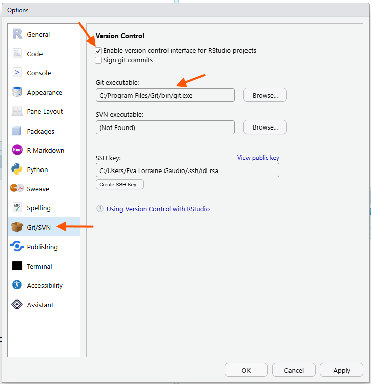
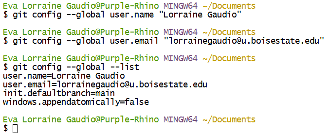

## Overview {#overview}

In this guided activity, you will connect GitHub, Git, and RStudio so they can work together. You will create a small GitHub repository, clone it into RStudio as a project, make changes locally, commit those changes, push them to GitHub, and practice pulling a change back down from GitHub.

In this course, you are not expected to learn how to write Git commands from memory. Git can be confusing at first, so the chapter keeps things simple with low-tech workarounds when useful. RStudio provides a beginner-friendly way to use Git, but its built-in Git tools are limited, so learning Git commands is necessary to take full advantage of Git. 

> To learn more about Git, check out the 1 credit hour course CS 155 - Introduction to Version Control.

By the end of this activity, you will 

- 🐙 have a working GitHub repository that proves your setup works.

- 🐙 understand the relationship between GitHub, Git, and RStudio.

- 🐙 know the workflow: Open Project → Pull → Edit → Save → Stage → Commit → Push.

- 🐙 know where to go to find Git and GitHub support on Campus.

### Setup Order {#setup-order}

Git and GitHub setup can feel challenging because several tools must connect correctly. This activity includes verification steps so you can confirm that each part works before moving forward. Complete the sections in order, pause when a verification step does not match what you see, and use support when you need it.

🎯 In this guided activity, you will:

1. Learn how [GitHub, Git, RStudio, and an RStudio Project](#github-git-and-rstudio) work together.
2. Check whether your current versions of [R and RStudio](#update-r-and-rstudio) meet the course requirements and update them only if needed.
3. Check whether RStudio can find [Git](#git).
4. [Install Git](#install-git), if needed, and verify that it works.
5. Create or access your [GitHub account](#github) and review what will be public.
6. Choose and [configure your Git commit identity](#configure-git-identity), including GitHub’s `noreply` email option if you prefer.
7. Check for existing SSH keys and [connect to GitHub safely with SSH](#configure-ssh-keys).
8. [Create the public practice repository](#make-github-repo) and [clone it into RStudio](#clone-github-via-rstudio).
9. Practice the complete [Open Project → Pull → Edit → Save → Stage → Commit → Push workflow](#workflow).
10. Create and test a `.gitignore` file for [data privacy and organization](#data-privacy-and-organization).
11. [Verify the final public repository](#final-repository-structure), review its commit history, and copy its regular browser URL for Canvas.

💡 **Tip**: If something does not work, and you're stuck, use the course support options to get help. You can do hard things!

---

## GitHub, Git, RStudio, and RStudio Projects {#github-git-and-rstudio}

Git, GitHub, RStudio, and an RStudio Project have different roles in a version-control workflow.

| Part | What it is | What it does in the workflow |
|---|---|---|
| [Git]{.glossary-term data-term="Git"} | A version-control tool installed on your computer | Tracks changes and records checkpoints called commits |
| [GitHub]{.glossary-term data-term="GitHub"} | A website that hosts remote Git repositories | Stores the tracked files and commit history that you push from your computer |
| RStudio | An application for working with R and project files | Lets you edit files and use Git through its built-in [Git pane]{.glossary-term data-term="Git Pane"} |
| RStudio Project | A project-specific RStudio workspace connected to a folder on your computer | Helps RStudio open in the correct folder and recognize the Git repository stored there |

A Git [repository]{.glossary-term data-term="Repository"} can exist in more than one location. The **local repository** is the project folder and Git history on your computer. The **remote repository** is the corresponding repository hosted on GitHub.

When you **push**, you send local commits to the remote repository. When you **pull**, you bring remote commits into your local repository.

[Version control]{.glossary-term data-term="Version Control"} tracks changes to files over time. A [commit]{.glossary-term data-term="Commit"} is a meaningful checkpoint that records a selected set of changes. You can compare commits or return to an earlier committed version when necessary.

Only tracked and committed work becomes part of Git history, and only commits that have been pushed appear in the remote repository on GitHub. Untracked, ignored, uncommitted, or unpushed files are not stored there.

> Git tracks the history. GitHub hosts the remote repository. RStudio provides the working interface. An RStudio Project keeps the work connected to the correct folder.

GitHub provides a useful remote copy and version history for tracked files, but it is not a complete backup of your project or computer.

---

## Update R and RStudio {#update-r-and-rstudio}

R and RStudio are separate programs that are updated on different schedules. You do not need to update either one simply because a newer version is available. If your current installation works and RStudio can find Git, continue with the activity.

Update R or RStudio when your course requires a particular version, when you need a feature that your installed version does not provide, or when a version-related problem has been identified. If you use a managed computer, follow your institution’s software-update process.

💡 **Tip:** Updating R is different from updating RStudio. Updating one does not automatically update the other.

[Download R and RStudio at https://posit.co/download/rstudio-desktop/](https://posit.co/download/rstudio-desktop/){target="_blank" rel="noopener noreferrer"}


## Git {#git}

As you are beginning to understand, [Git]{.glossary-term data-term="Git"} is the tool that tracks file changes. RStudio can use Git, but Git must be installed on your computer first. 

Git tools appear after version control is enabled for an RStudio Project.

Before downloading anything, check whether RStudio can already find Git. If RStudio can find Git, you do not need to install it again. RStudio Git integration means RStudio can use Git inside an RStudio Project. When this works, RStudio knows where Git is installed on your computer.

### Step 1 {#step-1-git-check}

**Open version control settings**

🎯 From the **[Tools]{.glossary-term}** menu, click **[Global Options]{.glossary-term}**.


🗣 This opens the Global Options window. On the left side of the window is a list of settings.

### Step 2 {#step-2-git-check}

**View Git/SVN settings**

🎯 Click the **Git/SVN** tab.



🎯 Make sure the box for **Enable version control interface for RStudio projects** is **checked.**

🎯 Look for the box labeled **Git executable**.

✅ Verify what you see:

- If you see a file path in the **Git executable** box, RStudio has found Git.
- If the Git executable box is empty, or RStudio says Git was not found, you need to install Git.

🗣 The Git executable path tells RStudio where Git lives on your computer. 

💡 **Tip:** Do not worry if your path looks different from someone else’s. Windows, Mac, and Linux store Git in different places.

### Step 3 {#step-3-git-check}

**Save the setting**

🎯 If the **Enable version control interface for RStudio projects** box was not checked, check it now.

🎯 Click **Apply**.

🎯 Click **OK**.

✅ Verify that the Global Options window closes.

🗣 You have now checked whether RStudio is ready to use Git.

## RStudio Terminal Check {#rstudio-terminal-check}

The Git/SVN tab is the main check for this activity. The Terminal check is optional, but it can help confirm that Git works.

 

In Figure 4, the Git/SVN option window in Global Options shows the path to the Git executable as well, confirming that Git is installed and recognized by RStudio. The Terminal pane shows the command which git and the output is /mingw64/bin/git, which indicates that Git is installed and located at that path. Your path will likely be different, but the key is that it shows a path to Git rather than an error message. The git --version command also shows the version of Git installed. If Git is not installed, it will return an error message, such as git: command not found.

### Step 1 {#step-1-terminal-check}

🎯 In RStudio, open the [Terminal]{.glossary-term} tab.

If you do not see the Terminal tab, go to:

```text
Tools > Terminal > New Terminal
```

### Step 2 {#step-2-terminal-check}

🎯 Type `git --version` in the terminal to check if Git is installed.

```bash
git --version
```
### Step 3 {#step-3-terminal-check}

✅ Verify what happens:

- If you see a Git version number, Git is installed.
- If you see an error message, Git may not be installed or RStudio may not be able to find it.


🗣 The Terminal check confirms whether Git responds to a command. The Git/SVN tab confirms whether RStudio knows where Git is installed.


---

## Checkpoint: Do You Need to Install Git? {#checkpoint-git}

✅ If RStudio shows a Git executable path, skip the install directions and continue to [Configure Git Identity](#configure-git-identity).


✅ If RStudio does not show a Git executable path, continue to the install directions for your operating system:

- [macOS: Install Git](#install-git-macos)
- [Linux: Install Git](#install-git-linux)
- [Windows: Git Bash](#install-git-windows)

---

## Install Git {#install-git}

Installation depends on your operating system: Windows users should install Git for Windows/Git Bash. If needed, Mac users should install Git through Xcode Command Line Tools, and Linux users can install Git through their package manager.

If you found that you do not have Git installed, navigate to the section that describes how to install Git for your operating system. 

### macOS: Install Git {#install-git-macos}

Most Macs have git. If for some reason you do not have Git installed, follow this 3 step process.

Most Mac computers can install Git through **Xcode Command Line Tools**. For this installation step, use the **Mac Terminal app**, not RStudio. You do **not** need to install the full Xcode app from the App Store for this course. 

#### Step 1 {#step-1-install-git-macos}

**Open the Mac Terminal app**

🎯  Here's how:

1. Press `Command + Space` to open Spotlight Search.
2. Type `Terminal`.
3. Press `Return`.

#### Step 2 {#step-2-install-git-macos}

**Type the command to install Git**

🎯 In the Mac Terminal app, type:

```bash
xcode-select --install
```

**Complete the installation process**

🎯 When the installation window appears:

1. Click Install.
2. Agree to the license terms.
3. Wait for the installation to finish.
4. Click Done when prompted.

#### Step 3 {#step-3-install-git-macos}

**✅ Verify Git installed correctly.**

🎯 Close the Mac Terminal app, reopen it, and type:

```bash
git --version
```
You should see a Git version number.

🗣 If you see a Git version number, Git is already installed. Return to RStudio and continue to [Configure Git Identity](#configure-git-identity).

💡 **Tip**: The Mac Terminal app and the RStudio Terminal tab look similar because both let you type commands. For installing Git on a Mac, you start with the Mac Terminal app, but after Git is installed, please use the RStudio Terminal for the remainder of the set up activity.


### Linux: Install Git {#install-git-linux}

Most Linux computers either already have Git installed or can install it through the Linux system's **package manager**. A package manager is the tool Linux uses to install and update software.

For this installation step, use your **Linux Terminal app**, not RStudio. After Git is installed, return to RStudio and check whether RStudio can find it.

#### Step 1 {#step-1-install-git-linux}

**Open the Linux Terminal app**

🎯 Open the Terminal app on your Linux computer.

How you open Terminal depends on your Linux version, but common options include:

- Press `Ctrl + Alt + T`
- Open the application menu and search for `Terminal`
- Right-click on the desktop and choose `Open Terminal`, if that option appears

#### Step 2 {#step-2-install-git-linux}

**Check whether Git is already installed**

🎯 In the Linux Terminal app, type:

```bash
git --version
```

✅ Verify what happens:

- If you see a Git version number, Git is already installed. Return to RStudio and continue to the **Configure Git Identity** section.
- If you see an error such as git: command not found, Git is not installed yet. Continue with the installation steps below.

#### Step 3 {#step-3-install-git-linux}

**Choose the command for your Linux version**

Linux has different versions, called distributions. The installation command depends on your distribution.

🎯 Use the command that matches your Linux system.

**Ubuntu or Debian**

```bash
sudo apt update
sudo apt install git
```

**Fedora**

```bash
sudo dnf install git
```

**Red Hat, CentOS, or older Fedora systems**

```bash
sudo yum install git
```

**Arch Linux**

```Bash
sudo pacman -S git
```

**openSuSE**

```bash
sudo zypper install git
```

#### Step 4 {#step-4-install-git-linux}

**Complete the installation process**

🎯 If Terminal asks for your password, type your computer password and press `Enter`.

You may not see the password characters while you type. That is normal.

🎯 If Terminal asks whether you want to continue, type:

```bash
y
```

Then press `Enter`.

#### Step 5 {#step-5-install-git-linux}

**✅ Verify Git installed correctly**

🎯 Close the Linux Terminal app, reopen it, and type:

```bash
git --version
```

You should see a Git version number.

🗣 If you see a Git version number, Git is installed on your Linux computer. Return to RStudio and continue to [Configure Git Identity](#configure-git-identity).

💡 Tip: The Linux Terminal app and the RStudio Terminal tab look similar because both let you type commands. For installing Git on Linux, start with the Linux Terminal app. After Git is installed, please use the RStudio Terminal for the remainder of the setup activity.

### Windows: Git Bash {#install-git-windows}

Most Windows computers do not come with Git already installed. Windows users usually need to install **Git for Windows**, which includes [Git Bash]{.glossary-term}. Here is how to install Git on your Windows computer when it is not already installed.

▶️ Watch the demonstration video if you want a visual walkthrough:

[Lorraine's Demonstration Video. Watch an RStudio Update and Git install on a Windows computer.](https://boisestate.hosted.panopto.com/Panopto/Pages/Viewer.aspx?id=21199429-d002-49ac-be8b-b3fa0017c302){target="_blank" rel="noopener noreferrer"}


#### Step 1 {#step-1-install-git-windows}

🎯 Go to the official Git for Windows download page:

[Link to Download Git for Windows](https://git-scm.com/install/windows){target="_blank" rel="noopener noreferrer"}

#### Step 2 {#step-2-install-git-windows}

🎯 Click the download link for the current 64-bit Git for Windows Setup.

💡 **Tip:** Choose the regular installer, not the portable version.

#### Step 3 {#step-3-install-git-windows}

Move through the installation process:

🎯 Open the downloaded installer file.

It will usually have a name like: `Git-2.XX.X-64-bit.exe`

🎯 Work through the installer screens.

For this course, keep the default options unless your computer gives you a clear reason not to.

- Keep the default installation location. It is usually something like "`C:\Program Files\Git`"
- Choosing the default editor used by Git.
- Keep the recommended/default PATH environment option.
- Keep the default HTTPS transport backend.
- Keep the default line ending conversions.
- Keep the default terminal emulator option.
  
🎯 Click Install.

🎯 When the installer finishes, click Finish.

#### Step 4 {#step-4-install-git-windows}

✅ Verify that Git Bash was installed.

1. Click the Windows Start menu.
2. Search for Git Bash.
3. Open Git Bash.
4. Type:

```bash
git --version
```

You should see a Git version number.

🗣 If Git Bash opens and shows a Git version number, Git is installed on your Windows computer. Return to RStudio and continue to [Configure Git Identity](#configure-git-identity).

---

## GitHub {#github}

[GitHub]{.glossary-term data-term="GitHub"} is the website that will host your online repository. A repository is a project folder that Git can track. In this course, you will use GitHub so your RStudio project can have an online copy.

Before you continue, make sure Git is installed and RStudio can find it. You will configure your Git identity after you create or access your GitHub account.

### Step 1 {#step-1-github}

**Open the GitHub sign-up page**

🎯 If you do not already have a GitHub account, go to the GitHub sign-up page:

[Sign up for GitHub: https://github.com/signup](https://github.com/signup){target="_blank" rel="noopener noreferrer"}

🎯 Keep this activity page open in another tab so you can return to the directions.

✅ Verify that you are on the GitHub sign-up page.

### Step 2 {#step-2-github}

**Create your account**

🎯 Follow the GitHub prompts to create a free personal account.

You will usually be asked for:

1. An email address.
2. A password.
3. A username.

💡 **Tip:** Use an email address you can access right now. GitHub may send a verification email before your account is fully ready.

### Step 3 {#step-3-github}

**Choose a username**

Your GitHub username may be visible on your public repositories, commits, and profile. Choose a username you would not mind showing to a professor, research mentor, internship supervisor, or future employer.

💡 **Tip**: A good username is:

- short,
- professional,
- memorable,
- timeless,
- easy to type,
- all lowercase if possible,
- separated with a hyphen `-` or underscore `_` if needed.

Examples of reasonable username styles:

```text
firstname-lastname
firstnamelastname
firstinitial-lastname
lastname-data
```
💡 **Tip**: Avoid usernames that are too silly, hard to spell, tied to a temporary joke, too personal, likely to embarrass you later.

🗣 Your GitHub username should be professional enough for academic or career use.

### Step 4 {#step-4-github}

**✅ Verify your email address**

🎯 Check the email account you used to sign up for GitHub.

🎯 Look for an email from GitHub.

🎯 Follow the verification instructions in that email.

✅ Verify that your GitHub email address is confirmed.

🗣 If your email is not verified, some GitHub features may not work correctly.

💡 **Tip**: If you do not see the email, check your spam, junk, promotions, or clutter folder.

### Step 5 {#step-5-github}

**Log into GitHub**

🎯 Go to [Github](https://github.com/login){target="_blank" rel="noopener noreferrer"} and log in.

🎯 Log in with the account you created.

✅ Verify that you can see your GitHub dashboard or profile menu.

🗣 If you can log in and see your GitHub account, you are ready to choose your commit email and configure your Git identity.

### Step 6 {#step-6-github}

**Review what will be public**

This activity uses a public practice repository. A public repository may display:

- the repository’s files and other contents;
- its commit history and commit messages;
- your GitHub username;
- the author name attached to each commit; and
- the commit email you choose.

Use this repository only for practice material. Do not include confidential research data, student records, passwords, tokens, private SSH keys, or other sensitive information.

### Step 7 {#step-7-github}

**Choose your commit email**

The email used to create or access your GitHub account and the email attached to your Git commits have different purposes. If you prefer not to display a personal or institutional email in future public commits, you can use the `noreply` email address GitHub provides for your account.

🎯 In GitHub:

1. Click your profile picture.
2. Click **Settings**.
3. In the **Access** section of the sidebar, click **Emails**.
4. Find the **Keep my email addresses private** setting.
5. If you want to use GitHub’s email-privacy option, select this setting—or leave it selected if it is already enabled.
6. Copy the exact `noreply` email address GitHub displays in your settings.

Do not invent the address or copy one from an example. GitHub supplies the correct address for your account.

✅ Verify that you have either:

- copied your exact GitHub-provided `noreply` address; or
- deliberately chosen another verified email address that you are willing to associate with future public commits.

🗣 GitHub’s email setting controls the identity used for work completed on the GitHub website. You will configure Git separately in the next section for commits created on your computer.

Changing your commit email affects future commits. It does not rewrite commits you made earlier.

[GitHub instructions for setting your commit email address](https://docs.github.com/en/account-and-profile/how-tos/email-preferences/setting-your-commit-email-address){target="_blank" rel="noopener noreferrer"}

### Step 8 {#step-8-github}

**Keep your GitHub information available**

🎯 Keep your GitHub username and chosen commit email available for the next section.

✅ Verify that you know your GitHub username and which commit email you selected.

🗣 You will use your GitHub username later when you create and verify your repository URL.

💡 **Tip:** Two-factor authentication protects access to your GitHub account. It is separate from your Git commit email and from the SSH-key passphrase introduced later in this chapter.

---

Now that Git is installed and you can access your GitHub account, you are ready to configure your Git identity.

## Configure Git Identity {#configure-git-identity}

Your [Git Identity]{.glossary-term data-term="Git Identity"} means the name and email Git attaches to your commits. This labels your work.

### Step 1 {#step-1-configure-git-identity}

🎯 Click the Terminal tab in the bottom left pane (next to the Console). 

If you do not see the Terminal tab, go to:

```text
Tools > Terminal > New Terminal
```

---

### Checkpoint: RStudio Terminal Check {#rstudio-terminal-check-2}

🎯 In RStudio, go to the Terminal tab and type:

```bash
git --version
```

✅ Verify you see a Git version number. See Figure 4 for more details. If you see a version number, Git is installed. If you see an error, Git is not installed correctly yet or RStudio cannot find it. 

💡 **Tip:** After installing Git, you may need to restart RStudio before RStudio recognizes it.

Continue only after RStudio displays a Git version number.

---

### Step 2 {#step-2-configure-git-identity}

**Check your current Git identity**

Before changing any settings, run these commands one at a time:

```bash
git config --global user.name
```

```bash
git config --global user.email
```

If the commands display the author name and commit email you selected, you do not need to set them again. Continue to the checkpoint below.

If a command returns no value, that setting has not been configured. If the displayed identity is not the one you intend to use, continue with the configuration commands.

If you are using a shared or managed computer and do not recognize the existing identity, do not replace it.

**Set your Git identity if needed**

The `--global` option makes these values the default author identity for future commits made through your user account on this computer. A particular repository can use different identity settings later.

Replace the placeholders below with your chosen author name and the exact commit email you selected in the previous section:

```bash
git config --global user.name "YOUR COMMIT AUTHOR NAME"
git config --global user.email "PASTE YOUR CHOSEN COMMIT EMAIL"
```

If you chose GitHub’s private email option, paste the exact `noreply` address GitHub provided. Do not construct or guess the address.

### Checkpoint: Git Identity Check {#git-identity-check}

🎯 Run these commands again:

```bash
git config --global user.name
```

```bash
git config --global user.email
```

✅ Verify that the results show the author name and exact commit email you intended to use.

🗣 The displayed values are Git’s default author name and commit email for future commits made through this computer account.

💡 **Tip:** Changing these settings affects future commits. It does not change the identity recorded in earlier commits.



Figure 5 shows an example of Git identity configuration in a Windows-style Terminal. Your Terminal prompt and additional settings may look different. For this activity, use the two focused commands in the checkpoint above to verify your author name and commit email.

---

Now that Git is installed, your Git identity is configured, and you can access GitHub, you are ready to connect with SSH.

## Configure SSH Keys {#configure-ssh-keys}

[SSH keys]{.glossary-term data-term="SSH Key"} allow your computer to authenticate with GitHub. After SSH is configured, RStudio can communicate with GitHub without asking for your GitHub password during every Git operation.

An SSH setup uses a matching pair of files:

| Key file | What it does | How to handle it |
|---|---|---|
| Private key | Stays on your computer and proves that the connection is yours | Keep it private. Never copy, upload, or share it. |
| Public key | Allows GitHub to recognize the matching private key on your computer | This is the key you may add to your GitHub account. |

A public-key filename normally ends in `.pub`. Its matching private-key filename does not end in `.pub`.

🗣 The public key can be added to GitHub, while the matching private key stays on the computer and proves the connection is authorized.

💡 **Tip:** Never paste, upload, email, or include your private key in a screenshot. When these directions tell you to copy a key, verify that the filename ends in `.pub`.

Official GitHub reference pages:

- [Check for existing SSH keys](https://docs.github.com/en/authentication/connecting-to-github-with-ssh/checking-for-existing-ssh-keys){target="_blank" rel="noopener noreferrer"}
- [Generate a new SSH key and use the SSH agent](https://docs.github.com/en/authentication/connecting-to-github-with-ssh/generating-a-new-ssh-key-and-adding-it-to-the-ssh-agent){target="_blank" rel="noopener noreferrer"}
- [Add a public SSH key to GitHub](https://docs.github.com/en/authentication/connecting-to-github-with-ssh/adding-a-new-ssh-key-to-your-github-account){target="_blank" rel="noopener noreferrer"}
- [Test an SSH connection](https://docs.github.com/en/authentication/connecting-to-github-with-ssh/testing-your-ssh-connection){target="_blank" rel="noopener noreferrer"}
- [Verify GitHub’s SSH host fingerprints](https://docs.github.com/en/authentication/keeping-your-account-and-data-secure/githubs-ssh-key-fingerprints){target="_blank" rel="noopener noreferrer"}

---

### Step 1 {#step-1-configure-ssh-keys}

**Open the correct terminal**

For this step, use a terminal that can run Git and SSH commands.

🎯 Open the correct terminal for your operating system:

| Operating system | Use this terminal |
|---|---|
| Windows | Git Bash |
| macOS | Mac Terminal app or RStudio Terminal |
| Linux | Linux Terminal app or RStudio Terminal |

✅ Verify that you have a terminal window open.

💡 **Tip:** Windows users should use Git Bash for this step. It was installed when you installed Git for Windows.

---

### Step 2 {#step-2-configure-ssh-keys}

**Check whether an SSH key already exists**

Before generating a new key, check the `.ssh` folder on your computer.

🎯 In the Terminal, run:

```bash
ls -al ~/.ssh
```

If the Terminal reports that the `.ssh` folder does not exist, no SSH key is stored in the default location. Follow the **new-key route** below.

If the folder exists, look for a matching public- and private-key pair. Common supported pairs include:

```text
id_ed25519     and id_ed25519.pub
id_ecdsa       and id_ecdsa.pub
id_rsa         and id_rsa.pub
```

The two filenames in a pair have the same base name. The public key ends in `.pub`; the private key does not.

### Checkpoint: Choose Your SSH Route {#checkpoint-choose-ssh-route}

✅ **Existing-key route:** If you recognize a complete key pair as yours and are authorized to use it, do not generate another key. Keep track of the public-key filename and skip Steps 3–5.

✅ **New-key route:** If the `.ssh` folder does not exist or contains no existing key pair, continue to Step 3.

If an existing key is unfamiliar, belongs to a shared or managed computer, or appears to be missing its matching file, stop here. Do not delete, rename, overwrite, display, or copy any of the files until you have confirmed how they should be handled.

🗣 Checking for an existing key first prevents an SSH key from being replaced accidentally.

💡 **Tip:** Finding a file that ends in `.pub` does not reveal the matching private key. Never open or share the file with the same name that does not end in `.pub`.

### Step 3 {#step-3-configure-ssh-keys}

**Generate an Ed25519 key—new-key route only**

If you selected the **existing-key route** in Step 2, do not run this command. Skip Steps 3–5 and continue to Step 6.

If you selected the **new-key route**, replace the placeholder below with the exact commit email you selected earlier:

```bash
ssh-keygen -t ed25519 -C "PASTE YOUR CHOSEN COMMIT EMAIL"
```

The email after `-C` becomes a label attached to the key. It does not replace your Git identity or your GitHub login information.

✅ Verify that the Terminal reports that it is generating an Ed25519 public/private key pair.

🗣 The `ssh-keygen` command creates two matching files: a public key and a private key.

If the Terminal reports that Ed25519 is unsupported, stop here. This activity uses Ed25519 throughout its remaining directions. Do not substitute another command or key type without checking current guidance for your system.

### Step 4 {#step-4-configure-ssh-keys}

**Confirm the file location without overwriting an existing key**

The Terminal will ask where to save the new key. The exact beginning of the path will depend on your computer, but the prompt should end with:

```text
.ssh/id_ed25519
```

If Step 2 confirmed that no `id_ed25519` key pair exists, press `Enter` to accept the default location.

The private and public keys will be saved using these matching filenames:

```text
id_ed25519
id_ed25519.pub
```

If the Terminal reports that the file already exists or asks a question such as:

```text
Overwrite (y/n)?
```

🎯 Type `n`, press `Enter`, and stop.

Do not type `y`. Do not overwrite, delete, or rename the existing key.

✅ Continue only if the Terminal advances to the passphrase prompt without displaying an overwrite question.

🗣 Accepting the available default location gives the matching key files consistent names without replacing another key.

### Step 5 {#step-5-configure-ssh-keys}

**Protect the private key with a passphrase**

The Terminal will display a prompt similar to:

```text
Enter passphrase (empty for no passphrase):
```

🎯 Type a secure passphrase and press `Enter`.

The Terminal will not display letters, dots, or other characters while you type. This is normal.

When prompted, type the same passphrase again and press `Enter`.

Do not use your GitHub password as the SSH-key passphrase. Keep the passphrase private and store it securely.

### Checkpoint: New SSH Key Created {#checkpoint-new-ssh-key-created}

✅ If you followed the new-key route, continue only after confirming that:

- the key was created without overwriting another file;
- the private-key filename is `id_ed25519`;
- the public-key filename is `id_ed25519.pub`; and
- the Terminal displays a fingerprint for the newly created key.

🗣 The SSH-key passphrase protects the private key. It is separate from the GitHub password and GitHub two-factor authentication.

💡 **Tip:** The next step uses an SSH agent so that the protected key can be used without entering its passphrase for every Git operation.

### Step 6 {#step-6-configure-ssh-keys}

**Prepare the selected SSH key**

In this step, you will:

1. add the selected private key to the SSH agent on your computer; and
2. copy the matching public key so you can add it to GitHub.

| Route | Private-key filename | Public-key filename |
|---|---|---|
| New-key route | `id_ed25519` | `id_ed25519.pub` |
| Existing-key route | The selected filename without `.pub` | The matching filename ending in `.pub` |

#### Start the SSH agent

In the same Terminal you have been using, run:

```bash
eval "$(ssh-agent -s)"
```

✅ Verify that the Terminal displays an agent process number similar to:

```text
Agent pid 12345
```

#### Add the private key to the SSH agent

This is a local operation. It does not display or upload the private key.

**Windows using Git Bash or Linux—new-key route**

```bash
ssh-add ~/.ssh/id_ed25519
```

**Windows using Git Bash or Linux—existing-key route**

Replace the placeholder with the private-key filename you selected in Step 2:

```bash
ssh-add ~/.ssh/YOUR_PRIVATE_KEY_FILENAME
```

**macOS—new-key route**

```bash
ssh-add --apple-use-keychain ~/.ssh/id_ed25519
```

**macOS—existing-key route**

If the existing key has a passphrase, replace the placeholder with its private-key filename:

```bash
ssh-add --apple-use-keychain ~/.ssh/YOUR_PRIVATE_KEY_FILENAME
```

If the existing key does not have a passphrase, use:

```bash
ssh-add ~/.ssh/YOUR_PRIVATE_KEY_FILENAME
```

If prompted, enter the SSH-key passphrase. The Terminal will not display characters while you type.

🎯 Check the keys currently loaded in the SSH agent:

```bash
ssh-add -l
```

✅ Verify that the agent lists the selected key. If you followed the new-key route, the displayed fingerprint should match the fingerprint created in Step 5.

🗣 The SSH agent can use the private key without displaying or uploading it. The private-key file remains on the computer.

#### Copy the matching public key

If you followed the existing-key route, replace `id_ed25519.pub` in the command with the public-key filename you selected in Step 2.

**Windows using Git Bash**

```bash
clip < ~/.ssh/id_ed25519.pub
```

If `clip` does not work, display the public key:

```bash
cat ~/.ssh/id_ed25519.pub
```

Then carefully select and copy the entire line.

**macOS**

```bash
pbcopy < ~/.ssh/id_ed25519.pub
```

**Linux**

```bash
cat ~/.ssh/id_ed25519.pub
```

Carefully select and copy the entire line.

The public key should appear as one long line. It begins with a key type, contains a long encoded value, and may end with a label.

### Checkpoint: SSH Key Ready for GitHub {#checkpoint-ssh-key-ready}

✅ Continue only after confirming that:

- the SSH agent lists the selected key;
- you copied the matching file whose name ends in `.pub`;
- you did not display, copy, or upload the private-key file; and
- the copied public key remains one complete line.

🗣 The SSH agent uses the private key locally, while the copied public key is the part that can be added to GitHub.

💡 **Tip:** The SSH agent remembers the unlocked key for the current session. Depending on your operating system and configuration, you may need to add the key to the agent again after restarting your computer.

### Step 7 {#step-7-configure-ssh-keys}

**Open GitHub SSH settings and check for a matching key**

First, display the SHA-256 fingerprints of the keys loaded in your SSH agent:

```bash
ssh-add -l -E sha256
```

Keep the Terminal open so you can compare the selected key’s fingerprint with GitHub.

🎯 In your browser:

1. Sign in to [GitHub](https://github.com/login){target="_blank" rel="noopener noreferrer"}.
2. Click your profile picture.
3. Click **Settings**.
4. In the **Access** section of the sidebar, click **SSH and GPG keys**.
5. Review the keys listed under **SSH keys**.

Compare the SHA-256 fingerprint shown for the selected key in the Terminal with the fingerprints listed in GitHub.

### Checkpoint: Does GitHub Already Have This Key? {#checkpoint-existing-github-key}

✅ **Matching key found:** If the same fingerprint already appears in your GitHub account, do not add the key again. Skip Step 8 and continue to Step 9.

✅ **No matching key found:** If the selected fingerprint does not appear in your GitHub account, continue to Step 8.

If GitHub shows a key that you do not recognize, pause this setup and review your account security before making changes. Do not delete a key merely because its title is unfamiliar; first compare its fingerprint and determine whether it belongs to another computer you use.

🗣 Matching fingerprints show that GitHub already has the public key associated with the selected private key on the computer.

### Step 8 {#step-8-configure-ssh-keys}

**Add the public key to GitHub if needed**

Complete this step only if Step 7 found no matching fingerprint.

🎯 On the **SSH and GPG keys** page:

1. Click **New SSH key** or **Add SSH key**.
2. In the **Title** box, enter a neutral description that will help you recognize the computer later.

Examples:

```text
Personal laptop
Home desktop
Windows laptop
Mac laptop
```

3. For **Key type**, select **Authentication Key**.
4. In the **Key** box, paste the public key copied in Step 6.
5. Verify that you pasted one complete line beginning with a key type such as `ssh-ed25519`.
6. Click **Add SSH key**.
7. Authenticate to your GitHub account if GitHub asks you to confirm the action.

Never paste the private key into GitHub. Only the public-key filename ending in `.pub` belongs in the **Key** box.

If GitHub reports `Key is already in use`, stop. Do not delete or regenerate the key. This message means the public key is already attached to another GitHub account or repository and must be identified before you continue.

### Checkpoint: Public Key Connected to GitHub {#checkpoint-public-key-connected}

✅ Verify that the selected key now appears in your GitHub SSH-key list.

✅ Compare its SHA-256 fingerprint with the result from:

```bash
ssh-add -l -E sha256
```

Continue only when the fingerprints match.

🗣 GitHub now has the selected public key, while the matching private key remains on the computer.

💡 **Tip:** The title is only a label to help you recognize the device. It does not change the key or its security.

### Step 9 {#step-9-configure-ssh-keys}

**Test the SSH connection**

Return to the same Terminal you used to start the SSH agent in Step 6.

🎯 Run:

```bash
ssh -T git@github.com
```

Use `git@github.com` exactly as written. Do not replace `git` with your GitHub username.

#### Verify GitHub’s host fingerprint if prompted

The first time this computer connects to GitHub, the Terminal may display a message similar to:

```text
The authenticity of host 'github.com' can't be established.
KEY-TYPE key fingerprint is SHA256:...
Are you sure you want to continue connecting (yes/no/[fingerprint])?
```

This is GitHub’s **server fingerprint**. It is different from the personal SSH-key fingerprint you compared in Steps 7–8.

Before typing `yes`:

1. Open GitHub’s current [SSH host fingerprints](https://docs.github.com/en/authentication/keeping-your-account-and-data-secure/githubs-ssh-key-fingerprints){target="_blank" rel="noopener noreferrer"}.
2. Find the fingerprint for the key type displayed in your Terminal.
3. Compare the entire SHA-256 fingerprint.

✅ If the fingerprints match exactly, type:

```text
yes
```

Then press `Enter`.

If the fingerprints do not match—or you cannot verify them—type `no` or cancel the command. Do not accept the connection.

If the Terminal does not display a host-fingerprint prompt, this computer may have connected to GitHub previously. Continue to the authentication result.

#### Verify the authentication result

If prompted, enter the SSH-key passphrase. The Terminal will not display characters while you type.

A successful result looks like:

```text
Hi YOUR-USERNAME! You've successfully authenticated, but GitHub does not provide shell access.
```

✅ Verify that the message contains the GitHub username you intend to use.

The phrase `GitHub does not provide shell access` is normal. GitHub uses this SSH connection for Git operations, not for an interactive server session.

💡 **Tip:** A successful test may still end with status code `1`. For this particular command, the authentication message—not the status code—confirms success.

If the message contains a different GitHub username, stop. The selected key is associated with a different account.

If you see `Permission denied (publickey)`, do not delete or regenerate any keys. Check that:

- the command uses `git@github.com`;
- `ssh-add -l -E sha256` lists the selected key; and
- the same fingerprint appears in the intended GitHub account.

If those checks do not resolve the problem, stop and use GitHub’s current [Permission denied troubleshooting](https://docs.github.com/en/authentication/troubleshooting-ssh/error-permission-denied-publickey){target="_blank" rel="noopener noreferrer"} before changing any keys.

---

### Checkpoint: SSH Setup Complete {#checkpoint-ssh-setup-complete}

✅ You have completed the SSH setup when:

- you selected a recognized and authorized key pair or safely created a new one;
- the private key remained private;
- the selected private key was loaded into the SSH agent;
- the matching public-key fingerprint appears in the intended GitHub account;
- you verified GitHub’s host fingerprint if the first-connection prompt appeared; and
- `ssh -T git@github.com` reported successful authentication for the correct GitHub username.

🗣 The successful authentication message confirms that this computer can use the selected SSH key to connect to the intended GitHub account.

---

If SSH is working, you are ready to create a GitHub repository and clone it into RStudio.

## Make GitHub Repo {#make-github-repo}

A GitHub **repository**, often called a repo, is the online project folder that GitHub stores for you. In this section, you will create a new repository on GitHub. Then you will copy its SSH link so RStudio can clone it onto your computer.

We'll start working on the GitHub website. Then, we'll move back into RStudio.

### Step 1 {#step-1-make-github-repo}

**Open GitHub**

🎯 In your browser, go to [GitHub](https://github.com/login){target="_blank" rel="noopener noreferrer"}

🎯 Make sure you are logged in.

✅ Verify that you can see your GitHub profile icon in the top-right corner.


### Step 2 {#step-2-make-github-repo}

**Start a new repository**

🎯 Find the `Repositories` area on your GitHub home page.

🎯 Click the green `New` button.

If you do not see the green `New` button:

1. Click your profile icon in the top-right corner.
2. Click Your repositories.
3. Click New.

✅ Verify that you are on a page called something like "Create a new repository."

### Step 3 {#step-3-make-github-repo}

**Name the repository**

🎯 In the **Repository name** box, type:

```text
data-r155-github-practice
```

✅ Verify that the repository name is exactly `data-r155-github-practice`.

🗣 This name identifies the repository as the practice project used in this activity.

💡 **Tip:** Lowercase letters and hyphens make repository names easy to read, remember, and type.

### Step 4 {#step-4-make-github-repo}

**Add a short description**

🎯 In the **Description** box, type:

```text
Practice repository for learning Git, GitHub, and RStudio
```

🗣 The description briefly explains the purpose of the repository.

### Step 5 {#step-5-make-github-repo}

**Choose repository visibility**

🎯 Choose **Public**.

🗣 Public means that the repository’s contents and commit history can be viewed online. This allows the completed workflow to be reviewed through a regular browser link.

💡 **Tip:** Use this repository only for practice material. Do not include private data, passwords, tokens, private keys, or sensitive files.

### Step 6 {#step-6-make-github-repo}

**Add a README file**

A `README` file is the front page of your repository. It explains what the repository is for.

🎯 Check the box for `Add a README file`

🗣 Adding a `README` gives the repository one starter file. 

We'll use this file to practice editing in RStudio.

### Step 7 {#step-7-make-github-repo}

**Leave the other options alone**

🎯 Leave these options unchanged:

- Repository template: No template
- `.gitignore`: None (for now). 
  - You will create and edit a `.gitignore` file later in the workflow activity.
- License: None

### Step 8 {#step-8-make-github-repo}

**Create the repository**

🎯 Click the green `Create repository` button.

✅ You should see:

- the repository name,
- a file called `README.md`,
- a green Code button.

---

Your repository now exists online on GitHub. Let's get it onto your computer.

## Copy SSH Repository Link {#copy-ssh-repo-link}

Now you need the repository link. Because you already set up SSH keys, you should copy the SSH link, not the HTTPS link.

### Step 1 {#step-1-copy-ssh-repo-link}

**Open the Code menu**

🎯 On your repository page, click the green Code button.

🎯 Make sure you are in the Local tab.

🎯 Choose `SSH`.

✅ Verify that the link starts with:

```text
git@github.com:
```

It should look something like this:

```markdown
git@github.com:YOUR-USERNAME/data-r155-github-practice.git
```

🗣 The SSH link tells RStudio to connect to GitHub using the SSH key you already set up.

💡 **Tip**: If the link starts with `https://`, you selected HTTPS. Switch to SSH before copying.

### Step 2 {#step-2-copy-ssh-repo-link}

**Copy the SSH link**

🎯 Click the copy button next to the SSH link.

✅ Verify that you copied the SSH link.

🗣 You are now ready to clone this GitHub repository into RStudio.

## Clone GitHub via RStudio {#clone-github-via-rstudio}

[Clone]{.glossary-term data-term="Clone"} means copy a GitHub repository onto your computer. RStudio will create a new project folder from the GitHub repository.

This is the part where students often get confused: cloning creates a new folder on your computer. That new folder is not a mistake. It is your local project folder.

### Step 1 {#step-1-clone-github-via-rstudio}

**Start a new RStudio Project**

🎯 Open RStudio.

🎯 Go to:

```text
File > New Project
```

🎯 Click:

```text
Version Control
```

🎯 Click:

```text
Git
```

✅ Verify that you see a screen asking for a repository URL.

### Step 2 {#step-2-clone-github-via-rstudio}

**Paste the SSH repository link**

🎯 In the `Repository URL` box, paste the SSH link you copied from GitHub.

> 🧐 **Notice:** This is the link copied in [Copy the SSH Repository Link](#copy-ssh-repo-link). If you did not copy the SSH link, return to that section and copy it now.

### Step 3 {#step-3-clone-github-via-rstudio}

**Check the project directory name**

RStudio will fill in the project directory name automatically.

🎯 The project directory name should be:

```text
data-r155-github-practice
```

💡 **Tip**: Ideally, the GitHub repository name and the RStudio project folder name should match. That makes it easier to stay organized.

### Step 4 {#step-4-clone-github-via-rstudio}

**Choose the parent folder**

The **Create project as subdirectory of** field asks where RStudio should place the cloned project folder.

🎯 Select a stable parent folder where you keep course or R projects. For example:

```text
Course-Projects/
```

RStudio will create the repository folder inside that parent folder:

```text
Course-Projects/
  data-r155-github-practice/
```

Do not create or select a second folder named `data-r155-github-practice`. RStudio creates that folder when it clones the repository.

✅ Verify that:

- the project directory name is still `data-r155-github-practice`; and
- the selected parent folder is a location you can find again.

🗣 RStudio will clone the repository into a new `data-r155-github-practice` folder inside the selected parent folder.

💡 **Tip:** A consistent project location makes it easier to reopen the correct RStudio Project later.

### Step 5 {#step-5-clone-github-via-rstudio}

**Create the project**

🎯 Choose to open in a **new session**, if that option appears.

🎯 Click `Create Project`.

✅ Verify that RStudio opens a project named:

```text
data-r155-github-practice
```

🗣 RStudio displays the active project name in the top-right corner of the RStudio window. If you do not see the project name, you may not be in the project yet.

### Step 6 {#step-6-clone-github-via-rstudio}

**Check the local project files**

🎯 Look in the RStudio Files pane.

✅ Verify that you can see:

```text
README.md
data-r155-github-practice.Rproj
```

The `README.md` file came from the GitHub repository. RStudio created the `.Rproj` file when it created the local project.

The `.Rproj` file stores project settings and allows the project to be reopened directly in RStudio. For this practice repository, you will include it in the first local commit.

You may also see the `.Rproj` file listed as untracked in the Git pane. That is expected. Hidden Git files may also exist, but you do not need to open or change them.

### Checkpoint: Repository Cloned into RStudio {#checkpoint-repository-cloned}

✅ Continue only after confirming that:

- RStudio displays `data-r155-github-practice` as the active project;
- `README.md` appears in the Files pane;
- `data-r155-github-practice.Rproj` appears in the Files pane; and
- the Git pane is available.

🗣 The GitHub repository has been cloned into a local RStudio Project, and the local project remains connected to the remote repository.

---

With the repository cloned, you have a local project folder on your computer that is connected to the online GitHub repository. Now you can make changes in RStudio and push them to GitHub.

## Local Changes {#local-changes} 

A [local change]{.glossary-term data-term="Local Change"} is a change you make on your own computer. In this section, you will edit the `README` file in RStudio, commit the change, push it to GitHub, and confirm that GitHub received it.

### Step 1 {#step-1-local-changes}

**Open `README.md`**

🎯 In the RStudio Files pane, click [README.md]{.glossary-term data-term="README.md"}

🗣 The `README.md` file opens in the source pane.

### Step 2 {#step-2-local-changes}

**Edit the `README`**

🎯 Add this line to the `README`:

```text
A line I wrote in RStudio.
```

🎯 Save the file.

✅ Verify that the file is saved.

🗣 You changed the file on your computer. Git should now notice that `README.md` has changed.

### Step 3 {#step-3-local-changes}

**Open the Git pane**

🎯 Find the [Git pane]{.glossary-term data-term="Git Pane"} in RStudio.

It is usually near the Environment, History, Connections, and Tutorial panes in the upper right area.

✅ Verify that `README.md` appears in the Git pane.

💡 **Tip**: If you do not see the Git pane, make sure you are inside the RStudio Project created from the GitHub repository.

### Step 4 {#step-4-local-changes}

**Stage the file**

🎯 In the Git pane, check the [Staged]{.glossary-term data-term="Staged"} box next to:

`README.md`

✅ Verify that `README.md` is checked.

🗣 [Staging]{.glossary-term data-term="Staged"} means, “include this file in the next commit.”

### Step 5 {#step-5-local-changes}

**Commit the change**

🎯 Click Commit button in the Git pane's menu bar.

The Commit window opens. It shows the staged file and a box for a commit message.

🎯 In the `Commit message` box, type:

```text
First Commit from RStudio
```

🎯 Click Commit.

🗣 A [commit]{.glossary-term data-term="Commit"} is a labeled checkpoint. It records what changed.

✅ Verify that the Commit window does not show a red error message and instead reports that the commit completed successfully.

💡 **Tip:** If Commit shows a red error message, do not keep clicking Commit. Read the first error line. A commit is created on your computer, so SSH and GitHub authentication errors occur during Push, not Commit. Check that at least one file is staged and that Git has a commit name and email configured before trying again.

### Step 6 {#step-6-local-changes}

**Push the commit to GitHub**

🎯 Click [Push]{.glossary-term data-term="Push"}.

You can find the Push button in the Git pane's menu bar, usually near the Commit button. It is also in the Commit window after you make a commit.

🗣 [Push]{.glossary-term data-term="Push"} sends your local commit from RStudio up to GitHub.

✅ Verify that the push finishes without an error.

💡 **Tip:** If Push reports `fetch first`, `non-fast-forward`, or that your repository is “behind,” stop and do not keep clicking Push. Pull once. If Pull completes without a conflict, try Push again. If RStudio reports a merge conflict, do not Push again until the conflict is resolved and the resolution is committed.

### Step 7 {#step-7-local-changes}

**Confirm the change on GitHub**

🎯 Return to your GitHub repository page in your browser.

🎯 Refresh the page.

🎯 Open or view `README.md`.

✅ Verify that you can see this line on GitHub:

A line I wrote in RStudio.

🗣 If the line appears on GitHub, your RStudio project successfully pushed a local change to your online GitHub repository.

---

Congratulations! You have successfully made a local change in RStudio, committed it, pushed it to GitHub, and confirmed that the change appears on GitHub. This is the basic workflow for using Git and GitHub with RStudio. 

Now let's talk about how to make this workflow a regular part of your work process. To learn the full workflow, start by closing RStudio. Opening RStudio is part of the steps in the workflow and you'll want to practice it from the beginning.

## Workflow {#workflow}

A [Git workflow]{.glossary-term data-term="Git Workflow"} is the repeatable order you follow when you sit down to work on a project connected to GitHub.

A useful Git workflow is:

```text
Open Project → Pull → Edit → Save → Stage → Commit → Push
```

This order matters. Pulling first checks whether GitHub has changes that your local computer does not have yet. That helps prevent push errors later. Git and GitHub are much easier to use when this workflow becomes automatic.

### Step 1 {#step-1-workflow}

**Open file system**

With RStudio closed, open your file system (Finder on Mac, File Explorer on Windows) and navigate to the folder where you saved your RStudio project. You should see a file with the extension `.Rproj` in that folder.

### Step 2 {#step-2-workflow}

**Open the project**

🎯 Open the project by double-clicking the `.Rproj` file in Finder or File Explorer. This helps ensure that RStudio opens in the correct project folder. You can also open RStudio and select `File > Open Project...`.

🗣 RStudio opens with the project name in the top-right corner. 

✅ Verify that the project name is correct and that you can see the project files in the Files pane.

### Step 3 {#step-3-workflow}

**Pull before working**

After you open your project, the first thing you should do is **Pull**. 

[Pull]{.glossary-term data-term="Pull"} means to grab changes from GitHub and bring them into your local project. Pulling is like saying, “What’s new on GitHub since I last worked?” If you are the only person using the repository, you will likely see "Already up to date." when you pull. That is normal. It means there are no new changes on GitHub that you don't have locally.

🎯 In RStudio, find the Git pane.

🎯 Click Pull.

✅ Verify that the pull finishes without a red error message.

🗣 Pulling first helps make sure your local project matches the version on GitHub before you make new edits.

💡 **Tip**: If you see a message that says “Already up to date,” that is good. It means GitHub does not have newer changes for your project right now.

### Step 4 {#step-4-workflow}

**Edit a file**

🎯 In RStudio, go to:

```text
File > New File > R Markdown
```

🎯 Give the document this title:

```text
GitHub Practice
```

🎯 Choose HTML as the output format.

🎯 Click OK or Create.

✅ Verify that a new R Markdown file opens in RStudio.

🗣 This file is currently open in RStudio, but it is not saved in your project folder yet.

> 🧐 Notice: These directions use an R Markdown file named `github_practice.Rmd`. If you prefer Quarto and already know how to use it, you may create `github_practice.qmd` instead. If you choose Quarto, treat every mention of `.Rmd` in the directions as `.qmd`.

### Step 5 {#step-5-workflow}

**Save the file**

🎯 Go to:

```text
File > Save As ...
```

🎯 Save the file in your project folder with this name:

```text
github_practice.Rmd
```
✅ Verify that `github_practice.Rmd` appears in the Files pane next to `README.md`.

🗣 The file should be saved in the main project folder. 


### Step 6 {#step-6-workflow}

**Stage the file**

Recall that [stage]{.glossary-term data-term="Stage"} means selecting the file or files that should be included in the next commit.

🎯 Go to the Git pane.

🎯 Check the Staged box next to:

```text
github_practice.Rmd
```

💡 **Tip:** Stage only the files you want to record in version control. Before committing, verify that you have not staged private, protected, restricted, or proprietary information.

### Step 7 {#step-7-workflow}

**Commit the file**

[Commit]{.glossary-term data-term="Commit"} means creating a labeled checkpoint in Git.

🎯 Click Commit.

🎯 In the commit message box, type:

```text
Add GitHub practice file
```

🎯 Click Commit.

✅ Verify that the Commit window does not show a red error message and instead reports that the commit completed successfully.

🗣 The commit saved a checkpoint in your local Git history.

💡 **Tip:** If Commit shows a red error message, do not keep clicking Commit. Read the first error line. A commit is created on your computer, so SSH and GitHub authentication errors occur during Push, not Commit. Check that at least one file is staged and that Git has a commit name and email configured before trying again.

### Step 8 {#step-8-workflow}

**Push the commit to GitHub**

[Push]{.glossary-term data-term="Push"} means sending your local commit to GitHub.

🎯 Click Push.

✅ Verify that the push finishes without a red error message.

🗣 Push sends your committed work from your computer to GitHub.

💡 **Tip:** If Push reports `fetch first`, `non-fast-forward`, or that your repository is “behind,” stop and do not keep clicking Push. Pull once. If Pull completes without a conflict, try Push again. If RStudio reports a merge conflict, do not Push again until the conflict is resolved and the resolution is committed.

### Step 9 {#step-9-workflow}

**Confirm the file on GitHub**

🎯 Return to your GitHub repository page in your browser.

🎯 Refresh the page.

✅ In your GitHub repository, verify that you can see:

```text
github_practice.Rmd
```

🗣 If the file appears on GitHub, your **Pull → Edit → Save → Stage → Commit → Push** workflow worked.

## Data Privacy & Organization {#data-privacy-and-organization}

A [data folder]{.glossary-term data-term="data/"} (`data/`) is a folder where project data files are stored. A [`.gitignore`]{.glossary-term data-term=".gitignore"} file tells Git which files or folders to ignore when committing changes.

In earlier course work, you may have stored a data file in the same folder as your R Notebook. That is a minimum workable structure, but it can get messy as projects grow. A better practice is to create a data/ folder and keep data files there.

In this section, you will learn how to keep the `data/` folder on your local computer. You will use `.gitignore` to prevent Git from pushing any files stored in the `data/` folder to GitHub.

**GitHub Sharing Guidelines**:

| Usually OK to upload to GitHub            | Do not upload to GitHub                |
| ----------------------------------------- | -------------------------------------- |
| Code you wrote                            | Human-subjects data                    |
| R Markdown or Quarto files                | Private, protected, or restricted data |
| README files                              | Passwords, tokens, or keys             |
| Public/open data you are allowed to share | Anything you promised to keep private  |


🗣 GitHub is useful for code and documentation. It is not automatically safe for every dataset.

### Step 1 {#step-1-data-privacy-and-organization}

**Pull first**

🎯 In RStudio, click **Pull** before making edits.

✅ Verify that the pull finishes without a red error message.

### Step 2 {#step-2-data-privacy-and-organization}

**Create a data folder**

🎯 In the RStudio Files pane, click New Folder.

🎯 Name the folder: "data"

✅ Verify that the `data/` folder appears in your Files pane.

> 🧐 **Notice:** Use only harmless practice text for this test. Do not use personal, private, restricted, or research data.

🎯 Open the `data/` folder.

🎯 Create a new text file and enter this practice sentence:

```text
This harmless practice file tests the data folder ignore rule.
```

🎯 Save the file inside the `data/` folder with this name:

```text
ignore-check.txt
```

✅ Verify that `ignore-check.txt` appears inside your local `data/` folder.

### Step 3 {#step-3-data-privacy-and-organization}

**Check for or create a `.gitignore` file**

🎯 In the RStudio Files pane, look in your main project folder for a file named:

```text
.gitignore
```

> 🧐 **Notice:** The file name starts with a period: `.gitignore`.  
> That may look strange if you are new to coding. Files that start with a period are often setup or configuration files. The period matters because Git is looking for this exact file name.

If you already see `.gitignore`, do **not** create a second one.

🎯 Click the existing `.gitignore` file to open it.

If you do **not** see `.gitignore`, create one:

```text
File > New File > Text File
```

🎯 Add these lines to the `.gitignore` file. If some lines are already there, leave them and add any missing lines:

```text
.Rproj.user
.Rhistory
.RData
.Ruserdata
.positai
data/
```

🎯 Save the file in the main project folder with this exact name:

```text
.gitignore
```

✅ Verify that `.gitignore` appears in the same folder as `README.md` and `github_practice.Rmd`.

💡 **Tip:** The file must be named `.gitignore`, not `gitignore`, `gitignore.txt`, or `.gitignore.txt`.

🗣 The line `data/` tells Git to ignore the local data folder. That means your `data/` folder can stay on your computer without being pushed to GitHub.

### Step 4 {#step-4-data-privacy-and-organization}

**Check the project files with R**

You can use R to check what files and folders are visible from the project.

🎯 In `github_practice.Rmd`, add and run this code chunk:

```{r eval=FALSE}
list.files()
list.files("data")
```

✅ Verify that the first command lists the `data` folder and the second command lists `ignore-check.txt`.

🗣 This confirms that the harmless test file exists on your computer. The next step checks whether Git is correctly ignoring it.

🎯 Add a short memo below the code chunk:

```markdown
🗣 The first command shows files and folders in my project folder. The second command checks what is inside the data folder.
```

🎯 Save `github_practice.Rmd`.

✅ Verify that `github_practice.Rmd` is saved.

> 🧐 **Notice:** To load data into R, you must include `data/` in the file path when loading those files.

### Step 5 {#step-5-data-privacy-and-organization}

**Stage only the files that should go to GitHub**

🎯 Go to the Git pane.

🎯 Stage these files:

```text
github_practice.Rmd
.gitignore
```

✅ Verify that `.gitignore` and your `github_practice.Rmd` or `github_practice.qmd` file are staged.

✅ Verify that neither `data/` nor `data/ignore-check.txt` appears as available to stage.

🗣 The test file exists on your computer but is unavailable to stage. This confirms that the `data/` rule is working for an untracked file.

💡 **Tip:** If `data/ignore-check.txt` appears in the Git pane, do not stage it. Check that:

- `.gitignore` is saved in the main project folder;
- the filename is exactly `.gitignore`; and
- the file includes this line exactly:

```text
data/
```

> 🧐 **Notice:** `.gitignore` helps prevent untracked files from being added to Git. It does not erase a file that was already committed. If sensitive information was committed, stop before making additional commits or pushes. Deleting the visible file may not remove it from the repository’s history. An exposed password or token must also be revoked or changed.

### Step 6 {#step-6-data-privacy-and-organization}

**Commit the data privacy rule**

🎯 Click Commit.

🎯 Use this commit message:

```text
Add data folder ignore rule
```

🎯 Click Commit.

✅ Verify that the commit completes successfully.

🗣 This commit records the data privacy and organization rule in your local Git history. The next step pushes that commit to GitHub.

### Step 7 {#step-7-data-privacy-and-organization}

**Push the data privacy rule to GitHub**

🎯 Click Push.

✅ Verify that the push finishes without a red error message.

🗣 This sends `.gitignore` and your updated R Markdown file to GitHub.

### Step 8 {#step-8-data-privacy-and-organization}

**Confirm the repository on GitHub**

🎯 Return to your GitHub repository page.

🎯 Refresh the page.

✅ Verify that GitHub shows:

```text
README.md
.gitignore
github_practice.Rmd
```

If you chose Quarto, verify that GitHub shows `github_practice.qmd` instead of `github_practice.Rmd`.

✅ Verify that GitHub does not show `data/` or `ignore-check.txt`.

🎯 Open the repository’s commit history.

✅ Verify that the commit history includes the commits you created during this activity.

🎯 Return to the repository’s main page and copy the URL from your browser’s address bar.

✅ Verify that the URL begins with `https://github.com/` and includes `data-r155-github-practice`. Do not use the SSH clone address beginning with `git@github.com:`.

🗣 The regular browser URL opens the public repository for another reader. Use this URL whenever you are asked to share or submit the repository.

---

### Check Point: Final Repository Structure {#final-repository-structure} 

✅ If your local computer folder  and GitHub repo structure matches  the diagram below, you have completed the activity. 


---


## Summary {#summary}

You have now completed the full GitHub, Git, and RStudio setup workflow. You created a GitHub repository, connected it to an RStudio Project, made local changes, committed those changes as checkpoints, pushed your work to GitHub, and practiced the habit of pulling before editing. You also used `.gitignore` to keep the `data/` folder local, which helps protect files that should not be uploaded online. This workflow is not something you need to memorize perfectly today, but it is something you should practice systematically: **Open Project → Pull → Edit → Save → Stage → Commit → Push**. RStudio gives you buttons for Pull, Commit, and Push, but you still need to make careful decisions about what files belong in each commit and what files should stay private. 

## Chapter Terms {#chapter-terms}

**Clone**: To copy a Git repository from GitHub or another remote location onto your computer. Cloning creates a new local project folder that contains the repository files and Git history, so you can work on the project in RStudio and later commit, pull, and push changes.

**Commit**: A saved checkpoint in Git that records a specific set of file changes with a message describing what changed. In this course, a commit is the version-control equivalent of saying, “save this meaningful stage of my work.”

**data/**: A project folder used to store dataset files separately from scripts, notebooks, and output files. Keeping data in a dedicated folder makes file paths clearer, keeps the project organized, and helps others find the raw or prepared data needed to reproduce the analysis. The data/ directory is also a common convention in R project structures.

**Git**: A version-control tool that tracks changes to files over time so you can save snapshots, review what changed, and return to earlier versions if needed. Git records the history of your R project files on your computer. 

**Git Identity**: The name and email address that Git attaches to each commit to show who authored the work. Your Git identity is set with `user.name` and `user.email`; it labels your commits so the project history shows who made each checkpoint.

**Git Pane**: The RStudio tab that shows Git-tracked file changes for the current project and provides point-and-click controls for common Git actions, such as viewing differences, staging files, committing, pulling, pushing, and viewing history. The Git pane appears only when Git version control is enabled for the project, and it is usually located near the Environment and History panes.

**GitHub**: An online platform for storing and sharing Git repositories. GitHub is the web-based location where your repository lives, while Git tracks changes locally and RStudio provides the Git pane you use to commit and push your work. 

**Git Bash**: A command-line program for Windows that comes with Git for Windows and provides a Bash-style terminal for running Git commands. It gives Windows users a consistent place to type commands such as `git status`, `git pull`, `git commit`, and `git push`, especially when instructions are written for a Unix-style terminal.

**.gitignore**: A plain-text file that tells Git which files or folders not to track or commit, such as temporary files, system files, rendered outputs, or large/private data files. A .gitignore file is usually placed in the root of a repository so the ignore rules apply consistently across the project.

**Git Workflow**: The regular sequence of steps used to move work through Git: update your local project, edit files, stage selected changes, commit a checkpoint, and push the commit to GitHub. A basic workflow is **pull → edit → stage → commit → push**. This pattern helps keep the local project and online repository in sync while creating a clear history of meaningful checkpoints. Commit snapshots when the project reaches a state worth recording.

**Global Options**: A settings window that controls how RStudio behaves across projects and sessions. This is where you can set defaults like appearance, saving behavior, code formatting, and how RStudio runs R.

**Local Change**: A file edit, addition, or deletion made in the project folder on your own computer before it is pushed to GitHub. Git can detect local changes in the working tree, but they are not part of the project history until you commit them, and they are not visible in the online repository until you push them.

**Pull**: Updating your local project with changes from the remote repository on GitHub. Pull before you start working so your RStudio project has the newest files before you edit, commit, and push. Technically, `git pull` fetches remote changes and merges them into your current local branch.

**Push**: Sending your local commits from your computer to the remote repository on GitHub. Pushing is how the work you committed in RStudio becomes visible in your online GitHub repository.

**README.md**: A Markdown file that explains what a repository contains and how to use it. On GitHub, the `README.md` is usually the first file people see when they open a repository, so it should provide key orientation such as the project purpose, file structure, setup steps, and important notes.

**Repository**: A project folder tracked by Git that stores the project files and each file’s revision history. A repository can live locally on your computer or remotely on a platform like GitHub, where it can be backed up, shared, and updated with commits, pulls, and pushes.

**SSH Key**: A pair of secure authentication files that lets your computer prove its identity to GitHub when Git connects by SSH. The public key is added to your GitHub account, and the private key stays on your computer; together, they let RStudio/Git communicate with GitHub without asking for your GitHub password each time. Never share the private key.

**Staged**: Marked for inclusion in the next Git commit. In RStudio’s Git pane, checking the Staged box tells Git, “include this file’s current changes in the checkpoint I am about to create.” Staging does not send the file to GitHub yet; it only prepares the selected change for the next commit.

**Subdirectory**: A folder located inside another folder, also called a **subfolder**. When you create a project as a subdirectory of a course folder, the new project folder is nested inside that larger folder (e.g, `DATA-R155/data-r155-github-practice/`). This keeps related files organized in a clear folder structure.

**Terminal**: A command-line tab in RStudio that lets you type commands directly to your computer’s system shell from inside the RStudio interface. The Terminal is different from the R Console: the Console runs R commands, while the Terminal is used for system-level commands such as Git commands, file navigation, and other command-line tools. In RStudio, the Terminal tab is usually next to the Console tab; if it is not visible, open it from Tools > Terminal > New Terminal or the Terminal menu.

**Tools**: The top-menu item that provides access to settings and helper features in RStudio. It is the place you go to change preferences, install tools, and access developer utilities. This menu that groups commands for customizing the IDE and running support tasks (for example, options, addins, and project tools).

**Version Control**: A system for tracking changes to files over time so you can review earlier versions, understand what changed, and return to a previous checkpoint if needed. In Git, these meaningful checkpoints are called commits, which are better than keep version history across many file copies. 


## References {#references}

Bryan, J., the STAT 545 TAs, & Hester, J. (n.d.). *Happy Git and GitHub for the useR*. [Happy Git and GitHub for the useR](https://happygitwithr.com/){target="_blank" rel="noopener noreferrer"}

Douglas, A., Roos, D., Mancini, F., Couto, A., & Lusseau, D. (2026, January 15). *An Introduction to R*. [Version control with Git and GitHub](https://intro2r.com/github_r.html){target="_blank" rel="noopener noreferrer"}

GitHub Docs. (n.d.). *About Git*. [Git, GitHub and how repositories work](https://docs.github.com/en/get-started/using-git/about-git){target="_blank" rel="noopener noreferrer"}

GitHub Docs. (n.d.). *Adding a new SSH key to your GitHub account*. [Add a new SSH key to GitHub](https://docs.github.com/en/authentication/connecting-to-github-with-ssh/adding-a-new-ssh-key-to-your-github-account){target="_blank" rel="noopener noreferrer"}

GitHub Docs. (n.d.). *Generating a new SSH key and adding it to the ssh-agent*. [Generate a new SSH key](https://docs.github.com/en/authentication/connecting-to-github-with-ssh/generating-a-new-ssh-key-and-adding-it-to-the-ssh-agent){target="_blank" rel="noopener noreferrer"}

GitHub Docs. (n.d.). *Testing your SSH connection*. [Test your SSH connection](https://docs.github.com/en/authentication/connecting-to-github-with-ssh/testing-your-ssh-connection){target="_blank" rel="noopener noreferrer"}

GitHub Docs. (n.d.). *Ignoring files*. [Use .gitignore to keep files out of GitHub](https://docs.github.com/en/get-started/git-basics/ignoring-files){target="_blank" rel="noopener noreferrer"}

Posit. (n.d.). *RStudio User Guide: Version Control*. [Use Git and GitHub with RStudio](https://docs.posit.co/ide/user/ide/guide/tools/version-control.html){target="_blank" rel="noopener noreferrer"}

Software Carpentry. (n.d.). *Version Control with Git*. [Follow Software Carpentry: Version Control with Git](https://swcarpentry.github.io/git-novice/index.html){target="_blank" rel="noopener noreferrer"}

Chacon, S., & Straub, B. (2014). *Pro Git* (2nd ed.). Apress. [Git basics: Getting a Git repository](https://git-scm.com/book/en/v2/Git-Basics-Getting-a-Git-Repository){target="_blank" rel="noopener noreferrer"}
