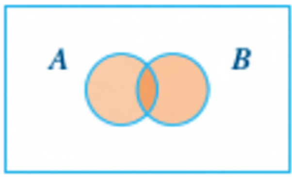

## Overview {#overview}

In Chapter 8, you learned how bracket subsetting works: `df[rows, cols]` lets you extract and modify exactly the pieces of a data frame you need. This chapter strengthens that skill by adding three essential logical operators to your toolkit: `&` (AND), `|` (OR), and `%in%` (in set). Most real analysis questions require more than one condition: “keep rows where X is true and Y is true,” “keep rows where A or B is true,” or “keep rows where a value is one of several allowed options.”

You will practice translating those English rules into correct R code using logical tests (`>`, `<`, `==`, `!=`) combined with `&`, `|`, and `%in%`. You will also practice checking your first interpretation instead of assuming that code is correct just because it ran. That is the open-mindedness focus for this chapter: write the filter you think matches the question, verify the result, and stay willing to revise the code when the output does not match the sentence you meant to write.

By the end of Chapter 10, you will be able to:

* ✂️ Apply bracket subsetting `x[i, j]` to select or exclude rows and columns by position.

* ⚖️ Generate and interpret logical vectors using relational operators (`>`, `<`, `<=`, `>=`, `==`, `!=`) on data-frame columns accessed with `$`.

* 🔍 Use logical vectors inside `[ ]` to filter rows based on conditions.

* 🔄 Explain and use logical negation with `!` to invert tests.

* 🧺 Combine multiple filtering conditions using `&` (AND), `|` (OR), and `%in%` (membership) to construct multi-criteria subsets.

* 🩹 Diagnose and correct a precedence bug by adding grouping parentheses.

* 🚜 Construct readable, reproducible multi-condition filters with clear comments and verification checks.

* 🤔 Compare more than one valid filtering approach and choose the one that is easier to read, check, and explain.

Keep these goals in mind as you move through each section.


## Activity Setup {#activity-setup}

🤔 You have used R Notebooks before to keep code, output, and memo notes together in one file. This chapter is your last guided activity using an R Notebook before we move to Quarto in the next chapter. As you work, notice what the R Notebook format makes easy: running chunks, seeing output under the code, and writing explanations near your work.

### Create/Save Chapter 10 Notebook {#create-notebook}

🎯 Create an R Notebook, edit the YAML, and save it in `Module_5/`.

1. Open an R Notebook: Go to `File > New File > R Notebook`.

2. Edit the YAML Header and delete the default text. The YAML header should look like this:

````{r echo=FALSE, results='asis'}
cat("```yaml
---
title: \"Chapter 10 Notes: And, Or, and Membership\"
author: \"[Your Name]\"
date: \"`r Sys.Date()`\"
output: html_notebook
---
```")
````

3. Change `[Your Name]` to your actual name and clear the default text in the body of the notebook.

4. Save your R Notebook: `File` > `Save As...`, choose your course folder, open `Module_5/`, and name the file `chapter10_notes`.

Suggested file structure:

```text
Intro_to_R/
└── Module_5/
    └── chapter10_notes.Rmd   # Add the guided activity file to your `Module_5/` folder
```

✅ Check that your file name ends in `.Rmd` and that it is saved inside your `Module_5/` folder.

🗣 This notebook will hold your Chapter 10 code, output, and memo notes. Keeping those pieces together makes it easier to rerun your work, check your filters, and explain the logic behind your subsetting choices.

🤔 This is a tool-choice moment. R Notebooks are useful because they let you test code in chunks and see the output right away. Later, when we move to Quarto, you will compare how a different file type supports a similar reproducible workflow.

**💡 Test knit.**

### Data for This Chapter {#data-for-this-chapter}

This chapter uses the built-in 🚗 `mtcars` dataset, so you do **not** need to download or move a data file for this guided activity.

🎯 Load the dataset inside your R Notebook.

```{r}
# ⚡ Type this in your R Notebook
data("mtcars")
```

✅ Check that `mtcars` appears in your Environment pane.

🗣 The `data()` function loads a built-in dataset that already comes with R. Because `mtcars` is built in, this chapter lets you focus on logical filters and subsetting without also managing an external CSV or Excel file.

🤔 Open-minded coding includes noticing what the task actually requires. In some chapters, the first problem is file management. In this chapter, the data is already available, so your attention can shift to writing, checking, and explaining your filtering logic.

**💡 Test knit.**

### Basic Data Inspection {#basic-data-inspection}

After loading data, inspect it before you start subsetting. You need to know what columns are available, what the values look like, and whether the dataset matches your expectations.

🎯 Open the help file and spreadsheet view for `mtcars`.

```{r, eval=FALSE}
# ⚡ Type this in your R Notebook
?mtcars       # opens the help file in the Help tab
View(mtcars)  # opens the spreadsheet view in the top-left pane
```

✅ Check the Help tab for variable names and descriptions. Check the spreadsheet view to see the rows and columns.

🗣 The help file gives you information about the dataset, including variable descriptions and source information. The spreadsheet view lets you inspect the data visually before writing subsetting code.

🤔 This is a good place to stay open-minded about the data. Do not assume you already know what each column means from the name alone. Check the documentation first, then let that information guide your code.

---

📖 **Review: Subsetting template**

📜 The SYNTAX: `x[i, j]`

* `i` is the **row index**.
* `j` is the **column index**.
* Leave `ROWS` blank → keep all rows.
* Leave `COLUMNS` blank → keep all columns.

🎯 Use bracket subsetting to preview the first 6 rows of `mtcars`.

```{r}
# ⚡ Type this in your R Notebook
mtcars[1:6, ]
```

✅ Check that the output shows the first 6 rows and all columns.

🗣 The blank after the comma means “keep all columns.” This code returns rows 1 through 6 of `mtcars` with every column included. This gives you a quick preview of the dataset before you start filtering it.

🤔 This preview is a verification habit. Before you write more specific filters, check that you understand the structure of the data you are working with. A good filter starts with a clear picture of the original dataset.

**💡 Test knit.**

---

Now that you have loaded and inspected `mtcars`, you are ready to subset it. The next section starts with one way to **exclude** rows or columns by position, then moves into logical tests that filter rows based on the values inside the data.


## Exclude Columns and Rows{#exclude-columns-and-rows}

Instead of keeping rows/columns by position or condition, you can also drop them. This is often done with negative indices or with logical conditions that create `TRUE`/`FALSE` vectors.

### Negative Indices {#negative-indices}

[Negative indexing]{.glossary-term data-term="Negative Indexing"} drops rows or columns by position. Inside the bracket subsetting operator `[` for vectors/matrices/data frames, a negative integer index means “leave these positions out.”

📜 The SYNTAX:  `x[-i, -j]`

Using negative indices drops rows/columns by position.

🎯 Drop columns 8 and 9 of `mtcars` to create a new data frame called `no_cat`. These columns, `vs` and `am`, are numeric indicator variables that represent categories.

```{r}
# ⚡ Type this in your R Notebook
no_cat <- mtcars[ , -c(8, 9)]   
# ✅ Verify
head(no_cat)
```

🗣 The `-c(8, 9)` is the integer vector containing `-8` and `-9`. Negative column indices mean: drop column 8 and drop column 9. The blank before the comma, `i` is empty → all rows. For `mtcars`, columns 8 and 9 are `vs` and `am`, respectively. So `mtcars[ , -c(8, 9)]` returns all rows and all columns except `vs` and `am`.

💡 **Tip:** With integer indexing, you generally use all positive indices (keep these) or all negative indices (drop these). Mixing them triggers the classic error: “only 0’s may be mixed with negative subscripts.”

🤔 Negative indexing is useful when you know the exact positions you want to drop. Stay open-minded about whether position is the best choice: if the column order changes, position-based code could remove the wrong columns.

The use of the negative sign `-` is one way to subset by excluding columns. However, the most powerful way to subset data frames is with logical operators that create `TRUE`/`FALSE` vectors.

### Inequality `!=` {#inequality}

[Conditional subsetting]{.glossary-term data-term="Conditional Subsetting"} with logical (relational) operators is more flexible than negative indexing because you can specify conditions on the values in the data frame, not just positions. Recall from Chapter 8 that logical tests create `TRUE`/`FALSE` vectors used inside of `[ ]`.

[Not Equal To]{.glossary-term data-term="Not Equal To"} (`!=`) is a relational operator that compares values and returns a logical vector of `TRUE`/`FALSE` results. When the element value is not equal to the specified value, the result is `TRUE`. When the element value is equal to the specified value, the result is `FALSE`. The result is the opposite of the `==` operator, which tests for equality.

🎯 Use `!=` to create a logical vector that is `TRUE` where the number of cylinders (`cyl`) is NOT equal to 4.

```{r}
# ⚡ Type this in your R Notebook
mtcars$cyl != 4       
```

🗣 This does not return a subset. It produces **a logical vector** you can use for subsetting, typically rows. In this example, the code returns a logical vector with `TRUE` where the number of cylinders is anything but 4 and `FALSE` otherwise.

🤔 This is a logic-translation moment. “Not equal to 4” and “exclude the 4-cylinder cars” describe the same idea from different angles. Before you subset, ask whether your code matches the sentence you mean.

---

📖 **Review:** Accessing Columns with `$`

* `$` extracts a single column as a vector.

* 📜 The SYNTAX: `dataframe$column_name`

🎯 Use `$` to access the `cyl` column of `mtcars` as a vector.

```{r}
# 📖 Review
mtcars$cyl
```

🗣 The `$` operator is used to access ONE specific column in a data frame by name. The column name is `cyl` and it tells the number of cylinders: 4, 6, or 8 for each car. The vector lists the values in `cyl` in row order. The `TRUE` and `FALSE` vector returned from `mtcars$cyl != 4` returned `TRUE` when the value did not equal 4.

For example, the first value 6 is `TRUE` because 6 is not equal to 4. The second value 6 is also `TRUE` because 6 is not equal to 4. The third value 4 is `FALSE` because 4 is equal to 4.

---

🎯 Use the logical test `!= 4` inside `[ ]` to keep only rows where `cyl` is NOT equal to 4.

```{r}
# ⚡ Type this in your R Notebook
not4 <- mtcars[mtcars$cyl != 4, ]
# ✅ Verify
head(not4)
```

🗣 This returns **a subset** of `mtcars` with all rows where the number of cylinders is anything but 4 and all columns. When the logical test returned `TRUE`, the row is selected. When the logical test returned `FALSE`, the row is removed from the output.

🤔 A filter can run and still deserve a check. Stay open to revising your code if the rows returned do not match the rule you meant to write.

### Not `!` {#not}

The [Not]{.glossary-term data-term="Not"} operator `!` negates a logical value. `!TRUE` becomes `FALSE`, and `!FALSE` becomes `TRUE`. It can be used to flip the result of a logical test.

🎯 Use `!` to create a logical vector that is `TRUE` where the number of cylinders (`cyl`) is NOT equal to 4.

```{r}
# ⚡ Type this in your R Notebook
not4_bang <- mtcars[!(mtcars$cyl == 4), ]
head(not4_bang)
```

🗣 `!(x == 4)` and `x != 4` mean the same thing! `!=` is a direct “not equal” comparison. `!` is more general. It negates a logical test. Here, `!(mtcars$cyl == 4)` reads as “NOT (cyl equals 4)”, which is equivalent to “cyl not equal to 4”.

🤔 You just wrote the same filter in two ways. When two approaches give the same result, the next question is which one is easier to read, check, and explain.

🎯 Verify that the `!` version of the subset matches the `!=` version.

```{r}
# ✅ Verify it matches the != version
identical(not4_bang, not4)
```

✅ Check that the output returns `TRUE`.

🗣 The two subsets are the same.

🤔 The `!` version is more flexible because you can negate *any* logical test, not just equality.

---

In summary, **negative indices** `-` exclude rows/columns by position only. The **inequality** `!=` operator compares values and returns `TRUE`/`FALSE` results, which are useful for filtering rows. The **Not** `!` operator negates any logical test. **Not** is useful for more complex logical tests such as element-by-element or membership logical operators covered later in this chapter.

## Practice Relational Operators {#practice-relational-operators}

Before we dive into complex logical tests, let's make sure we understand how relational operators work with subsetting. So far in this chapter, we have used the logical operators `==`, `!=`, and `!`. Let's practice using relational operators in combination with subsetting.

### Example 1 {#example-1}

The **Less Than or Equal To** (`<=`) operator returns `TRUE` where the left side is less than or equal to the right side, and `FALSE` otherwise.

🎯 Answer the question, "How many cars in the dataset have `mpg ≤ 15`?" Use a logical test to count how many cars have miles per gallon less than or equal to 15.

```{r}
# ⚡ Type this in your R Notebook in a code chunk
sum(mtcars$mpg <= 15)
```

🗣 The [less than or equal to]{.glossary-term data-term="Less Than or Equal To"} logical test `<= 15` evaluates each row value in the column `mpg` in the `mtcars` dataset (`mtcars$mpg`). If the car in a row has a value less than or equal to 15, the result is `TRUE`, otherwise `FALSE`. In R, `TRUE` is treated as `1` and `FALSE` as `0`. The function `sum()` adds all the `TRUE` values. There are 6 cars in the `mtcars` dataset with miles per gallon less than or equal to 15.

🤔 This is a good time to translate code back into words. `mtcars$mpg <= 15` means “find cars with mpg less than or equal to 15.” If your words and your code do not match, revise before moving on.

### Example 2 {#example-2}

The [Greater Than or Equal To]{.glossary-term data-term="Greater Than or Equal To"} (`>=`) operator returns `TRUE` where the left side is greater than or equal to the right side, and `FALSE` otherwise. We can combine this operator with negative indexing to create a subset of the data frame.

🎯 Create a subset of `mtcars` that contains rows with `hp >= 100`, and drops columns `3`, `5`, and `8:9` by position.

```{r}
# ⚡ Type this in your R Notebook in a code chunk
selection <- mtcars[mtcars$hp >= 100, -c(3, 5, 8:9)]
# ✅ Verify
head(selection)
```

🗣 `mtcars$hp >= 100` keeps only rows where horsepower is at least 100. The `-c(3, 5, 8:9)` part drops columns 3, 5, 8, and 9 from the result. In other words, it removes those column positions.

💡 **Tip:** A common mistake is to forget which side the `>`, `<` goes to the `=`. Remember that the `=` is always on the *right side* of the operator.

✔️ **`>=`**

🚫 **`=>`**

🤔 This subset combines two decisions: which rows to keep and which columns to drop. When code does more than one thing, check each part separately in your mind: “What rows am I keeping?” and “What columns am I removing?”

### Example 3 {#example-3}

We can also verify that we got the expected number of columns in our subset by passing the stored object names through functions. The function `ncol()` counts columns, and [Equal To]{.glossary-term data-term="Equal To"} (`==`) compares the results.

🎯 Verify that `selection` has the expected number of columns: 7 columns, since we dropped 4 from the original 11.

```{r}
# ✅ Verify
ncol(selection) == ncol(mtcars) - length(c(3, 5, 8:9))
```

🗣 This checks whether the subset has **the expected number of columns** after dropping columns 3, 5, 8, and 9.

* `ncol(selection)` counts the number of columns in the `selection` data frame.

* `ncol(mtcars)` counts the number of columns in the original `mtcars` dataset, which is 11.

* `length(c(3, 5, 8:9))` counts how many columns we dropped, which is 4. *Note that we could have written it as `c(3, 5, 8, 9)`.*

* `ncol(mtcars)` (11) minus `length(c(3, 5, 8:9))` (4) gives us the expected number of columns in `selection`, which is 7.

If it returns `TRUE`, the subset has the expected number of columns. If it returns `FALSE`, something went wrong, such as dropping too many or too few columns.

💡 **Tip:** This check confirms the column count, not the exact column names. If you also want to verify which columns remain, use `names(selection)`.

```{r}
# ✅ Optional verification
names(selection)
```

🤔 Verification is part of open-minded coding. Do not assume your subset is correct just because the code ran. Use small checks to see whether the result matches what you meant to create.

---

The next section introduces three new logical operators that help with more complex conditions: `&` (and), `|` (or), and `%in%` (in set).

## `&`, `|`, `%in%` {#and-or-in}

Up to this point, you have used single logical tests inside brackets to pick rows. For example:

```{r}
mtcars[mtcars$mpg <= 15, ]
```

That works when your filter has one requirement.

What if we have multiple requirements?

* “I want cars that are automatic **AND** have `mpg <= 22`.”

* “I want cars with 4 **OR** 8 cylinders.”

* “I want cylinders in the set `{4, 6}`.”

This section adds three new logical operators to your R toolkit: [And]{.glossary-term data-term="And"} (`&`), [Or]{.glossary-term data-term="Or"} (`|`), and [In Set]{.glossary-term data-term="In Set"} (`%in%`).

These operators allow us to combine multiple conditions for more complex subsetting.

Here is a summary table showing primary logical operators.

| Operator   | Meaning            | Example                              |              |              |
| ---------- | ------------------ | ------------------------------------ | ------------ | ------------ |
| `>`        | greater than       | mpg **`>`** 20                       |              |              |
| `<`        | less than          | mpg **`<`** 15                       |              |              |
| `==`       | equal to           | am **`==`** 1                        |              |              |
| `>=`       | greater *or* equal | mpg **`>=`** 25                      |              |              |
| `<=`       | less *or* equal    | mpg **`<=`** 15                      |              |              |
| `!`        | not                | **`!`**(gear %in% c(3, 4))           |              |              |
| `!=`       | not equal to       | gear **`!=`** 4                      |              |              |
| **`&`**    | and                | x > 2 **`&`** y == "a"               |              |              |
| **`        | `**                | or                                   | cyl == 4 **` | `** cyl == 8 |
| **`%in%`** | in set             | region **`%in%`** c("West", "South") |              |              |

Let's explore each of these three new operators in more detail. In this section, we'll build multiple logical tests on columns, combine tests with `&` and `|` to form a single condition, and use `%in%` to match one of many allowed values.

🤔 As the filters get longer, stay open to checking your first interpretation. A filter should match the question in plain English, not just produce output.

### And `&` {#and}

Suppose we have two events: A and B. The [and]{.glossary-term data-term="And"} operator `&` returns `TRUE` only if **both** event A and event B are **true**. It returns `FALSE` if either event A or event B, or both, are false. The "and" is used to combine two or more conditions where all conditions must be true.

```{r And, out.width='40%', fig.align='center', fig.cap='Figure 1. Venn diagram showing the AND condition. The shaded area is the overlap between A and B, which means only observations that satisfy both conditions are included.', fig.alt='Venn diagram showing the AND operation, with only the overlapping area between A and B shaded.', echo=FALSE}
knitr::include_graphics("images/ch10-andor/And.png")
```

🎯 Filter `mtcars` to keep cars that are both automatic (`am == 0`) *and* have miles per gallon less than or equal to 22.

**Step 1:** Create two separate logical vectors for each condition.

```{r}
# ⚡ Type this in your R Notebook in a code chunk
is_auto <- mtcars$am == 0
mpg_22_or_less <- mtcars$mpg <= 22

# ✅ Verify: look at the first few TRUE/FALSE values
head(is_auto)
head(mpg_22_or_less)
```

🗣 Two logical vectors are created. `is_auto` is `TRUE` where the car has automatic transmission (`am == 0`) and `FALSE` where it has manual transmission (`am == 1`). `mpg_22_or_less` is `TRUE` where the miles per gallon is less than or equal to 22, and `FALSE` otherwise.

🤔 Creating the conditions separately can make the logic easier to inspect. Before combining them, check whether each individual test means what you think it means.

**Step 2:** Combine the two logical vectors with `&` to create a single condition that is `TRUE` only where both conditions are met.

```{r}
# ⚡ Combine conditions row-by-row
keep_rows <- is_auto & mpg_22_or_less

# ✅ Verify
head(keep_rows)
sum(keep_rows)   # how many rows will be kept?
```

🗣 The `keep_rows` vector is `TRUE` only where both `is_auto` and `mpg_22_or_less` are `TRUE`. The `sum(keep_rows)` counts how many rows satisfy both conditions.

🤔 The word **and** makes the filter stricter. If one condition is `TRUE` but the other is `FALSE`, the row is not kept. Check that this matches the data question before you subset.

**Step 3:** Use the combined logical vector to subset the data frame.

```{r}
# ⚡ Subset the data
auto_mpg_22_or_less <- mtcars[keep_rows, ]

# ✅ Verify
head(auto_mpg_22_or_less)
```

🗣 The `auto_mpg_22_or_less` object is a subset data frame of `mtcars` that contains only rows where the car is automatic and has miles per gallon less than or equal to 22.

Alternatively, you can combine the conditions directly inside the subset without creating intermediate logical vectors.

```{r, eval=FALSE}
# ⚡ Type this in your R Notebook in a code chunk
auto_mpg_22_or_less <- mtcars[mtcars$am == 0 & mtcars$mpg <= 22, ]
```

🗣 Use `&` when you want rows that satisfy all requirements at the same time. Both `mtcars$am == 0` and `mtcars$mpg <= 22` must meet the condition to be `TRUE`.

```{r, eval=FALSE}
# ✅ Verify 
head(auto_mpg_22_or_less)
```

```{r, eval=FALSE}
# ✅ Verify 
nrow(auto_mpg_22_or_less)
```

🗣 `&` is the correct operator for the creation of `auto_mpg_22_or_less` because we want cars that are *both* automatic and have `mpg` less than or equal to 22. `&` is strict. It requires *everything* to be true.

🤔 You have now seen two ways to write the same filter: separate logical vectors first, or one combined condition inside `[ ]`. When two approaches give the same result, ask which one is easier to read, check, and explain.

💡 **Tip:** Students often write one condition correctly and “half-write” the other, like this:

```{r, eval=FALSE} 
mtcars$am == 0 & mpg <= 22
```

That is wrong because `mpg` is not defined by itself here. Both sides of `&` must be complete logical tests.

---

The next section uses `|`, which answers a different kind of question. Use `&` when **all** conditions must be true. Use `|` when **at least one** condition can be true.


### Or `|` {#or}

Suppose we have two events: A and B. The [or]{.glossary-term data-term="OR"} logical operator `|` returns `TRUE` if either **event A** is true, **event B** is true, **or both** events are **true**. It only returns `FALSE` if both events are false. "Or" is inclusive and is used to combine two or more conditions where at least one condition must be true.


```{r Or, out.width='40%', fig.align='center', fig.cap='Figure 2. Venn diagram showing the OR condition. The shaded area includes anything in A or B, which means observations that satisfy either condition, or both conditions, are included.', fig.alt='Venn diagram showing the inclusive OR operation, with both circles A and B shaded, including their overlap.', echo=FALSE} 

```

Use `|` when you want rows that satisfy at least one requirement. The `|` is located above the Enter key on your keyboard. It is the vertical bar and shares the key with the backslash `\`. Click and hold the Shift key to type `|`.

🎯 Keep rows for cars that have either 4 *or* 8 cylinders.

```{r, eval=FALSE}
# ⚡ Type this in your R Notebook in a code chunk
four_or_eight <- mtcars[mtcars$cyl == 4 | mtcars$cyl == 8, ]
```

```{r, eval=FALSE}
# ✅ Verify 
head(four_or_eight)
```

```{r, eval=FALSE}
# ✅ Verify 
unique(four_or_eight$cyl)
```

🗣 The Or `|` operator checks element-by-element to return only cars that have either 4 or 8 cylinders.

🤔 Before choosing `|`, say the filter in words: “4 cylinders or 8 cylinders.” If either condition is allowed, `|` is the right operator.

💡 **Tip:** Sometimes students mix up when to use `|` when they meant `&`, or vice versa. Try saying the filter out loud before coding.

* "I want rows that are both A **and** B" means both conditions must be `TRUE` at the same time. 👉 use `&`

* "I want rows where at least one condition, A **or** B, is `TRUE`." 👉 use `|`

### Membership `%in%` {#membership}
[OR]{.glossary-term data-term="OR"} becomes annoying when you have many options. The [in set]{.glossary-term data-term="In Set"} `%in%` operator tests if values belong to a set, or vector. It is a shorthand for multiple OR `|` conditions. This is the scalable OR operator when you have many values to match.

The `%in%` in `x %in% c(a, b, c)` means, "For each value in `x`, is it one of these allowed values?" It returns a logical vector (`TRUE`/`FALSE`) the same length as `x`.

🎯 Complete the same task as the `|` example, but this time use `%in%`.

```{r, eval=FALSE}
# ⚡ Type this in your R Notebook in a code chunk
four_or_eight_2 <- mtcars[mtcars$cyl %in% c(4, 8), ]
```

```{r, eval=FALSE}
# ✅ Verify: same number of rows as the | version
nrow(four_or_eight) == nrow(four_or_eight_2) 
```

🗣 When matching many categories, `%in%` is easier than chaining many `|` statements. `%in%` prevents repetitive OR chains and stays readable when the list is long.

🤔 You just wrote the same filter in two ways: once with `|` and once with `%in%`. When two approaches give the same result, the next question is which one is easier to read, check, and explain.

🎯 Use `%in%` to filter `mtcars` for cars with 3, 4, 6, or 8 carburetors.

```{r, eval=FALSE}
# ⚡ Type this in your R Notebook in a code chunk
carb_3_4_6_8 <- mtcars[mtcars$carb %in% c(3, 4, 6, 8), ]
```

```{r, eval=FALSE}
# ✅ Verify
head(carb_3_4_6_8)
```

🗣 If we had used `|` instead of `%in%`, we would have had to write `mtcars$carb == 3 | mtcars$carb == 4 | mtcars$carb == 6 | mtcars$carb == 8`, which is much more verbose and harder to read.

💡 **Tip:** A common mistake with `%in%` is mixing the order.

* `c(4, 8) %in% mtcars$cyl` is valid R code, but it answers the wrong question for filtering rows.

* Use the `x %in% c(a, b, c)` format for subsetting rows. The left side is the column you are testing, and the right side is the set of allowed values.

🤔 `%in%` helps when your thinking is “keep rows where this column matches one of these allowed values.” If your code puts the allowed values on the left, pause and check whether you are testing the column or testing the set.

---

Now that we have these three tools for building row filters, we can combine them to create more complex conditions.

## Putting `&`, `|`, `%in%` Together {#putting-and-or-in-together}

In this section, you’ll practice combining `&`, `|`, and `%in%` into realistic filters. The hard part is not typing the operators. The hard part is making sure your code matches the sentence you think you wrote.

### Grouping Parentheses {#grouping-parentheses}

When we combine multiple conditions with `&`, `|`, or `%in%`, we need to make sure the code matches the sentence we think it does. Use [grouping parentheses]{.glossary-term data-term="Grouping Parentheses"} when mixing `&` and `|` to make intent explicit. Without grouping parentheses, we can trigger a [precedence bug]{.glossary-term data-term="Precedence Bug"}, where R groups a mixed `&`/`|` filter by its precedence rules. R evaluates `&` before `|`, so `a & b | c` is treated as `(a & b) | c` instead of the logic we may have intended: `a & (b | c)`. The grouping parentheses override the operator precedence.

**Add parentheses to show what the OR part is.**

Let's see how the parentheses change which rows are selected.

🎯 Keep automatic transmission cars (`am == 0`) that are either very efficient (`mpg >= 25`) or very light (`wt < 2.5`, meaning less than 2500 lb).

We'll write this with and without parentheses to see the difference.

```{r}
# ⚡ Type this in your R Notebook in a code chunk
maybe_wrong <- mtcars[mtcars$am == 0 & mtcars$mpg >= 25 | mtcars$wt < 2.5, ]
head(maybe_wrong)
```

🗣 The statement was evaluated like this: (`mtcars$am == 0 & mtcars$mpg >= 25`) OR `mtcars$wt < 2.5`. This means that we kept cars that are both automatic and very efficient, or we kept cars that are very light. This is not our defined goal.

```{r}
# ⚡ Type this in your R Notebook in a code chunk
intended <- mtcars[mtcars$am == 0 & (mtcars$mpg >= 25 | mtcars$wt < 2.5), ]
head(intended)
```

🗣 The statement was evaluated like this: `mtcars$am == 0` AND (`mtcars$mpg >= 25 | mtcars$wt < 2.5`). This means that we kept cars that were automatic and either very efficient or very light. That's our goal!

⚖️ Compare the number of rows in `maybe_wrong` to `intended`.

```{r, eval=FALSE}
# ✅ Verify
nrow(maybe_wrong) == nrow(intended)
```

🗣 The parentheses matter when mixing `&` and `|` because parentheses clarify the order of operations. Without parentheses, R follows its precedence rules, which can lead to unintended results. With parentheses, we make sure the conditions inside them are evaluated first.

🤔 Both versions of the code can run, but they do not mean the same thing. When the result surprises you, compare the code to the sentence you meant to write before deciding which version is correct.

---

### Multi-Condition Filter {#multi-condition-filter}

The previous example was about controlling meaning. Now you’ll apply that idea to a filter that looks like something you’d actually do in analysis: restrict the dataset using several criteria at once.

🎯 Pick cars that weigh less than 3,000 lb, have horsepower between 110 and 180, and have either 4 or 6 cylinders.

*In `mtcars`, weight is in units of 1000 lbs, so we want `wt < 3`.*

💡 **Tip:** Before coding, translate the goal into a single sentence that matches the logic you want: "I want cars that are light (`wt < 3`) **AND** have mid-range horsepower (`110 <= hp <= 180`) **AND** have either 4 OR 6 cylinders."

```{r}
# ⚡ Type this in your R Notebook in a code chunk
light_midpower <- mtcars[
  mtcars$wt < 3 &           
  mtcars$hp >= 110 & mtcars$hp <= 180 &
  mtcars$cyl %in% c(4, 6), ]
```

🗣 We wrote each condition on a separate line for readability, but they are combined into a single filter. By having one condition per line, we can visually identify the logical arguments. When you click "Enter" or "Return," R automatically indents.

🤔 Longer filters are easier to check when each condition is visible. If your code feels crowded, stay open to rewriting it in a clearer layout before you move on.

```{r}
# ✅ Verify
head(light_midpower)
```

```{r}
# ✅ Verify
range(light_midpower$hp)
```

🗣 The code selected rows with horsepower between 110 and 180.

```{r}
# ✅ Verify
unique(light_midpower$cyl)
```

🗣 The code selected rows with 4 or 6 cylinders.

```{r}
# ✅ Verify
all(light_midpower$wt < 3)
```

🗣 The code selected rows with weight under 3, meaning under 3000 lbs.

🤔 These checks look at the subset from more than one angle: horsepower, cylinders, and weight. Open-minded coding means not relying on one quick glance when several conditions need to be true.

---

By this point, you should be able to translate a real-world rule into a logical filter, use parentheses to prevent a precedence bug, and confirm that your subset matches your intent with quick verification checks. Next, we’ll step back and summarize the core subsetting and logic skills you practiced in this chapter and why they matter for reliable analysis.

## Summary {#summary}

You learned how to subset data frames more precisely by building logical tests and using them inside `df[rows, cols]`. You practiced excluding columns with negative indexing, filtering rows with relational operators like `!=`, and negating logical tests with `!`. You then added three high-impact operators: `&` to require multiple conditions at the same time, `|` to accept at least one condition, and `%in%` to match values that belong to a set without writing long OR chains.

You also practiced open-minded coding. In this chapter, that meant comparing more than one way to write a filter, checking whether your code matched the sentence you intended, and revising your approach when the output gave you a reason to look again. This matters most when filters get longer. A filter can run and still mean the wrong thing.

Most importantly, you learned to prevent a precedence bug by using grouping parentheses whenever you mix `&` and `|`, so the code matches the sentence you intended. If you can state your rule clearly, write the logical filter cleanly, and verify the output with quick checks (`nrow()`, `unique()`, `range()`, `all()`), you can trust that the subset you pass into later analysis is the right one.


## Chapter Terms {#chapter-terms}

**And** (`&`): An element-by-element logical operator that returns `TRUE` only where both conditions are `TRUE`; otherwise it returns `FALSE` (or `NA` when the result can’t be determined because of missing values).

**Conditional Subsetting** (Logical Subsetting): Filtering an object by using a logical condition inside [ (e.g., `df[df$cyl != 4, ]`), where `TRUE` keeps an element/row and `FALSE` drops it. This contrasts with negative indexing, which excludes by position rather than by a condition.

**Equal To** (`==`): A relational operator that tests equality and returns `TRUE` where values are equal and `FALSE` where they are not (element-by-element for vectors).

**Greater Than** (`>`): A relational operator that compares two values (or vectors) and returns a logical vector that is `TRUE` where the left side is greater than the right side, and `FALSE` otherwise (with `NA` if the comparison is unknown).

**Greater Than or Equal To** (`>=`): A relational operator that returns `TRUE` where the left side is greater than or equal to the right side, and `FALSE` otherwise.

**Grouping Parentheses**: Parentheses `(` `)` used to explicitly group parts of an expression so R evaluates them together, in the order you intend, rather than relying on operator precedence and associativity rules. This is especially important when mixing logical operators like `&` and `|`, where missing parentheses can change the meaning of your filter.

**In Set** (`%in%`): A membership operator that returns a logical vector indicating whether each element on the left appears anywhere in the vector on the right (e.g., `region %in% c("West","South")`)

**Not Equal To** (`!=`): A relational (comparison) operator that tests whether values are not equal and returns a logical vector (`TRUE`/`FALSE`) element-by-element (e.g., `x != 4`). By itself it doesn’t drop anything—it creates a condition you can use for subsetting.

**Less Than** (`<`): A relational operator that returns `TRUE` where the left side is less than the right side, and `FALSE` otherwise (vectorized across elements).

**Less Than or Equal To** (`<=`): A relational operator that returns `TRUE` where the left side is less than or equal to the right side, and `FALSE` otherwise.

**Negative Indexing**: Using negative integers inside the single bracket operator `[` to exclude elements (or rows/columns) by position (e.g., `x[-2]` drops the 2nd element; `df[ , -c(8, 9)]` drops columns 8 and 9). In base R, negative and positive indices can’t be mixed in the same subset (except `0`)

**Not** (`!`): A logical operator that negates a logical value: `!TRUE` becomes `FALSE`, and `!FALSE` becomes `TRUE` (and `!NA` remains `NA`).

**Not Equal To** (`!=`): A relational operator that returns `TRUE` where values differ and `FALSE` where they match (vectorized across elements).

**Or** (`|`): An element-by-element logical operator that returns `TRUE` where either condition is `TRUE`; otherwise it returns `FALSE` (or `NA` when the result is ambiguous due to missing values).

**Precedence Bug**: An error where a mixed-operator expression is grouped and evaluated differently than intended because R applies operator precedence rules when parentheses are missing. In R, & binds more tightly than |, so `a & b | c` is interpreted as `(a & b) | c` unless you add parentheses to force `a & (b | c)`.

## 📝 Practice Space {#practice-space}

This Practice Space uses a new scenario to help you generalize your learning. While the dataset and question are different from the guided activity, the filtering patterns are the same. You will work with `dslabs::gapminder` and use the columns `country`, `year`, `region`, `population`, `life_expectancy`, `infant_mortality`, and `fertility` to build a shortlist for an **NGO health pilot**.

Open a new R Notebook and save it in your course folder as: `chapter10_practice.Rmd`.

Fill in the blanks and answer the short prompts in your R Notebook. This Practice Space helps you check whether you can use bracket subsetting, relational operators, `&`, `|`, `%in%`, `which()`, and verification checks to create a readable, defensible subset of data.

Before you begin:

1. Create a new R Notebook in RStudio.

2. Save it in your course folder as `chapter10_practice.Rmd`.

3. Edit the YAML so that it includes:

   * the title `"Chapter 10 Practice"`,
   * your name as the author, and
   * the date.

4. Remove the default content in the R Notebook.

5. Create headings for each task using the `##` heading level.

Complete each task in order.

Add short memo notes throughout your notebook. Your memo notes should explain what your code does, what output you expected, what surprised or confused you, and what you would check next if something did not work.

In this Practice Space, you will see two kinds of memo prompts:

* 🗣 **Add Comments** asks you to explain what the code or output shows.
* 🪞 **Reflect** asks you to explain your thinking process, what confused you, what changed in your understanding, or what strategy you would use next.

These prompts are there to help you practice the habit of writing memos as you work. **In each task, you can choose whether to answer one, two, or all memo prompts.** Each task should contain at least one memo response. The goal is to practice writing your thinking as you work, not to write a perfect answer for every prompt.

**Open-mindedness** is the habit of checking your first idea against evidence, considering more than one reasonable approach, and revising your thinking when the output gives you a reason to look again. Show open-mindedness by comparing filters such as `|` and `%in%`, checking whether your code matches the rule you meant to write, and explaining why one approach is easier to read, check, or explain. 

If you encounter an error, document your **tenacity** by briefly noting what happened, what you tried, and how you fixed it or what still confuses you. Document how you troubleshot the error and what resource(s) you used to help you resolve the issue (**transparency**). Show **courage** by sharing your thinking process, even if it includes mistakes or confusion.

You may quote AI output only when you clearly mark it as quoted text, either with quotation marks or a block quote using `>`. Then hand-type your own explanation of why you are including the quote.

Before you finish, clear your Environment and run the notebook from top to bottom. Then knit to HTML to check that the notebook works and is formatted correctly. See Task 10 for more details on how to do this.


**NGO Health Pilot** 🌍💉

Imagine your nonprofit received 100 vaccine coolers and one charter flight. You must assemble a shortlist of countries for a health-equity pilot within the next few weeks.

Use `dslabs::gapminder` to:

1. focus on specific regions,
2. filter by health-need indicators, and
3. apply a simple feasibility window based on population size.

### Task 0 {#task-0}

🚀 **Setup & Orientation**

🎯 Load the data, read the help page, and become familiar with the `gapminder` dataset.

We installed the package `dslabs` in Chapter 7. `dslabs` has curated datasets from Harvard/X data-science labs for data science education. 

```{r , eval=FALSE}
# ⚡ Type this in your R Notebook in a code chunk

# install.packages("dslabs")  # uncomment if you have not yet installed dslabs
## NOTE: Please comment out the install.packages() line after you run it once. Your report will not knit with install.packages() in it.  You only need to install the package once per computer.

# Load the package and data
library(dslabs)  # use library() to load the package

gapminder <- dslabs::gapminder  # load the dataset "gapminder"

?gapminder   # pull up gapminder in the help window
```


```{r ,eval=FALSE}
colnames(gapminder)   # use colnames() to list names of the columns in gapminder
```

🗣 Add Comments: How many rows are in gapminder? What column names do you see?

🪞 Reflect: Before choosing filters, what did you learn from checking the help page, column names, or row count? What assumption would have been risky to make without inspecting the data first?

💡 **Test knit**.

### Task 1  {#task-1}

📅 **Pick a Year**

🎯 Identify the years present in the data, store the 2010 as `target_year`.

**Step 1** Use `unique()` to print the available `year` in `gapminder`.

```{r ,eval=FALSE}
# ⚡ Type this in your R Notebook, Fill in the blanks
# TODO 1‑A: list years
unique(gapminder$___)   # see unique `year` in `gapminder`
```

**Step 2** Store 2010 as `target_year`.


```{r , eval=FALSE}
# ⚡ Type this in your R Notebook, Fill in the blanks
# TODO 1‑B: Select the 2010 year
target_year <- ___   # must be a single year of gapminder
```

🗣 Add Comments: Explain why checking the available years matters before filtering by year.

🪞 Reflect: What could go wrong if you didn't check what years were available?

💡 **Test knit**.

### Task 2  {#task-2}

🧭 **Pick your regions**

🎯 Identify the exact region names; then pick (your choice) your three target regions.

**Step 1** Identify the `unique` `region` options in `gapminder`.

```{r , eval=FALSE}
# ⚡ Type this in your R Notebook, Fill in the blanks
# TODO 2-A: Show all region options
___(___$___)    # Fill in: function, dataset, and column name  
```

🪞 Reflect: Why is it important to check the values in region before assigning `region_1`, `region_2`, and `region_3`?

**Step 2** 

🎯 Use Step 1's output to select three regions. Copy exact names.

```{r , eval=FALSE}
# ⚡ Type this in your R Notebook, Fill in the blanks
# TODO 2-B: store three regions EXACTLY as shown above
region_1 <- "___"
region_2 <- "___"
region_3 <- "___"
```

---

💡 **Tip:** If your prefer, you can pick a set of three regions from options below. Using these reduces your chance that Task 8 will return zero rows.

```{r , eval=FALSE}
# Option A

region_1 <- "Caribbean"
region_2 <- "Central America"
region_3 <- "South America"

# Option B

region_1 <- "Eastern Africa"
region_2 <- "Middle Africa"
region_3 <- "Western Africa"

# Option C

region_1 <- "South-Eastern Asia"
region_2 <- "Southern Asia"
region_3 <- "Western Asia"
```

---


🗣 Add Comments: I selected ____, ____, and ____ as my target regions because _____. Or I selected Option ___ because _____.


🪞 Reflect: How did checking `unique(gapminder$region)` help you avoid guessing, misspelling, or using a region label that R would not recognize?

💡 **Test knit**.

### Task 3 {#task-3}

🔍 **Focus the Pool**

🎯 Create `focus_pool` that keeps rows from the `target_year` **AND** restricts to three regions you want to prioritize. 

**Step 1** Build the logical tests for year and region separately.

```{r , eval=FALSE}
# ⚡ Type this in your R Notebook, Fill in the blanks
# TODO 3-A: build the logical tests (two separate vectors)

is_year   <- gapminder$year __ target_year  # test for equality

is_region <- _________$region ___ c(region_1, region_2, region_3)  # test for membership in the set
```

**Step 2** Combine the two logical vectors with `&` to create a single filter.

```{r , eval=FALSE}
# ⚡ Type this in your R Notebook, Fill in the blanks
# TODO 3-B: combine
keep <- _______ _ _______           # is_year and is_region with AND

```

**Step 3** Use the combined logical vector to subset `gapminder` and create `focus_pool`.

```{r , eval=FALSE}
# ⚡ Type this in your R Notebook, Fill in the blanks
# TODO 3-C: subset 
focus_pool <- gapminder[____, ____] # subset rows with keep, keep all columns
```

 ✅ Compare the number of rows in `gapminder` with the number of rows in `focus_pool`

```{r , eval=FALSE}
# ✅ Verify 
nrow(gapminder) 
nrow(focus_pool) 
head(focus_pool)   
```

🗣 Add Comments: Describe what `%in%` and `&` are doing here, and why you used `$` with column names.

🪞 Reflect: This filter uses both `%in%` and `&`. Explain why `%in%` is a good choice, and why `&` is needed to combine. If your `focus_pool` had more or fewer rows than expected, what would you check first: the year test, the region test, or the combined filter? Explain your choice.

💡 **Test knit**.

### Task 4 {#task-4}

🗂 **Negative Indices**

🎯 Create a simpler briefing table `brief_sheet` by dropping exactly columns by position (not by name). 

Use negative indexing to drop the columns 7, 8, and 9 from `focus_pool`. 

```{r , eval=FALSE}
# ⚡ Type this in your R Notebook, Fill in the blanks
brief_sheet <- focus_pool[ , ___(7, 8, 9) ]    # use negative c() 
# ✅ Verify
names(______)
```

🗣 Add Comments: Explain how negative indices work for column selection.

🪞 Reflect: Why might how negative indices work this be efficient in this task, and why might it be risky if the column order changed? What quick check helped you confirm that `brief_sheet` kept the columns you intended?

💡 **Test knit**.

### Task 5  {#task-5}

🔢 **Inspect before choosing thresholds**

🎯 In task 6, you will identify countries that need the health pilot the most. You will use three indicators as filters: 

- `life_expectancy`, 
- `infant_mortality`, and 
- `fertility`. 

Before you set thresholds for these indicators, inspect the range of values and count how many rows meet possible cutoff values.

#### Life Expectancy (`a`) {#life-expectancy}

**Step 1** Use `range()` to inspect the range of values in `life_expectancy`.

```{r, eval=FALSE}
# ⚡ Type this in your R Notebook, Fill in the blanks
# The value `a` in Task 6 will be based on this range and count.
range(brief_sheet$life_expectancy, na.rm = ____)
```

🗣 Add Comments: The range of life expectancy in `brief_sheet` is from ___ to ___ years.

**Step 2** Use `sum()` to count how many countries have life expectancy at or below a certain threshold.

💡 **Tip:** Choose a value within the range you found in Step 1. Lower life expectancy represents greater need in this screening task.

```{r, eval=FALSE}
# ⚡ Type this in your R Notebook, Fill in the blanks
# The value `a` in Task 6 will be based on this range and count.
sum(brief_sheet$life_expectancy <= ___, na.rm = TRUE)
```

🗣 Add Comments: There are ___ countries with life expectancy at or below ___ years.

#### Infant Mortality (`b`) {#infant-mortality}

**Step 3** Use `range()` to inspect the range of values in `infant_mortality`

```{r, eval=FALSE}
# ⚡ Type this in your R Notebook, Fill in the blanks
# The value `b` in Task 6 will be based on this range and count.
range(brief_sheet$__________, na.rm = TRUE)
```

🗣 Add Comments: The range of infant mortality in `brief_sheet` is from ___ to ___ deaths per 1000 live births.

**Step 4** Use `sum()` to count how many countries have infant mortality above a certain threshold (e.g., 35 deaths per 1000 live births). 

💡 **Tip:** Select a value within the mid-range you found in Step 3.

```{r , eval=FALSE}
# ⚡ Type this in your R Notebook, Fill in the blanks
# The value `b` in Task 6 will be based on this range and count.
sum(brief_sheet$infant_mortality >= ___, na.rm = TRUE)
```

🗣 Add Comments: There are ___ countries with infant mortality above ___ deaths per 1000 live births.

#### Fertility (`c`) {#fertility}

**Step 5** Use `range()` to inspect the range of values in `fertility`

```{r, eval=FALSE}
# ⚡ Type this in your R Notebook, Fill in the blanks
# The value `c` in Task 6 will be based on this range and count.
range(_________$fertility, na.rm = TRUE)
```

🗣 Add Comments: The range of fertility in `brief_sheet` is from ___ to ___ children per woman.

**Step 6** Use `sum()` to count how many countries have fertility above a certain threshold (e.g., 2 children per woman). Select a value within the range you found in Step 5.

```{r , eval=FALSE}
# ⚡ Type this in your R Notebook, Fill in the blanks
# The value `c` in Task 6 will be based on this range and count.
sum(brief_sheet$fertility >= ___, na.rm = TRUE)
```

🗣 Add Comments: There are ___ countries with fertility above ___ children per woman.

🪞 Reflect: How did `range()` and `sum()` help you choose thresholds based on the data? Did any of the ranges or counts make you reconsider your first cutoff idea? Explain what changed or what stayed the same.

💡 **Test knit**.

### Task 6 {#task-6}

📏 **Build the Need Screen**

🎯 Now that you have inspected the ranges and counts for each indicator, set thresholds for each one: 

- a = life expectancy cutoff
- b = infant mortality cutoff
- c = fertility cutoff

Use values from Task 5 to make your choices.

```{r , eval=FALSE}
# ⚡ Type this in your R Notebook, Fill in the blanks
a <- ___  # life expectancy cutoff (<= a) 
b <- ___  # infant mortality cutoff (>= b) 
c <- ___  # fertility cutoff (>= c) 

# Hint: The values should be within the range you found in Task 5.
```

*Note: High fertility is typically used as a proxy for higher maternal/child health burden and a greater strain on the health systems. More developed countries tend to have lower fertility rates.*

🪞 Reflect: How did `range()` and `sum()` help you choose thresholds for based on the data? Did any of the ranges or counts make you reconsider your first cutoff idea? Explain what changed or what stayed the same.

🎯 Combine these conditions with `&` to create a filter that selects countries that meet all three criteria.

```{r , eval=FALSE}
# ⚡ Type this in your R Notebook, Fill in the blanks
needs_screen <- brief_sheet[
  brief_sheet$life_expectancy __ a &  # keep low values with which relational operator
  brief_sheet$infant_mortality __ b & # keep high values with which relational operator
  brief_sheet$fertility __ c,          # keep high values with which relational operator
]

# ✅ Verify
nrow(needs_screen)
head(needs_screen)
```

If `nrow(needs_screen) == 0`, adjust the values in `a`, `b`, and/or `c` using the evidence from Task 5. Do not change numbers randomly. Use your range and count checks to decide which cutoff is too strict.

🗣 Add Comments: Explain how the three conditions are combined to filter the data.

🪞 Reflect: If `nrow(needs_screen)` returned `0`, how did you decide whether to adjust `a`, `b`, or `c`? Why is `&` the correct operator here? What would change if you used `|` instead?

💡 **Test knit**.

### Task 7 {#task-7}

🔁 **`|` vs `%in%`** 

Same Result, Different Syntax

🎯 Show that filtering the same three regions with `|` is equivalent to using `%in%`.

**Step 1** Use `|` to filter for the regions you used in Task 3.

```{r , eval=FALSE}
# ⚡ Type this in your R Notebook, Fill in the blanks
# Use stored region_1 and region_2
# TODO 6-A:
A_or_B <- gapminder[
  gapminder$year == target_year &
    (gapminder$region == region_1 ___ gapminder$region == region_2 ___ gapminder$region == region_3), 
]
```
 **Step 2** Use `%in%` to filter for the same regions.

```{r , eval=FALSE}
# ⚡ Type this in your R Notebook, Fill in the blanks
# Use the SAME year and regions you used earlier
in_set <- gapminder[
  gapminder$year == target_year &
    gapminder$region ___ c(region_1, region_2, region_3),
]
```

**Step 3** Compare the number of rows in `A_or_B` and `in_set`.

```{r , eval=FALSE}
# ⚡ Type this in your R Notebook, Fill in the blanks
# TODO 6-B:
nrow(____) 
nrow(____)
```

🗣 Add Comments: Briefly compare `|` and `%in%`.
 
🪞 Reflect: You wrote the same region filter two ways: once with `|` and once with `%in%`. When two approaches give the same result, which one is easier to read, check, and explain? When would `%in%` be a better choice than a chain of `|` statements?

💡 **Test knit**.

### Task 8 {#task-8}

📍 **Feasibility with `which()`**

Recall from Chapter 8 that `which()` converts `TRUE` positions to row indices (numbers). This can be useful when you want to store and reuse the row positions that match a condition.

🎯 From `needs_screen`, keep countries with population between 2 million and 50 million, inclusive, using `which()`.

In R, $2e6$ means 2 million, or $2 × 10^6$.
In R, $5e7$ means 50 million, or $5 × 10^7$.

If these values return no rows, you may choose to adjust the population window after checking the population range.

**Step 1** Inspect population values first

```{r , eval=FALSE}
# ⚡ Type this in your R Notebook
range(needs_screen$population, na.rm = TRUE)
```

**Step 2** Use `which()` to build an index of matching rows.

💡 **Tip:** If your range is outside `2e6` to `5e7`, adjust the population window based on what you see. For example, if the smallest populations are below 2 million, you may lower the minimum to 1 million. If the largest populations are above 50 million, you may raise the maximum.

```{r , eval=FALSE}
# ⚡ Type this in your R Notebook, Fill in the blanks
# TODO 7-A: Build an index of matching rows with which()
idx <- which(needs_screen$population >= 2e6 __ needs_screen$population <= 5e7) # what operators go here?  

# ✅ Verify: how many rows matched?
length(idx)
```

If `length(idx) == 0`, adjust the lower limit, upper limit, or both based on the range you inspected in Step 1.

**Step 3** Use the index `idx` to subset `needs_screen` and create `shortlist`.

```{r , eval=FALSE}
# ⚡ Type this in your R Notebook, Fill in the blanks
# TODO 7-B: Subset rows using idx to create shortlist
shortlist <- needs_screen[___ , ____] # subset rows with idx, keep all columns
```

**Step 4** Display a compact table of the shortlist (choose a few columns to show).

```{r , eval=FALSE}
# ⚡ Type this in your R Notebook
# TODO 7-C: Display a compact table of shortlist (choose a few columns)
shortlist[ , c("country", "population", "life_expectancy", "infant_mortality", "fertility")]

```

🗣 Add Comments: Explain what `which()` returns, and and why it can be useful to store row positions.

🪞 Reflect: How is using `which()` different from using a `TRUE`/`FALSE` vector directly inside `[ ]?` If your population window returned no rows, how did you decide whether to widen the lower limit, the upper limit, or both?

💡 **Test knit**.

### Task 9 {#task-9}

🧠 **Compare `-`, `!`, and `!=`**

🎯 Explain the difference between `-`, `!`, and `!=`.

🗣 Add Comments: Compare the three symbols.

- Which one removes rows or columns by position?
- Which one flips a logical test?
- Which one means “not equal to”?

🪞 Reflect: Give one example of when each would be the clearest choice.

 
### Task 10 {#task-10}

📄 **Final Report Check**

🎯 Create a well-formatted HTML report for submission.

**Step 1: Sweep your Environment (start clean).**  
Click the 🧹 **broom icon** in the Environment pane to clear objects.

**Step 2: Run everything top-to-bottom.**  
Use **Run → Run All** to execute every chunk in order.

**Step 3: Save and submit.**  
After your notebook runs without errors, save your R Notebook (`.Rmd`) and knit to HTML (`.html`) for submission to Canvas, as directed. 

💡 **Tip:** After you knit, look in your course folder for two files with the same name. 

- One file ends in `.Rmd` 
- One ends in `.html`. 

The `.html` usually has a internet browser icon. You can check which is which by double clicking to open them. One opens in R and the other usually opens in a web browser. Upload the `.html` file. Before submission, check that the uploaded file ends in `.html`.

---

🪞 Reflect: After clearing the Environment and running the notebook from top to bottom, did anything fail or change? What did that tell you about whether your work is reproducible? Before submitting, what evidence showed you that your HTML report included your code, output, and explanations? How much time do you spend completing the practice space?