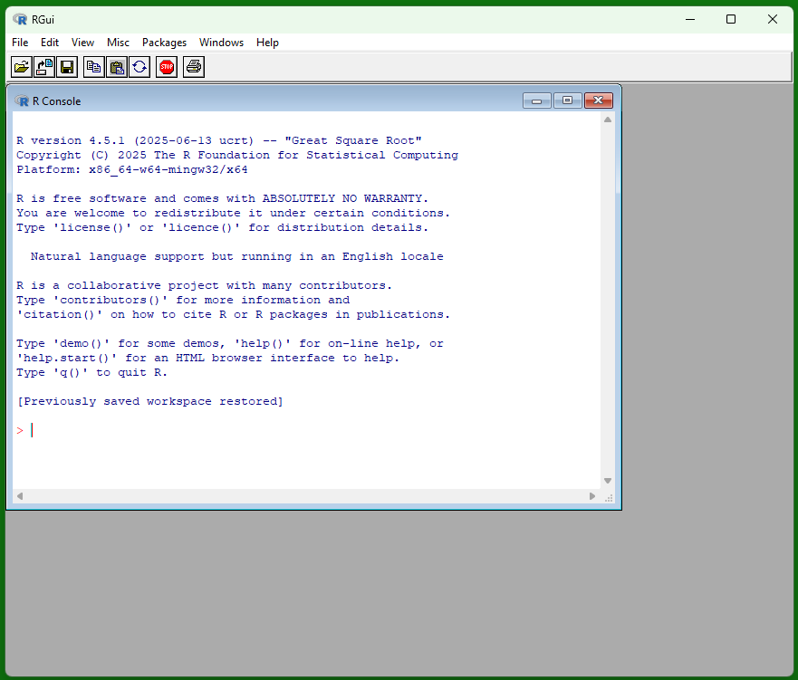
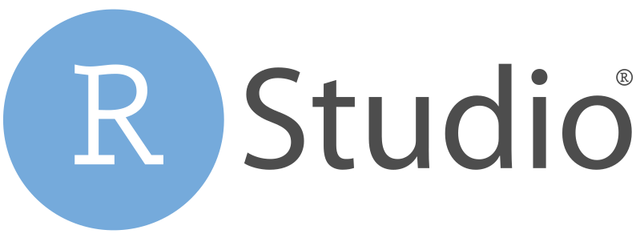

# Preface {.unnumbered}

Welcome to Introduction to R Programming

## Guided Activities for Learning R Workflow {#guided-activities-for-learning-r-workflow}

Welcome to _Introduction to R Programming: Goal, Code, Verify, Reflect_! This text is for learners who expect to work with data—in their majors, research, or industry, graduate study, or as data-educated member of society. You will be in class with first-year undergraduates and advanced graduate students, with backgrounds ranging from biology and psychology to anthropology, engineering, business, and the humanities. Some of your classmates already code in languages like Python; others are opening RStudio for the first time. The course is designed so that no programming experience is assumed, while still offering meaningful extension work for those who want more depth or need R for thesis and research projects.

In sixteen chapters, you will learn to use R with the desktop version of RStudio to create transparent, reproducible analyses that another person can re-run on a different computer. Early chapters focus on the foundations: navigating RStudio, managing your workspace, writing and submitting clean R scripts, and keeping a record of the objects you create. From there you will build up a working toolkit with vectors, functions, and missing-data handling; move into importing data from real files; and practice wrangling datasets with base R indexing, logical tests, and the `dplyr` verbs that power much of modern data science. In the final stretch, you will create visualizations with `ggplot2`, run basic simulations, and assemble an end-to-end mini-analysis that demonstrates readiness for your next statistics or data course.

The course is not only about code. Each chapter asks you to document your thinking as you work, building your memoing skills alongside your R programming skills. You will practice stating goals, making predictions, and writing short memos about what you tried, what failed, and what finally worked. You will practice asking questions, persisting through bugs, revisiting your reasoning and examine how and when to use AI tools as part of your workflow. Throughout, you will be expected to type your own code, to disclose when you consult outside resources (including AI), and to treat reproducibility and integrity as central parts of doing data work, not as afterthoughts.

## Why Learn R? {#why-learn-r}

R is one of the most widely used programming languages for data analysis, statistics, and scientific research. It is popular among statisticians, data scientists, and researchers due to its powerful capabilities for data manipulation, visualization, and statistical modeling. Here are some reasons why learning R is beneficial:

- **Open Source and Free**: R is open-source software, which means it is freely available to anyone. This makes it accessible to students, researchers, and professionals without the need for expensive licenses.

- **Extensive Package Ecosystem**: R has a vast ecosystem of packages (libraries) that extend its functionality. The Comprehensive R Archive Network (CRAN) hosts thousands of packages for various statistical techniques, data visualization, machine learning, and more.

- **Data Visualization**: R has powerful libraries like `ggplot2` that allow users to create high-quality and customizable visualizations. This is essential for effectively communicating data insights.

- **Statistical Analysis**: R is designed for statistical computing and provides a wide range of statistical functions and models. It is widely used in academia and research for statistical analysis.

- **Reproducible Research**: R supports reproducible research practices through tools like R Script, R Markdown, and Quarto which allows users to combine code, text, and visualizations in a single document. These tools facilitates a more efficient and effective team review process. Research collaborators can see exactly how the results were generated, including algorithms used, parameter settings, and data transformations. The entire analysis is fully reproducible by anyone with access to the original data and code.

- **Active Community**: R has a large and active community of users and developers who contribute to forums, blogs, and online resources. This makes it easy to find help and support when learning R.

- **Integration with Other Tools**: R can be integrated with other programming languages (like Python and C++) and tools (like databases and web applications), making it versatile for various data workflows. Version control systems like Git and GitHub can be used to track changes to your files, saving snapshots of your work over time. Shiny apps allow you to turn your analyses into interactive web applications.

**Large Language Models** (LLMs) are AI tools that can predict text and code. They can be used to draft and explain code. Given the transformative potential of AI for human societies, it is crucial to equip you with the values, knowledge and skills needed to navigate the future with AI. Using AI will undoubtedly have an impact on your learning. Using AI tools can either facilitate and prevent learning. It all depends on how it is used, the specific use case. 

If these AI tools are very good at producing code, why should you learn to read and write R code? Here are just a few important reasons:

**Explanatory Power** means you can account for results. It means being able to accurately and knowingly explain relationships and mechanisms. It is not enough to have correct code and analysis. It is correctly and knowingly being able to explain why it is correct. If you can’t read the R code that produces the statistical output because you copied what AI produces, you lose the explanatory power of the results. AI is not a researcher. AI is a black box, or algorithmic opacity. An AI system’s internal logic is very complex, hidden, or “proprietary,” making it difficult to inspect. You can’t see how inputs become outputs, which limits auditability, explanation, and reproducibility (Kisselburgh & Beever, 2022). LLMs are not conscious (Shardlow & Przybyła, 2024). We must always keep humans “in the loop” of research processes that utilize AI tools. Ultimately, you, as the researcher, are responsible for your work.

**Critical Thinking and Problem-Solving Skills**: Learning R helps you develop critical thinking and problem-solving skills. You learn how to break down complex problems into smaller, manageable parts and how to approach data analysis systematically.

While course will focus on the foundations, learning R opens up many possibilities for advanced data analysis, machine learning, and statistical modeling. It is a valuable skill for anyone working with data in various fields, including academia, industry, healthcare, finance, and more.

## Acquiring the Software {#acquiring-the-software}

Lessons are hands-on. To follow along, you must have both **R** and **RStudio** installed on your own computer. These are two separate pieces of software that work together. They run on Windows, macOS, and Linux.

- **R** is a programming language and engine that runs your R code.

- **RStudio Desktop** is an **integrated development environment** (IDE) that makes writing, running and organizing R code easier. In this course, you will always use RStudio to interact with R. You must use the **desktop** version locally (not the Posit Cloud or other browser-based tools).

RStudio does not include R. You must install R first, then RStudio Desktop, which will detect your R installation when it starts. 

### Download and Install R {#download-and-install-r}

1. Go to the [CRAN R Project for Statistical Computing](https://cran.r-project.org/){target="_blank" rel="noopener noreferrer"} website.

2. Download the correct file for your operating system. 

a. **Windows**: Click on the "Download R for Windows" link if you are using Windows. You will download an `.exe` file. Open the file and accept defaults. Do not change the file location to your OneDrive cloud folder. 

b. **macOS**: Click "Download R for macOS" if you are using a Mac. You will download a `.pkg` file. Open the file and accept defaults. You’ll get both the R framework and the R.app GUI.

c. **Linux**: Click the [Linux folder of the Cran website](https://cran.r-project.org/bin/linux/){target="_blank" rel="noopener noreferrer"} link and follow your distribution’s installation instructions.

If you double-click the R icon after installation, you may see a window like this, called the R console (or RGui on Windows). This is the base interface that comes with R, and it can run R code, but we will not use it in this course. Instead, you will always write, run, and save your work in **RStudio Desktop**, which provides a script editor, projects, and tools that make your analyses easier to organize, share, and reproduce.

### Download and Install RStudio {#download-and-install-rstudio}

1. Go to the [RStudio download page](https://posit.co/download/rstudio-desktop/){target="_blank" rel="noopener noreferrer"}.

2. Choose the installer for your operating system and run it, accepting defaults.

a. **Windows**: Select the Windows installer (a file ending in `.exe`). After it downloads, double-click the file and follow the prompts, accepting the default options.

b. **macOS**: Select the macOS installer (a file ending in `.dmg`). After it downloads, double-click the file, then drag the RStudio icon into your Applications folder if prompted, or follow the installer’s instructions.

c. **Linux**: Select the installer that matches your Linux distribution (for example, a `.deb` package for Ubuntu/Debian or an `.rpm` package for Fedora/RHEL/OpenSUSE). Download the file and install it using your system’s standard package tools (e.g., `dpkg`, `apt`, or `dnf`).

3. After installation, open **RStudio Desktop**. It should automatically detect the version of R you already installed. If RStudio does not start or cannot find R, reinstall R and then reopen RStudio.

### Intallation Video Tutorials {#installation-video-tutorials}

If you prefer a video walkthrough, you can watch a short tutorial:

**Windows**:
[How to install R and RStudio - a practical guide](https://www.youtube.com/watch?v=aiBWLfHeWGE){target="_blank" rel="noopener noreferrer"}

**macOS**:
[How to Correctly install R and RStudio on MacOS (2025)](https://www.youtube.com/watch?v=8NvvydRwxEI){target="_blank" rel="noopener noreferrer"}

**Linux**:
[How To Install R and RStudio on Ubuntu 24.04 LTS](https://www.youtube.com/watch?v=7RSq4uuS36A){target="_blank" rel="noopener noreferrer"}

[R for Ecologists (Lesson 1) Installing R and RStudio](https://youtu.be/YKvkXKeGoa8?si=YAMM-MpMqtQX-6ep){target="_blank" rel="noopener noreferrer"}

## Chapter Terms {#chapter-terms}

**Large Language Models (LLMs)**: AI systems trained on massive collections of text and code to predict and generate language, including R code and explanations. In an R-learning context, LLMs can help you brainstorm, interpret error messages, and draft code—but they can also produce plausible-sounding mistakes, so you must verify outputs, understand each line you run, and document when and how you used the tool.

**R** is a programming language and engine that runs your R code.

**RStudio Desktop** is an **integrated development environment** (IDE) that makes writing, running and organizing R code easier.

## References {#references}

Kisselburgh, L., & Beever, J. (2022). The Ethics of Privacy in Research and Design: Principles, Practices, and Potential. In B. P. Knijnenburg, X. Page, P. Wiseniewski, H. R. Lipford, N. Proferes, & J. Romano (Eds.), Modern Socio-Technical Perspectives on Privacy (pp. 395–426). Springer. [https://doi.org/10.1007/978-3-030-82786-1](https://doi.org/10.1007/978-3-030-82786-1){target="_blank" rel="noopener noreferrer"}

Shardlow, M., & Przybyła, P. (2024). Deanthropomorphising NLP: can a language model be conscious?. PloS one, 19(12), e0307521.

